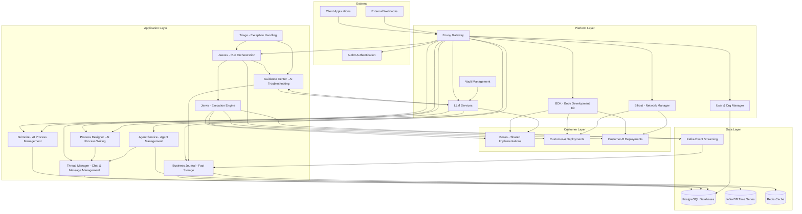

# Architecture Overview

The Voyager system is deployed as microservices across Kubernetes namespaces. Each service typically runs in its own namespace with dedicated database resources where needed.

## Service Organization

The services are organized into functional groups:

- **Execution Services**: Core execution engine and orchestration
- **Data Services**: Fact processing, storage, and querying
- **Process Management**: AI-powered process definitions and management
- **Book Services**: Shared book implementations and customer deployments
- **Chat & Agent Services**: AI-powered conversational interfaces and agent orchestration
- **Integration Services**: External event processing and triggers
- **Platform Services**: Authentication, authorization, networking, and AI services

## High-Level Data Flow



## Core Concepts

### SPy Programs
SPy programs are a subset of Python (specification pending) that define automation logic. They are interpreted by Jarvis using a REST interpreter and can call Book functions for third-party integrations.

### Processes
Processes define how AI agents interact and coordinate to accomplish tasks within the Voyager platform.

### Agent Operating Procedures (AOP)
Agent Operating Procedures define how AI agents interact and coordinate to accomplish tasks within the Voyager platform.

## Core Execution Flow

1. **Request Initiation**: Client requests come through Envoy Gateway
2. **Authentication**: Auth0 validates JWTs, UOM handles authorization
3. **Process Design**: English specifications created and stored in Grimoire
4. **Book Deployment**: BDK manages Python skill collections with Bifrost network configuration
5. **Run Creation**: Jeeves orchestrates new runs and manages execution metadata
6. **SPy Execution**: Jarvis executes SPy programs (Python subset) calling Book procedures
7. **Exception Handling**: Guidance Center handles execution exceptions for Automation Troubleshooters
8. **Fact Processing**: Business Journal persists execution logs in InfluxDB and provides dynamic querying
9. **Event Streaming**: Kafka provides the backbone for event-driven communication

## Key Architectural Patterns

### Microservices with Single Responsibility
Each service has a clear, focused responsibility:
- **Jarvis**: Execute SPy programs (Python subset) and call Book procedures
- **Jeeves**: Orchestrate runs and manage execution metadata
- **Business Journal**: Persist facts in InfluxDB and provide dynamic querying
- **Grimoire**: Store English process specifications and provide AI-powered process design
- **Thread Manager**: Chat thread and message management for conversational AI services
- **Process Designer**: AI-powered process writing and design through chat interface
- **Agent Service**: Agent management and configuration with data source integration
- **BDK**: Python skill collection (Book) development, deployment, and lifecycle management
- **Bifrost**: Network management and secure customer connectivity
- **Guidance Center**: Exception handling and troubleshooting for Automation Troubleshooters
- **Object Service**: Artifact storage and signed URL generation for downloads

### Event-Driven Architecture
Services communicate primarily through Kafka events:
- Loose coupling between services
- Scalable and resilient communication
- Event sourcing for auditability

#### Proposed Kafka Topic Structure
```yaml
# Core Execution Topics
execution_control:
  - spy_control              # Jeeves → Jarvis execution commands
  - execution_status         # Jarvis → Jeeves status updates

# Event Streaming  
events:
  - execution_logs           # Jarvis → Telegraf raw logs
  - run_status               # Run lifecycle events
  - thread_events           # Thread Manager → Journal conversation events

# Exception Handling
exceptions:
  - execution_exceptions     # Failed executions → Guidance Center
  - recovery_attempts       # Triage recovery attempts
  - escalations             # Human intervention needed

# Integration & Triggers
integration:
  - webhook_events          # BDK webhook processing
  - external_triggers       # External system events
  - book_deployments        # BDK deployment events

# AI & Analytics
analytics:
  - llm_requests           # LLM usage tracking
  - agent_interactions     # Agent conversation analytics
  - performance_metrics    # System performance data
```

### AI-First Architecture
AI capabilities are deeply integrated throughout the platform:
- **Centralized AI Services**: LLM Services provides unified AI access
- **Agent Orchestration**: Agent Service manages AI agents and Thread Manager handles conversations
- **Intelligent Process Design**: Grimoire uses AI for process optimization
- **Automated Troubleshooting**: Guidance Center provides AI-powered issue resolution
- **Context-Aware Intelligence**: AI services leverage historical data and patterns

### API Gateway Pattern
Envoy Gateway serves as the single entry point:
- Centralized authentication and authorization
- Protocol translation (REST ↔ gRPC)
- Rate limiting and traffic management
- WebSocket support for real-time features

### Database per Service
Each service owns its data:
- Data sovereignty and independence
- Service-specific data models
- Independent scaling and optimization

### Kubernetes-Native
Built for cloud-native deployment:
- Custom Resource Definitions (CRDs)
- Controller pattern for automation
- Service mesh for communication
- Horizontal scaling capabilities

## Security Architecture

### Identity and Access Management
- **Authentication**: Auth0 for JWT validation
- **Authorization**: UOM for fine-grained permissions
- **API Keys**: Managed through UOM for service accounts

### Network Security
- **Service Mesh**: Encrypted inter-service communication
- **Network Isolation**: Kubernetes namespaces provide boundaries
- **Customer Isolation**: Dedicated namespaces per customer
- **External Access**: Tailscale for secure customer network connectivity

### Secret Management
- **Vault Integration**: External HashiCorp Vault for secret storage
- **Automatic Rotation**: Vault Operator manages secret lifecycle
- **Encrypted Storage**: Kubernetes secrets with encryption at rest

## Observability

### Logging
- **Structured Logging**: JSON format across all services
- **Centralized Collection**: Aggregated logging infrastructure
- **Execution Logs**: Streamed from Jarvis to InfluxDB

### Metrics
- **Prometheus**: Service metrics collection
- **Custom Metrics**: Business logic and performance indicators
- **Alerting**: Automated alerts on critical conditions

### Tracing
- **Distributed Tracing**: Request tracing across service boundaries
- **LLM Telemetry**: Phoenix for AI model tracing and evaluation
- **Performance Analysis**: End-to-end request latency tracking

## Scalability Considerations

### Horizontal Scaling
- **Stateless Services**: Most services can scale horizontally
- **Event-Driven Autoscaling**: KEDA for workload-based scaling
- **Database Scaling**: Read replicas and connection pooling

### Performance Optimization
- **Caching**: Redis for frequently accessed data
- **Connection Pooling**: Efficient database connections
- **Async Processing**: Event-driven processing for non-blocking operations

### Resource Management
- **Resource Limits**: Kubernetes resource quotas and limits
- **Multi-tenancy**: Customer isolation with shared infrastructure
- **Cost Optimization**: Right-sizing and efficient resource utilization
