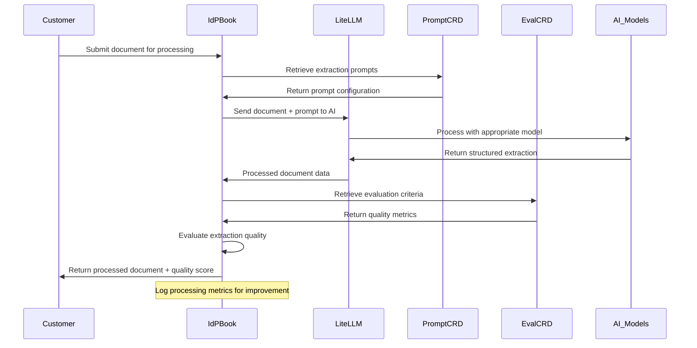

# Books - Shared Book Implementations and Document Processing

**Namespace**: `books`  
**Technology**: Python, Kubernetes CRDs, LiteLLM  
**Purpose**: Shared book implementations and intelligent document processing

## Overview

The Books service provides shared Book implementations that can be reused across multiple customer deployments. Books are Python-based skill collections that provide capabilities for integrating with third-party systems. The service specializes in intelligent document processing workflows and hosts reusable Book components like the IdP (Intelligent Document Processing) Book.

## Responsibilities

- Host shared Book implementations (Python skill collections) for cross-customer reuse
- Provide capabilities for third-party system integrations through standardized interfaces
- Manage intelligent document processing workflows with AI integration
- Store and manage Book-specific prompts and evaluation criteria
- Implement standardized document processing patterns and skills
- Integrate with LLM services for AI-powered document analysis
- Expose Book functions that can be called by SPy programs during execution

## Architecture

### Services within Namespace

#### IdP Book (Intelligent Document Processing)
- **Purpose**: Python skill collection for intelligent document processing
- **Technology**: Kubernetes Service, Python application with skill functions
- **Function**: Provides document processing capabilities callable by SPy programs
- **Integration**: Uses LiteLLM Proxy for AI model access and structured document extraction

#### Extract Data Prompt
- **Purpose**: Custom Resource Definition for document extraction prompts
- **Technology**: Kubernetes Custom Resource Definition (CRD)
- **Function**: Defines and manages prompts for intelligent document processing
- **Configuration**: Stores prompt templates, parameters, and extraction schemas

#### Extract Data Evaluation
- **Purpose**: Custom Resource Definition for evaluating document extraction quality
- **Technology**: Kubernetes Custom Resource Definition (CRD)
- **Function**: Defines evaluation criteria and metrics for document processing accuracy
- **Quality Control**: Automated quality assessment and improvement workflows

## Key Features

### Intelligent Document Processing
- **AI-Powered Extraction**: Uses advanced LLM models for document understanding
- **Structured Output**: Converts unstructured documents to structured data
- **Multi-Format Support**: Handles various document formats (PDF, Word, images, etc.)
- **Quality Assurance**: Built-in evaluation and quality control mechanisms

### Shared Implementation Model
- **Cross-Customer Reuse**: Single implementation serves multiple customers
- **Cost Efficiency**: Shared infrastructure and maintenance costs
- **Standardization**: Consistent document processing capabilities
- **Scalability**: Efficient resource utilization across deployments

### CRD-Based Configuration
- **Declarative Configuration**: Kubernetes-native configuration management
- **Version Control**: GitOps-friendly configuration management
- **Dynamic Updates**: Runtime configuration updates without service restarts
- **Validation**: Built-in configuration validation and schema enforcement

## Infrastructure

### Kubernetes Custom Resource Definitions
- **Configuration Management**: CRDs for prompts and evaluations
- **Lifecycle Management**: Kubernetes controllers for resource management
- **Schema Validation**: Built-in validation for configuration resources
- **GitOps Integration**: Source control integration for configuration

### LLM Service Integration
- **Model Access**: Integration with various AI models via LiteLLM Proxy
- **Prompt Management**: Dynamic prompt configuration and optimization
- **Response Processing**: Structured processing of AI model responses
- **Error Handling**: Robust error handling for AI service failures

### Shared Infrastructure
- **Multi-Tenancy**: Secure isolation between customer workloads
- **Resource Sharing**: Efficient sharing of computational resources
- **Monitoring**: Centralized monitoring and observability
- **Scaling**: Automatic scaling based on processing demand

## Data Flow



## Book Implementation: IdP Book (Intelligent Document Processing)

### Purpose
Intelligent Document Processing (IdP) Book provides AI-powered document analysis and structured data extraction capabilities.

### Capabilities
- **Document Analysis**: Advanced AI-powered document understanding
- **Data Extraction**: Structured data extraction from unstructured documents
- **Quality Assessment**: Automated quality scoring and validation
- **Multi-Format Support**: PDF, Word, images, and other document formats
- **Custom Schemas**: Configurable extraction schemas per use case

### Processing Pipeline
1. **Document Ingestion**: Accept documents in various formats
2. **Preprocessing**: Document normalization and optimization
3. **AI Analysis**: LLM-powered content analysis and understanding
4. **Data Extraction**: Structured data extraction based on prompts
5. **Quality Evaluation**: Automated quality assessment using evaluation criteria
6. **Result Formatting**: Structured output in customer-specified format

### Integration Points
- **LiteLLM Proxy**: AI model access for document processing
- **Extract Data Prompts**: Dynamic prompt configuration
- **Extract Data Evaluations**: Quality assessment criteria
- **Customer Books**: Integration with customer-specific book deployments

## Custom Resource Definitions

### Extract Data Prompt CRD
```yaml
apiVersion: books.voyager.io/v1
kind: ExtractDataPrompt
metadata:
  name: invoice-extraction-prompt
  namespace: books
spec:
  documentType: "invoice"
  extractionSchema:
    fields:
      - name: "invoice_number"
        type: "string"
        required: true
      - name: "total_amount"
        type: "number"
        required: true
      - name: "vendor_name"
        type: "string"
        required: true
  promptTemplate: |
    Extract the following information from this invoice document:
    - Invoice number
    - Total amount
    - Vendor name
    
    Return the data in JSON format with the specified field names.
  modelParameters:
    temperature: 0.1
    maxTokens: 1000
```

### Extract Data Evaluation CRD
```yaml
apiVersion: books.voyager.io/v1
kind: ExtractDataEvaluation
metadata:
  name: invoice-extraction-eval
  namespace: books
spec:
  promptRef:
    name: "invoice-extraction-prompt"
  evaluationCriteria:
    accuracy:
      weight: 0.4
      metrics:
        - "field_completeness"
        - "data_format_compliance"
    consistency:
      weight: 0.3
      metrics:
        - "cross_field_validation"
        - "business_logic_compliance"
    confidence:
      weight: 0.3
      metrics:
        - "ai_confidence_score"
        - "extraction_certainty"
  qualityThresholds:
    minimum: 0.7
    target: 0.85
    excellent: 0.95
```

## API Specifications

### Document Processing API
```python
# IdP Book Python API
class IdPBook:
    def process_document(
        self,
        document: bytes,
        document_type: str,
        extraction_schema: dict,
        quality_threshold: float = 0.7
    ) -> ProcessingResult:
        """
        Process a document using AI-powered extraction.
        
        Args:
            document: Raw document bytes
            document_type: Type of document (invoice, contract, etc.)
            extraction_schema: Schema defining fields to extract
            quality_threshold: Minimum quality score required
            
        Returns:
            ProcessingResult with extracted data and quality metrics
        """
        pass

    def evaluate_extraction(
        self,
        extracted_data: dict,
        evaluation_criteria: dict
    ) -> QualityScore:
        """
        Evaluate the quality of extracted data.
        
        Args:
            extracted_data: The extracted structured data
            evaluation_criteria: Evaluation criteria from CRD
            
        Returns:
            QualityScore with detailed metrics
        """
        pass
```

### Processing Result Format
```json
{
  "extraction_id": "uuid",
  "document_type": "invoice",
  "extracted_data": {
    "invoice_number": "INV-2024-001",
    "total_amount": 1250.00,
    "vendor_name": "Acme Corp"
  },
  "quality_metrics": {
    "overall_score": 0.92,
    "accuracy": 0.95,
    "consistency": 0.88,
    "confidence": 0.94
  },
  "processing_metadata": {
    "model_used": "gpt-4",
    "processing_time_ms": 2500,
    "prompt_version": "v1.2",
    "evaluation_version": "v1.1"
  },
  "issues": [
    {
      "type": "low_confidence",
      "field": "vendor_address",
      "confidence": 0.65,
      "message": "Address extraction has low confidence"
    }
  ]
}
```

## Shared Deployment Model

### Multi-Customer Architecture
- **Shared Infrastructure**: Single deployment serves multiple customers
- **Tenant Isolation**: Secure data isolation between customers
- **Resource Efficiency**: Optimized resource utilization across tenants
- **Cost Distribution**: Shared operational costs across customer base

### Configuration Management
- **Per-Customer Customization**: Customer-specific prompt and evaluation configurations
- **Global Defaults**: Shared default configurations for common use cases
- **Override Mechanisms**: Customer-specific overrides for shared configurations
- **Version Management**: Independent versioning for customer configurations

### Scaling Strategy
- **Horizontal Scaling**: Scale processing capacity based on aggregate demand
- **Queue Management**: Fair queuing and priority handling across customers
- **Resource Allocation**: Dynamic resource allocation based on customer needs
- **Performance Isolation**: Ensure customer performance isolation

## Integration with Customer Deployments

### Customer Book Integration
- **Shared Skill Collections**: Customer Books can leverage shared skill capabilities
- **SPy Program Integration**: Book functions callable from SPy programs during execution
- **Custom Extensions**: Customer-specific extensions to shared Book functionality
- **Configuration Inheritance**: Inherit and override shared Book configurations
- **Function Call Interface**: Seamless function call integration from SPy to Book skills

### Deployment Coordination
- **Version Synchronization**: Coordinate versions between shared and customer deployments
- **Configuration Propagation**: Propagate shared configurations to customer deployments
- **Rollback Coordination**: Coordinated rollback capabilities across deployments
- **Monitoring Integration**: Unified monitoring across shared and customer components

## Performance and Optimization

### AI Model Optimization
- **Model Selection**: Optimal model selection based on document type and requirements
- **Batch Processing**: Efficient batch processing for multiple documents
- **Caching**: Result caching for similar documents and prompts
- **Performance Monitoring**: Continuous monitoring of AI model performance

### Resource Management
- **Memory Optimization**: Efficient memory usage for document processing
- **CPU Scaling**: Dynamic CPU scaling based on processing demand
- **I/O Optimization**: Optimized I/O for document ingestion and processing
- **Network Efficiency**: Efficient network usage for AI model communication

### Quality Improvement
- **Feedback Loops**: Automated feedback loops for continuous improvement
- **A/B Testing**: A/B testing for prompt and model optimization
- **Performance Analytics**: Detailed analytics for processing performance
- **Error Analysis**: Automated error analysis and correction suggestions

## Security Considerations

### Data Protection
- **Encryption**: End-to-end encryption for document processing
- **Access Control**: Role-based access control for processing capabilities
- **Audit Logging**: Comprehensive audit logging for compliance
- **Data Retention**: Configurable data retention policies

### Multi-Tenant Security
- **Tenant Isolation**: Strong isolation between customer data
- **Configuration Security**: Secure handling of customer configurations
- **API Security**: Secure API access with proper authentication
- **Resource Isolation**: Prevent resource contention between tenants

### AI Security
- **Prompt Injection Protection**: Protection against prompt injection attacks
- **Model Security**: Secure integration with AI models
- **Data Sanitization**: Input sanitization for AI processing
- **Response Validation**: Validation of AI model responses
