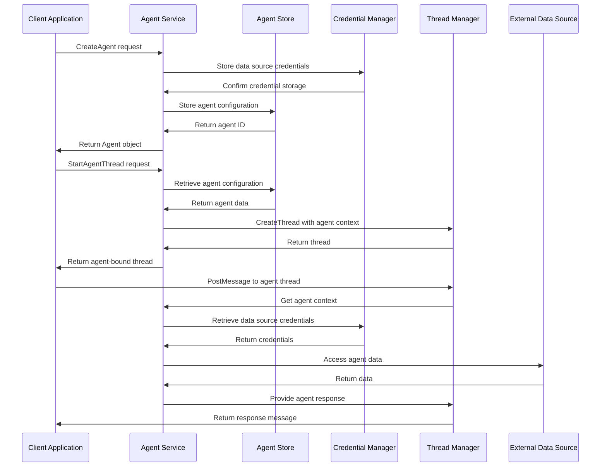

# Agent Service - Agent Management and Configuration

**Namespace**: `threads`  
**Technology**: Python, gRPC, Database  
**Purpose**: Manage agent specifications, configurations, and lifecycle for conversational AI agents

## Overview

Agent Service is a core service that provides comprehensive agent management capabilities for the Voyager platform's conversational AI ecosystem. It handles agent creation, configuration, storage, and lifecycle management, serving as the central registry for all AI agents and their associated data sources and capabilities.

## Responsibilities

### Agent Specification Management
- **Agent Creation**: Create new agents with configurations and data sources
- **Agent Retrieval**: Retrieve agent specifications and configurations
- **Agent Updates**: Update agent configurations and settings
- **Agent Deletion**: Remove agents and cleanup associated resources

### Data Source Management
- **Book Integration**: Manage agent books (data sources) with provider-specific credentials
- **Credential Management**: Securely store and manage data source credentials
- **Provider Support**: Support multiple data providers (S3, Atlas, etc.)
- **Access Control**: Control agent access to specific data sources

### Agent Configuration
- **Restrictions Management**: Manage system/restrictions prompts for agents
- **Capability Configuration**: Configure agent capabilities and behaviors
- **Template Management**: Provide agent templates and configurations
- **Version Control**: Track agent configuration changes over time

### Thread Integration
- **Agent Thread Creation**: Create threads bound to specific agents
- **Agent Context**: Maintain agent context within conversation threads
- **Multi-Agent Support**: Support multiple agents within conversation flows
- **Agent Routing**: Route messages to appropriate agents based on context

## Architecture

### Services within Namespace

#### Agent Service Pod
The Agent Service Pod contains the core agent management functionality:

##### Agent Service
- **Purpose**: Core agent management and configuration operations
- **Technology**: Kubernetes Service (K8 Service), Kubernetes Deployment (K8 Deployment), Python application
- **Function**: Implements agents.proto gRPC service specification
- **Integration**: Integrates with database for persistence and Thread Manager for agent threads

**APIs**:
- **gRPC**: Full agents.proto implementation for agent operations
- **REST via Gateway**: `/api/v1/agents` endpoints for HTTP access

##### Agent Service gRPC Transcoder
- **Purpose**: Protocol translation and gateway integration
- **Technology**: Envoy application
- **Function**: Translates between REST and gRPC protocols for external API access

**APIs**:
- **REST via Gateway**: Agent operations accessible through Envoy Gateway

#### Agent Store
- **Purpose**: Persistent storage for agent specifications and configurations
- **Technology**: PostgreSQL database with encrypted credential storage
- **Function**: Stores all agent data with secure credential management
- **Features**: Encryption at rest, audit logging, configuration versioning

#### Credential Manager
- **Purpose**: Secure management of data source credentials
- **Technology**: HashiCorp Vault integration or encrypted database storage
- **Function**: Manages provider-specific credentials securely
- **Capabilities**: Credential rotation, access logging, encryption

#### Agent Template Library
- **Purpose**: Repository of agent templates and configurations
- **Technology**: Template storage and management system
- **Function**: Maintains library of proven agent configurations and patterns
- **Access**: Used for quick agent creation from templates

## Key Features

### Agent Lifecycle Management
- **Agent Creation**: Create agents with comprehensive configurations
- **Configuration Updates**: Update agent settings and data sources
- **Agent Versioning**: Track configuration changes over time
- **Agent Deletion**: Clean deletion with dependency checking

### Data Source Integration
- **Multi-Provider Support**: Support various data providers (S3, Atlas, etc.)
- **Credential Security**: Secure storage and management of provider credentials
- **Access Control**: Fine-grained access control to data sources
- **Connection Validation**: Validate data source connections

### Thread Integration
- **Agent-Bound Threads**: Create conversation threads bound to specific agents
- **Context Management**: Maintain agent-specific context in conversations
- **Agent Routing**: Route conversations to appropriate agents
- **Multi-Agent Coordination**: Support multi-agent conversation flows

### Security and Compliance
- **Credential Encryption**: Encrypt all stored credentials
- **Audit Logging**: Complete audit trail of agent operations
- **Access Control**: Role-based access control for agent management
- **Compliance**: Support compliance requirements for data handling

## Data Flow



## API Specifications

### gRPC APIs (agents.proto)

```protobuf
syntax = "proto3";
package agents.v1;

import "google/protobuf/struct.proto";
import "threads/v1/threads.proto";

message AgentRef { string name = 1; }

message AgentBook {
  string book_id = 1;                     // e.g., corpus/dataset identifier
  string provider = 2;                    // e.g., "s3", "atlas", etc.
  google.protobuf.Struct credentials = 3; // provider-specific credentials (opaque)
}

message Agent {
  string name = 1;                         // unique agent name (e.g., "default")
  repeated AgentBook books = 2;            // data sources with credentials
  string restrictions_prompt = 3;          // system/restrictions prompt applied to the agent
  int64 created_at_ms = 4;
  int64 updated_at_ms = 5;
}

service Agents {
  rpc CreateAgent(CreateAgentRequest) returns (CreateAgentResponse);
  rpc GetAgent(GetAgentRequest) returns (GetAgentResponse);
  rpc UpdateAgent(UpdateAgentRequest) returns (UpdateAgentResponse);
  rpc DeleteAgent(DeleteAgentRequest) returns (DeleteAgentResponse);
  rpc ListAgents(ListAgentsRequest) returns (ListAgentsResponse);
  rpc StartAgentThread(StartAgentThreadRequest) returns (StartAgentThreadResponse);
}
```

#### Agent Management
```protobuf
message CreateAgentRequest { Agent agent = 1; }
message CreateAgentResponse { Agent agent = 1; }

message GetAgentRequest { string name = 1; }
message GetAgentResponse { Agent agent = 1; }

message UpdateAgentRequest { Agent agent = 1; }
message UpdateAgentResponse { Agent agent = 1; }

message DeleteAgentRequest { string name = 1; }
message DeleteAgentResponse {}

message ListAgentsRequest { int32 page_size = 1; string page_token = 2; }
message ListAgentsResponse { repeated Agent agents = 1; string next_page_token = 2; }
```

#### Thread Integration
```protobuf
message StartAgentThreadRequest {
  string agent_name = 1;                   // required
  string title = 2;                         // optional thread title
  map<string, string> metadata = 3;         // optional UI/session correlation
}
message StartAgentThreadResponse { threads.v1.Thread thread = 1; }
```

### REST APIs (via Gateway)

#### Agent Management
```http
POST /api/v1/agents
Content-Type: application/json

{
  "agent": {
    "name": "customer-support-agent",
    "books": [
      {
        "book_id": "kb-customer-support",
        "provider": "s3",
        "credentials": {
          "bucket": "voyager-kb",
          "region": "us-west-2",
          "access_key_id": "AKIA...",
          "secret_access_key": "encrypted_secret"
        }
      },
      {
        "book_id": "faq-database",
        "provider": "atlas",
        "credentials": {
          "connection_string": "mongodb+srv://...",
          "database": "faq",
          "collection": "questions"
        }
      }
    ],
    "restrictions_prompt": "You are a helpful customer support agent. Always be polite and professional. If you don't know the answer, direct the customer to human support."
  }
}

Response: 201 Created
{
  "agent": {
    "name": "customer-support-agent",
    "books": [
      {
        "book_id": "kb-customer-support",
        "provider": "s3",
        "credentials": {
          "bucket": "voyager-kb",
          "region": "us-west-2"
          // credentials are masked in response
        }
      },
      {
        "book_id": "faq-database",
        "provider": "atlas",
        "credentials": {
          "database": "faq",
          "collection": "questions"
          // sensitive credentials masked
        }
      }
    ],
    "restrictions_prompt": "You are a helpful customer support agent...",
    "created_at_ms": 1699123456789,
    "updated_at_ms": 1699123456789
  }
}
```

```http
GET /api/v1/agents/{agent_name}

Response: 200 OK
{
  "agent": {
    "name": "customer-support-agent",
    "books": [
      {
        "book_id": "kb-customer-support",
        "provider": "s3",
        "credentials": {
          "bucket": "voyager-kb",
          "region": "us-west-2"
          // credentials masked for security
        }
      }
    ],
    "restrictions_prompt": "You are a helpful customer support agent...",
    "created_at_ms": 1699123456789,
    "updated_at_ms": 1699123456789
  }
}
```

```http
PUT /api/v1/agents/{agent_name}
Content-Type: application/json

{
  "agent": {
    "name": "customer-support-agent",
    "books": [
      {
        "book_id": "kb-customer-support-v2",
        "provider": "s3",
        "credentials": {
          "bucket": "voyager-kb-v2",
          "region": "us-west-2",
          "access_key_id": "AKIA...",
          "secret_access_key": "new_encrypted_secret"
        }
      }
    ],
    "restrictions_prompt": "Updated prompt with new guidelines..."
  }
}

Response: 200 OK
{
  "agent": {
    "name": "customer-support-agent",
    "books": [
      {
        "book_id": "kb-customer-support-v2",
        "provider": "s3",
        "credentials": {
          "bucket": "voyager-kb-v2",
          "region": "us-west-2"
        }
      }
    ],
    "restrictions_prompt": "Updated prompt with new guidelines...",
    "created_at_ms": 1699123456789,
    "updated_at_ms": 1699123467890
  }
}
```

```http
GET /api/v1/agents?page_size=20&page_token=next_page_123

Response: 200 OK
{
  "agents": [
    {
      "name": "customer-support-agent",
      "books": [{"book_id": "kb-customer-support", "provider": "s3"}],
      "restrictions_prompt": "You are a helpful customer support agent...",
      "created_at_ms": 1699123456789,
      "updated_at_ms": 1699123456789
    },
    {
      "name": "technical-support-agent",
      "books": [{"book_id": "technical-docs", "provider": "atlas"}],
      "restrictions_prompt": "You are a technical support specialist...",
      "created_at_ms": 1699123456800,
      "updated_at_ms": 1699123456800
    }
  ],
  "next_page_token": "next_page_456"
}
```

#### Agent Thread Creation
```http
POST /api/v1/agents/{agent_name}/threads
Content-Type: application/json

{
  "title": "Customer Support Session",
  "metadata": {
    "customer_id": "cust_123",
    "session_type": "support",
    "priority": "normal"
  }
}

Response: 201 Created
{
  "thread": {
    "thread_id": "thread_agent_789",
    "title": "Customer Support Session",
    "created_at_ms": 1699123456789,
    "metadata": {
      "agent_name": "customer-support-agent",
      "customer_id": "cust_123",
      "session_type": "support",
      "priority": "normal"
    }
  }
}
```

## Database Schema

### Agents Table
```sql
CREATE TABLE agents (
    name VARCHAR(255) PRIMARY KEY,
    restrictions_prompt TEXT,
    created_at_ms BIGINT NOT NULL,
    updated_at_ms BIGINT NOT NULL,
    metadata JSONB,
    INDEX idx_agents_created_at (created_at_ms),
    INDEX idx_agents_updated_at (updated_at_ms)
);
```

### Agent Books Table
```sql
CREATE TABLE agent_books (
    id BIGINT AUTO_INCREMENT PRIMARY KEY,
    agent_name VARCHAR(255) NOT NULL,
    book_id VARCHAR(255) NOT NULL,
    provider VARCHAR(100) NOT NULL,
    credentials_encrypted TEXT NOT NULL,
    created_at_ms BIGINT NOT NULL,
    updated_at_ms BIGINT NOT NULL,
    FOREIGN KEY (agent_name) REFERENCES agents(name) ON DELETE CASCADE,
    UNIQUE KEY uk_agent_book (agent_name, book_id),
    INDEX idx_agent_books_agent (agent_name),
    INDEX idx_agent_books_provider (provider)
);
```

### Agent Audit Log Table
```sql
CREATE TABLE agent_audit_log (
    id BIGINT AUTO_INCREMENT PRIMARY KEY,
    agent_name VARCHAR(255) NOT NULL,
    operation VARCHAR(50) NOT NULL, -- CREATE, UPDATE, DELETE, ACCESS
    user_id VARCHAR(255),
    ip_address VARCHAR(45),
    details JSONB,
    created_at_ms BIGINT NOT NULL,
    INDEX idx_audit_agent (agent_name),
    INDEX idx_audit_created_at (created_at_ms),
    INDEX idx_audit_operation (operation)
);
```

## Data Source Providers

### S3 Provider
```json
{
  "provider": "s3",
  "credentials": {
    "bucket": "my-knowledge-base",
    "region": "us-west-2",
    "access_key_id": "AKIA...",
    "secret_access_key": "encrypted_secret",
    "prefix": "documents/",
    "format": "text" // text, json, pdf
  }
}
```

### Atlas (MongoDB) Provider
```json
{
  "provider": "atlas",
  "credentials": {
    "connection_string": "mongodb+srv://...",
    "database": "knowledge_base",
    "collection": "documents",
    "username": "agent_user",
    "password": "encrypted_password"
  }
}
```

### Vector Database Provider
```json
{
  "provider": "pinecone",
  "credentials": {
    "api_key": "encrypted_api_key",
    "environment": "us-west1-gcp",
    "index_name": "knowledge-base",
    "namespace": "customer-support"
  }
}
```

### Custom API Provider
```json
{
  "provider": "custom_api",
  "credentials": {
    "base_url": "https://api.example.com/v1",
    "api_key": "encrypted_api_key",
    "headers": {
      "User-Agent": "VoyagerAgent/1.0"
    },
    "timeout": 30
  }
}
```

## Integration Points

### With Thread Manager
- **Agent Thread Creation**: Create threads bound to specific agents
- **Agent Context Injection**: Inject agent context into thread metadata
- **Message Processing**: Process messages with agent-specific context
- **Multi-Agent Threads**: Support threads with multiple agents

### With Process Designer
- **Agent-Assisted Process Writing**: Provide agent capabilities for process development
- **Knowledge Base Access**: Access agent knowledge bases during process creation
- **Process Validation**: Use agents to validate process designs
- **Implementation Assistance**: Provide agent-powered implementation guidance

### With LLM Services
- **Agent Prompt Management**: Manage agent-specific prompts and restrictions
- **Knowledge Injection**: Inject agent knowledge into LLM context
- **Response Filtering**: Filter LLM responses based on agent restrictions
- **Capability Enhancement**: Enhance LLM capabilities with agent-specific data

### With Vault (Credential Management)
- **Secure Credential Storage**: Store data source credentials securely
- **Credential Rotation**: Support automatic credential rotation
- **Access Logging**: Log all credential access for audit purposes
- **Encryption Management**: Manage encryption keys for credential storage

## Security Considerations

### Credential Security
- **Encryption at Rest**: Encrypt all stored credentials using strong encryption
- **Encryption in Transit**: Use TLS for all credential transmission
- **Access Control**: Strict access control for credential management
- **Audit Logging**: Complete audit trail of credential access

### Agent Security
- **Prompt Injection Protection**: Protect against prompt injection attacks
- **Data Access Control**: Control agent access to sensitive data sources
- **Response Filtering**: Filter agent responses for sensitive information
- **Rate Limiting**: Implement rate limiting for agent operations

### API Security
- **Authentication**: Authenticate all API requests
- **Authorization**: Authorize access to specific agents and operations
- **Input Validation**: Validate all input data for security
- **Output Sanitization**: Sanitize output to prevent data leakage

### Compliance
- **Data Residency**: Support data residency requirements
- **Privacy Controls**: Implement privacy controls for agent data
- **Retention Policies**: Implement data retention policies
- **Right to be Forgotten**: Support data deletion requests

## Performance Optimization

### Agent Storage
- **Caching**: Cache frequently accessed agent configurations
- **Connection Pooling**: Pool database connections for performance
- **Lazy Loading**: Lazy load agent books and credentials
- **Batch Operations**: Support batch operations for multiple agents

### Data Source Access
- **Connection Caching**: Cache data source connections
- **Request Batching**: Batch requests to external data sources
- **Async Operations**: Use asynchronous operations for data access
- **Circuit Breakers**: Implement circuit breakers for external services

### Scalability Features
- **Horizontal Scaling**: Scale agent service across multiple instances
- **Database Sharding**: Shard agent data for improved performance
- **Load Balancing**: Distribute requests across service instances
- **Auto-scaling**: Implement auto-scaling based on demand

## Monitoring and Observability

### Agent Metrics
- **Agent Creation Rate**: Track agent creation and modification patterns
- **Agent Usage**: Monitor agent usage and activity patterns
- **Data Source Access**: Track data source access patterns and performance
- **Error Rates**: Monitor error rates for agent operations

### Performance Metrics
- **Response Time**: Monitor API response times
- **Throughput**: Track agent operation throughput
- **Database Performance**: Monitor database query performance
- **External Service Latency**: Track latency to external data sources

### Security Metrics
- **Authentication Failures**: Track authentication failures
- **Authorization Violations**: Monitor authorization violations
- **Credential Access**: Track credential access patterns
- **Suspicious Activity**: Detect and alert on suspicious activity

### Business Metrics
- **Agent Adoption**: Track agent adoption and usage patterns
- **Feature Usage**: Monitor usage of different agent features
- **User Satisfaction**: Track user satisfaction with agent performance
- **Cost Optimization**: Monitor costs associated with agent operations
