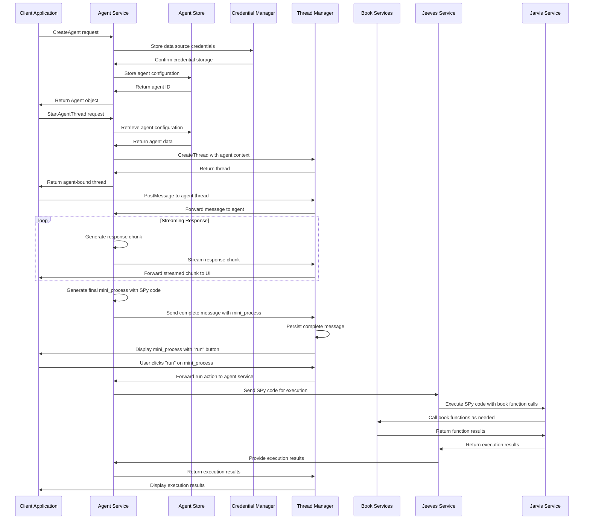

# Agent Service - Agent Management and Configuration

**Namespace**: `threads`  
**Technology**: Python, gRPC, Database  
**Purpose**: Manage agent specifications, configurations, and lifecycle for conversational AI agents

## Overview

Agent Service is a core service that provides comprehensive agent management capabilities for the Voyager platform's conversational AI ecosystem. It handles agent creation, configuration, storage, and lifecycle management, serving as the central registry for all AI agents and their book access configurations. The service generates mini_processes with embedded SPy code that users can approve for execution through the standard Jeeves → Jarvis flow.

## Responsibilities

### Agent Specification Management
- **Agent Creation**: Create new agents with configurations and data sources
- **Agent Retrieval**: Retrieve agent specifications and configurations
- **Agent Updates**: Update agent configurations and settings
- **Agent Deletion**: Remove agents and cleanup associated resources

### Book Integration Management
- **Book Configuration**: Configure books with provider-specific credentials for agent access
- **Credential Management**: Securely store and manage book credentials
- **Provider Support**: Support multiple book providers (S3, Atlas, etc.)
- **Access Control**: Control which books agents can access and call functions from

### Agent Configuration
- **Restrictions Management**: Manage system/restrictions prompts for agents
- **Mini-Process Generation**: Generate mini_processes in English with hidden SPy code
- **Book Function Access**: Configure which book functions agents can call through SPy code
- **Template Management**: Provide agent templates and configurations
- **Version Control**: Track agent configuration changes over time

### Streaming Chat and Process Generation
- **Streaming Chat Interface**: Provide real-time streaming chat responses to users
- **Mini-Process Creation**: Create mini_processes with English descriptions and hidden SPy code
- **Agent Thread Creation**: Create threads bound to specific agents
- **Agent Context**: Maintain agent context within conversation threads
- **Agent-Specific Actions**: Handle all agent-specific actions like "run", "edit", "validate"
- **Multi-Agent Support**: Support multiple agents within conversation flows

## Architecture

### Services within Namespace

#### Agent Service Pod
The Agent Service Pod contains the core agent management functionality:

##### Agent Service
- **Purpose**: Core agent management and configuration operations
- **Technology**: Kubernetes Service (K8 Service), Kubernetes Deployment (K8 Deployment), Python application
- **Function**: Implements agents.proto gRPC service specification
- **Integration**: Integrates with database for persistence and Thread Manager for agent threads

**APIs**:
- **gRPC**: Full agents.proto implementation for agent operations
- **gRPC Streaming**: Real-time chat interface for agent conversations
- **REST via Gateway**: `/api/v1/agents` endpoints for HTTP access

##### Agent Service gRPC Transcoder
- **Purpose**: Protocol translation and gateway integration
- **Technology**: Envoy application
- **Function**: Translates between REST and gRPC protocols for external API access

**APIs**:
- **REST via Gateway**: Agent operations accessible through Envoy Gateway

#### Agent Store
- **Purpose**: Persistent storage for agent specifications and configurations
- **Technology**: PostgreSQL database with encrypted credential storage
- **Function**: Stores all agent data with secure credential management
- **Features**: Encryption at rest, audit logging, configuration versioning

#### Credential Manager
- **Purpose**: Secure management of data source credentials
- **Technology**: HashiCorp Vault integration or encrypted database storage
- **Function**: Manages provider-specific credentials securely
- **Capabilities**: Credential rotation, access logging, encryption

#### Agent Template Library
- **Purpose**: Repository of agent templates and configurations
- **Technology**: Template storage and management system
- **Function**: Maintains library of proven agent configurations and patterns
- **Access**: Used for quick agent creation from templates

## Key Features

### Agent Lifecycle Management
- **Agent Creation**: Create agents with comprehensive configurations
- **Configuration Updates**: Update agent settings and data sources
- **Agent Versioning**: Track configuration changes over time
- **Agent Deletion**: Clean deletion with dependency checking

### Book Integration
- **Multi-Provider Support**: Support various book providers (S3, Atlas, etc.)
- **Credential Security**: Secure storage and management of book credentials
- **Function Access Control**: Fine-grained control over which book functions agents can call
- **Book Validation**: Validate book configurations and available functions

### Streaming Chat and Process Generation
- **Real-time Streaming**: Stream agent responses to users in real-time through Thread Manager
- **Mini-Process Generation**: Generate mini_processes with English descriptions and embedded SPy code
- **Agent-Bound Threads**: Create conversation threads bound to specific agents
- **Context Management**: Maintain agent-specific context in conversations
- **Action Handling**: Handle all agent-specific actions (run, edit, validate, etc.)
- **Execution Coordination**: Coordinate with Jeeves for mini_process execution
- **Multi-Agent Coordination**: Support multi-agent conversation flows

### Security and Compliance
- **Credential Encryption**: Encrypt all stored credentials
- **Audit Logging**: Complete audit trail of agent operations
- **Access Control**: Role-based access control for agent management
- **Compliance**: Support compliance requirements for data handling

## Data Flow



## API Specifications

### gRPC APIs (agents.proto)

```protobuf
syntax = "proto3";
package agents.v1;

import "google/protobuf/struct.proto";
import "threads/v1/threads.proto";

message AgentRef { string name = 1; }

message AgentBook {
  string book_id = 1;                     // e.g., book identifier for function access
  string provider = 2;                    // e.g., "s3", "atlas", etc.
  google.protobuf.Struct credentials = 3; // provider-specific credentials (opaque)
  repeated string available_functions = 4; // functions this agent can call from this book
}

message Agent {
  string name = 1;                         // unique agent name (e.g., "default")
  repeated AgentBook books = 2;            // books with credentials and function access
  string restrictions_prompt = 3;          // system/restrictions prompt applied to the agent
  int64 created_at_ms = 4;
  int64 updated_at_ms = 5;
}

service Agents {
  rpc CreateAgent(CreateAgentRequest) returns (CreateAgentResponse);
  rpc GetAgent(GetAgentRequest) returns (GetAgentResponse);
  rpc UpdateAgent(UpdateAgentRequest) returns (UpdateAgentResponse);
  rpc DeleteAgent(DeleteAgentRequest) returns (DeleteAgentResponse);
  rpc ListAgents(ListAgentsRequest) returns (ListAgentsResponse);
  rpc StartAgentThread(StartAgentThreadRequest) returns (StartAgentThreadResponse);
  
  // Streaming chat interface
  rpc Chat(stream AgentChatMessage) returns (stream AgentChatMessage);
  
  // Agent-specific actions
  rpc ExecuteMiniProcess(ExecuteMiniProcessRequest) returns (ExecuteMiniProcessResponse);
}
```

#### Agent Management
```protobuf
message CreateAgentRequest { Agent agent = 1; }
message CreateAgentResponse { Agent agent = 1; }

message GetAgentRequest { string name = 1; }
message GetAgentResponse { Agent agent = 1; }

message UpdateAgentRequest { Agent agent = 1; }
message UpdateAgentResponse { Agent agent = 1; }

message DeleteAgentRequest { string name = 1; }
message DeleteAgentResponse {}

message ListAgentsRequest { int32 page_size = 1; string page_token = 2; }
message ListAgentsResponse { repeated Agent agents = 1; string next_page_token = 2; }
```

#### Thread Integration
```protobuf
message StartAgentThreadRequest {
  string agent_name = 1;                   // required
  string title = 2;                         // optional thread title
  map<string, string> metadata = 3;         // optional UI/session correlation
}
message StartAgentThreadResponse { threads.v1.Thread thread = 1; }

// Streaming chat messages
message AgentChatMessage {
  string thread_id = 1;
  threads.v1.Role role = 2; // USER | ASSISTANT | SYSTEM
  string content = 3;       // markdown/plain text
  string client_msg_id = 4; // optional client-generated id
  google.protobuf.Struct mini_process = 5; // optional mini_process attachment
}

// Agent-specific actions
message ExecuteMiniProcessRequest {
  string thread_id = 1;
  string message_id = 2;     // message containing the mini_process
  string action = 3;         // "run", "edit", "validate", etc.
  map<string, string> parameters = 4; // action-specific parameters
}
message ExecuteMiniProcessResponse {
  string execution_id = 1;
  google.protobuf.Struct result = 2;
  string status = 3;         // "success", "error", "pending"
  string message = 4;        // human-readable status message
}
```

### REST APIs (via Gateway)

#### Agent Management
```http
POST /api/v1/agents
Content-Type: application/json

{
  "agent": {
    "name": "customer-support-agent",
    "books": [
      {
        "book_id": "kb-customer-support",
        "provider": "s3",
        "credentials": {
          "bucket": "voyager-kb",
          "region": "us-west-2",
          "access_key_id": "AKIA...",
          "secret_access_key": "encrypted_secret"
        },
        "available_functions": ["search_knowledge_base", "get_article", "list_categories"]
      },
      {
        "book_id": "faq-database",
        "provider": "atlas",
        "credentials": {
          "connection_string": "mongodb+srv://...",
          "database": "faq",
          "collection": "questions"
        },
        "available_functions": ["search_faq", "get_question_by_id", "list_topics"]
      }
    ],
    "restrictions_prompt": "You are a helpful customer support agent. Always be polite and professional. If you don't know the answer, direct the customer to human support."
  }
}

Response: 201 Created
{
  "agent": {
    "name": "customer-support-agent",
    "books": [
      {
        "book_id": "kb-customer-support",
        "provider": "s3",
        "credentials": {
          "bucket": "voyager-kb",
          "region": "us-west-2"
          // credentials are masked in response
        },
        "available_functions": ["search_knowledge_base", "get_article", "list_categories"]
      },
      {
        "book_id": "faq-database",
        "provider": "atlas",
        "credentials": {
          "database": "faq",
          "collection": "questions"
          // sensitive credentials masked
        },
        "available_functions": ["search_faq", "get_question_by_id", "list_topics"]
      }
    ],
    "restrictions_prompt": "You are a helpful customer support agent...",
    "created_at_ms": 1699123456789,
    "updated_at_ms": 1699123456789
  }
}
```

```http
GET /api/v1/agents/{agent_name}

Response: 200 OK
{
  "agent": {
    "name": "customer-support-agent",
    "books": [
      {
        "book_id": "kb-customer-support",
        "provider": "s3",
        "credentials": {
          "bucket": "voyager-kb",
          "region": "us-west-2"
          // credentials masked for security
        }
      }
    ],
    "restrictions_prompt": "You are a helpful customer support agent...",
    "created_at_ms": 1699123456789,
    "updated_at_ms": 1699123456789
  }
}
```

```http
PUT /api/v1/agents/{agent_name}
Content-Type: application/json

{
  "agent": {
    "name": "customer-support-agent",
    "books": [
      {
        "book_id": "kb-customer-support-v2",
        "provider": "s3",
        "credentials": {
          "bucket": "voyager-kb-v2",
          "region": "us-west-2",
          "access_key_id": "AKIA...",
          "secret_access_key": "new_encrypted_secret"
        }
      }
    ],
    "restrictions_prompt": "Updated prompt with new guidelines..."
  }
}

Response: 200 OK
{
  "agent": {
    "name": "customer-support-agent",
    "books": [
      {
        "book_id": "kb-customer-support-v2",
        "provider": "s3",
        "credentials": {
          "bucket": "voyager-kb-v2",
          "region": "us-west-2"
        }
      }
    ],
    "restrictions_prompt": "Updated prompt with new guidelines...",
    "created_at_ms": 1699123456789,
    "updated_at_ms": 1699123467890
  }
}
```

```http
GET /api/v1/agents?page_size=20&page_token=next_page_123

Response: 200 OK
{
  "agents": [
    {
      "name": "customer-support-agent",
      "books": [{"book_id": "kb-customer-support", "provider": "s3"}],
      "restrictions_prompt": "You are a helpful customer support agent...",
      "created_at_ms": 1699123456789,
      "updated_at_ms": 1699123456789
    },
    {
      "name": "technical-support-agent",
      "books": [{"book_id": "technical-docs", "provider": "atlas"}],
      "restrictions_prompt": "You are a technical support specialist...",
      "created_at_ms": 1699123456800,
      "updated_at_ms": 1699123456800
    }
  ],
  "next_page_token": "next_page_456"
}
```

#### Agent Thread Creation
```http
POST /api/v1/agents/{agent_name}/threads
Content-Type: application/json

{
  "title": "Customer Support Session",
  "metadata": {
    "customer_id": "cust_123",
    "session_type": "support",
    "priority": "normal"
  }
}

Response: 201 Created
{
  "thread": {
    "thread_id": "thread_agent_789",
    "title": "Customer Support Session",
    "created_at_ms": 1699123456789,
    "metadata": {
      "agent_name": "customer-support-agent",
      "customer_id": "cust_123",
      "session_type": "support",
      "priority": "normal"
    }
  }
}
```

## Database Schema

### Agents Table
```sql
CREATE TABLE agents (
    name VARCHAR(255) PRIMARY KEY,
    restrictions_prompt TEXT,
    created_at_ms BIGINT NOT NULL,
    updated_at_ms BIGINT NOT NULL,
    metadata JSONB,
    INDEX idx_agents_created_at (created_at_ms),
    INDEX idx_agents_updated_at (updated_at_ms)
);
```

### Agent Books Table
```sql
CREATE TABLE agent_books (
    id BIGINT AUTO_INCREMENT PRIMARY KEY,
    agent_name VARCHAR(255) NOT NULL,
    book_id VARCHAR(255) NOT NULL,
    provider VARCHAR(100) NOT NULL,
    credentials_encrypted TEXT NOT NULL,
    available_functions JSON NOT NULL, -- list of functions this agent can call
    created_at_ms BIGINT NOT NULL,
    updated_at_ms BIGINT NOT NULL,
    FOREIGN KEY (agent_name) REFERENCES agents(name) ON DELETE CASCADE,
    UNIQUE KEY uk_agent_book (agent_name, book_id),
    INDEX idx_agent_books_agent (agent_name),
    INDEX idx_agent_books_provider (provider)
);
```

### Agent Audit Log Table
```sql
CREATE TABLE agent_audit_log (
    id BIGINT AUTO_INCREMENT PRIMARY KEY,
    agent_name VARCHAR(255) NOT NULL,
    operation VARCHAR(50) NOT NULL, -- CREATE, UPDATE, DELETE, ACCESS
    user_id VARCHAR(255),
    ip_address VARCHAR(45),
    details JSONB,
    created_at_ms BIGINT NOT NULL,
    INDEX idx_audit_agent (agent_name),
    INDEX idx_audit_created_at (created_at_ms),
    INDEX idx_audit_operation (operation)
);
```

## Book Providers

### S3 Book Provider
```json
{
  "provider": "s3",
  "credentials": {
    "bucket": "my-knowledge-base",
    "region": "us-west-2",
    "access_key_id": "AKIA...",
    "secret_access_key": "encrypted_secret",
    "prefix": "documents/",
    "format": "text" // text, json, pdf
  },
  "available_functions": [
    "search_documents",
    "get_document",
    "list_files",
    "upload_document"
  ]
}
```

### Atlas (MongoDB) Book Provider
```json
{
  "provider": "atlas",
  "credentials": {
    "connection_string": "mongodb+srv://...",
    "database": "knowledge_base",
    "collection": "documents",
    "username": "agent_user",
    "password": "encrypted_password"
  },
  "available_functions": [
    "query_documents",
    "find_by_id",
    "aggregate_data",
    "insert_document"
  ]
}
```

### Vector Database Book Provider
```json
{
  "provider": "pinecone",
  "credentials": {
    "api_key": "encrypted_api_key",
    "environment": "us-west1-gcp",
    "index_name": "knowledge-base",
    "namespace": "customer-support"
  },
  "available_functions": [
    "vector_search",
    "upsert_vectors",
    "delete_vectors",
    "get_index_stats"
  ]
}
```

### Custom API Book Provider
```json
{
  "provider": "custom_api",
  "credentials": {
    "base_url": "https://api.example.com/v1",
    "api_key": "encrypted_api_key",
    "headers": {
      "User-Agent": "VoyagerAgent/1.0"
    },
    "timeout": 30
  },
  "available_functions": [
    "get_user_data",
    "create_ticket",
    "search_records",
    "update_status"
  ]
}
```

## Integration Points

### With Thread Manager
- **Streaming Integration**: Stream agent responses through Thread Manager to users
- **Message Persistence**: Thread Manager persists complete messages with mini_processes
- **Action Coordination**: Thread Manager forwards user actions to appropriate Agent Service
- **Agent Thread Creation**: Create threads bound to specific agents
- **Agent Context Injection**: Inject agent context into thread metadata
- **Multi-Agent Threads**: Support threads with multiple agents

### With Process Designer
- **Agent-Assisted Process Writing**: Provide agent capabilities for process development
- **Mini-Process Generation**: Generate mini_processes with embedded SPy code for user approval
- **Process Validation**: Use agents to validate process designs
- **Implementation Assistance**: Provide agent-powered implementation guidance

### With LLM Services
- **Agent Prompt Management**: Manage agent-specific prompts and restrictions
- **Mini-Process Generation**: Use LLM to generate English descriptions for mini_processes
- **SPy Code Generation**: Generate hidden SPy code that calls book functions
- **Response Filtering**: Filter LLM responses based on agent restrictions

### With Jeeves and Jarvis (Execution Services)
- **Action-Based Execution**: Handle user actions (run, edit, validate) on mini_processes
- **SPy Code Execution**: Send SPy code to Jeeves for orchestrated execution through Jarvis
- **Book Function Calls**: Jarvis executes SPy code that calls configured book functions
- **Execution Results**: Receive execution results and format for user display
- **Execution Coordination**: Manage execution lifecycle and status updates

### With Vault (Credential Management)
- **Secure Credential Storage**: Store book credentials securely
- **Credential Rotation**: Support automatic credential rotation
- **Access Logging**: Log all credential access for audit purposes
- **Encryption Management**: Manage encryption keys for credential storage

## Security Considerations

### Credential Security
- **Encryption at Rest**: Encrypt all stored credentials using strong encryption
- **Encryption in Transit**: Use TLS for all credential transmission
- **Access Control**: Strict access control for credential management
- **Audit Logging**: Complete audit trail of credential access

### Agent Security
- **Prompt Injection Protection**: Protect against prompt injection attacks
- **Book Function Access Control**: Control which book functions agents can include in SPy code
- **SPy Code Validation**: Validate generated SPy code for security before user approval
- **Response Filtering**: Filter agent responses for sensitive information
- **Rate Limiting**: Implement rate limiting for agent operations and mini_process generation

### API Security
- **Authentication**: Authenticate all API requests
- **Authorization**: Authorize access to specific agents and operations
- **Input Validation**: Validate all input data for security
- **Output Sanitization**: Sanitize output to prevent data leakage

### Compliance
- **Data Residency**: Support data residency requirements
- **Privacy Controls**: Implement privacy controls for agent data
- **Retention Policies**: Implement data retention policies
- **Right to be Forgotten**: Support data deletion requests

## Performance Optimization

### Agent Storage
- **Caching**: Cache frequently accessed agent configurations
- **Connection Pooling**: Pool database connections for performance
- **Lazy Loading**: Lazy load agent books and credentials
- **Batch Operations**: Support batch operations for multiple agents

### Mini-Process Generation
- **Template Caching**: Cache frequently used mini_process templates
- **Code Generation**: Optimize SPy code generation for common patterns
- **Validation**: Validate generated SPy code before presenting to users
- **Context Awareness**: Generate context-aware mini_processes based on conversation history

### Scalability Features
- **Horizontal Scaling**: Scale agent service across multiple instances
- **Database Sharding**: Shard agent data for improved performance
- **Load Balancing**: Distribute requests across service instances
- **Auto-scaling**: Implement auto-scaling based on demand

## Monitoring and Observability

### Agent Metrics
- **Agent Creation Rate**: Track agent creation and modification patterns
- **Agent Usage**: Monitor agent usage and activity patterns
- **Mini-Process Generation**: Monitor mini_process creation rates and approval rates
- **User Interaction**: Track user approval/rejection patterns for mini_processes
- **Error Rates**: Monitor error rates for agent operations

### Performance Metrics
- **Response Time**: Monitor API response times
- **Throughput**: Track agent operation throughput
- **Database Performance**: Monitor database query performance
- **Mini-Process Generation Time**: Track time to generate mini_processes

### Security Metrics
- **Authentication Failures**: Track authentication failures
- **Authorization Violations**: Monitor authorization violations
- **Credential Access**: Track credential access patterns
- **Suspicious Activity**: Detect and alert on suspicious activity

### Business Metrics
- **Agent Adoption**: Track agent adoption and usage patterns
- **Feature Usage**: Monitor usage of different agent features
- **User Satisfaction**: Track user satisfaction with agent performance
- **Cost Optimization**: Monitor costs associated with agent operations
