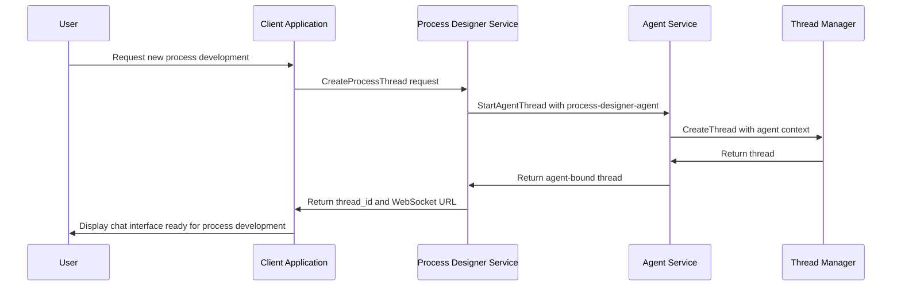
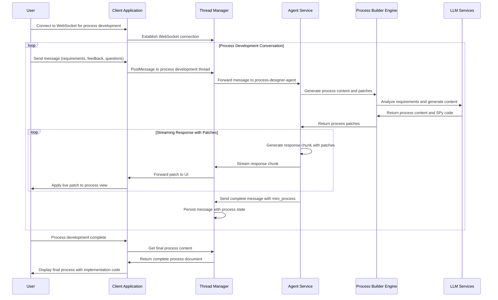

# Process Designer - AI-Powered Process Development

**Namespace**: `threads`  
**Technology**: Python, AI/ML, Agent Frameworks  
**Purpose**: Develop processes through conversational AI interface with live process patching

## Overview

Process Designer is an AI-powered service that enables users to create processes through natural conversation with a specialized Process Designer agent. The service provides live process patching capabilities similar to cursor.sh, where the agent incrementally builds and updates process content through chat interactions.

## Responsibilities

### Conversational Process Development
- **Process Designer Agent**: Specialized AI agent for process development conversations
- **Live Process Building**: Build processes incrementally through chat interactions
- **Process Patching**: Apply live patches to process content during conversation
- **Context Management**: Maintain conversation and process development state

### Process Generation
- **From-Scratch Generation**: Generate processes from natural language requirements without templates
- **Incremental Development**: Build processes step by step through conversation
- **Process Documentation**: Create comprehensive process documentation
- **SPy Code Integration**: Generate SPy code as part of process development

### Code Generation and Development
- **SPy Program Generation**: Generate complete SPy programs from process requirements
- **Function Generation**: Generate specific functions and code blocks for SPy programs
- **Integration Code**: Generate code for system integrations and API connections
- **Implementation Guidance**: Provide step-by-step implementation guidance

### Quality Assurance
- **Process Validation**: Validate processes for completeness and clarity
- **Process Analysis**: Analyze processes for efficiency and potential issues
- **Best Practice Compliance**: Ensure processes follow established best practices
- **Code Quality**: Ensure generated SPy code meets quality standards

## Architecture

### Services within Namespace

#### Process Designer Pod
The Process Designer Pod contains the core process development functionality:

##### Process Designer Service
- **Purpose**: Core process development through conversational AI interface
- **Technology**: Kubernetes Service (K8 Service), Kubernetes Deployment (K8 Deployment), Python application
- **Function**: Provides AI-powered process development through chat with live patching
- **Integration**: Integrates with Thread Manager for chat sessions and Agent Service for process designer agent

**APIs**:
- **gRPC**: Process Designer specific thread creation and management
- **REST via Gateway**: `/api/v1/process-designer` endpoints for process development

##### Process Designer gRPC Transcoder
- **Purpose**: Protocol translation and gateway integration
- **Technology**: Envoy application
- **Function**: Translates between REST and gRPC protocols for external API access

**APIs**:
- **REST via Gateway**: Process development operations accessible through Envoy Gateway

#### Process Builder Engine
- **Purpose**: Incremental process building and patching engine
- **Technology**: AI-powered process generation with patch capabilities
- **Function**: Builds processes incrementally through conversation patches
- **Capabilities**: Context awareness, patch generation, SPy code integration

#### Process Designer Agent
- **Purpose**: Specialized AI agent for process development conversations
- **Technology**: AI agent with process development expertise
- **Function**: Converses with users to understand requirements and build processes
- **Capabilities**: Natural language understanding, process expertise, code generation

## Key Features

### Conversational Process Development
- **Natural Conversation**: Users describe what they want in natural language
- **Incremental Building**: Process built step by step through conversation
- **Live Patching**: Process content updated in real-time during conversation
- **Context Awareness**: Agent understands what's already been built

### Live Process Patching
- **Real-time Updates**: Process content updated live during conversation (like cursor.sh)
- **Patch Application**: Apply incremental patches to process content
- **Version Tracking**: Track process changes throughout development
- **Undo Capability**: Ability to undo patches and revert changes

### Intelligent Process Generation
- **No Templates**: Generate processes from scratch based on user requirements
- **Adaptive Generation**: Adapt process structure based on conversation flow
- **Best Practice Integration**: Incorporate best practices automatically
- **SPy Code Generation**: Generate implementation code alongside process documentation

### Quality Assurance
- **Real-time Validation**: Validate process content as it's being developed
- **Completeness Checking**: Ensure all necessary process elements are included
- **Code Quality**: Validate generated SPy code for correctness and security
- **Best Practice Compliance**: Ensure processes follow established patterns

## Data Flow

### Process Development Thread Creation



### Process Development Conversation and Live Patching



## API Specifications

### gRPC APIs

#### Process Development Thread Creation
```protobuf
service ProcessDesigner {
  rpc CreateProcessThread(CreateProcessThreadRequest) returns (CreateProcessThreadResponse);
  rpc GetProcessThread(GetProcessThreadRequest) returns (GetProcessThreadResponse);
}

message CreateProcessThreadRequest {
  string title = 1;                        // process title
  string description = 2;                  // initial process description
  map<string, string> context = 3;         // development context
  map<string, string> metadata = 4;        // session metadata
}

message CreateProcessThreadResponse {
  string thread_id = 1;
  string websocket_url = 2;               // WebSocket URL for chat
  string agent_name = 3;                  // Process Designer agent name
  int64 created_at_ms = 4;
}

message GetProcessThreadRequest {
  string thread_id = 1;
}

message GetProcessThreadResponse {
  string thread_id = 1;
  string title = 2;
  string current_process_content = 3;     // current state of process
  string status = 4;                      // "active", "completed", "paused"
  int64 created_at_ms = 5;
  int64 updated_at_ms = 6;
}
```

### REST APIs (via Gateway)

#### Create Process Development Thread
```http
POST /api/v1/process-designer/threads
Content-Type: application/json

{
  "title": "Customer Onboarding Process",
  "description": "Create process for automated customer onboarding with email notifications and CRM integration",
  "context": {
    "business_domain": "SaaS",
    "complexity": "medium",
    "integrations": ["salesforce", "mailchimp", "stripe"],
    "team_size": "5",
    "expected_volume": "100 customers/month"
  },
  "metadata": {
    "user_id": "user_123",
    "project_id": "proj_456",
    "session_type": "process_development"
  }
}

Response: 201 Created
{
  "thread_id": "thread_proc_789",
  "websocket_url": "wss://api.voyager.com/v1/threads/thread_proc_789/stream",
  "agent_name": "process-designer-agent",
  "status": "active",
  "current_process_content": "",
  "created_at_ms": 1699123456789
}
```

#### Get Process Development Status
```http
GET /api/v1/process-designer/threads/{thread_id}

Response: 200 OK
{
  "thread_id": "thread_proc_789",
  "title": "Customer Onboarding Process",
  "current_process_content": "# Customer Onboarding Process\n\n## Overview\nAutomates customer onboarding with CRM integration...\n\n## Steps\n### Step 1: Customer Registration\n...",
  "status": "active",
  "patch_count": 15,
  "last_patch_at_ms": 1699123456890,
  "created_at_ms": 1699123456789,
  "updated_at_ms": 1699123456890
}
```

#### List Process Development Threads
```http
GET /api/v1/process-designer/threads?page_size=10&page_token=abc123

Response: 200 OK
{
  "threads": [
    {
      "thread_id": "thread_proc_789",
      "title": "Customer Onboarding Process",
      "status": "active",
      "created_at_ms": 1699123456789,
      "updated_at_ms": 1699123456890
    },
    {
      "thread_id": "thread_proc_790",
      "title": "Invoice Processing Automation",
      "status": "completed",
      "created_at_ms": 1699123456700,
      "updated_at_ms": 1699123456800
    }
  ],
  "next_page_token": "def456"
}
```

#### WebSocket Chat Interface with Live Patching
```javascript
// Connect to process development chat
const ws = new WebSocket('wss://api.voyager.com/v1/threads/thread_proc_789/stream');

// Send user message
ws.send(JSON.stringify({
  thread_id: "thread_proc_789",
  role: "USER",
  content: "I need to add error handling for API timeouts and retry logic",
  client_msg_id: "msg-456"
}));

// Receive agent response with live process patches
ws.onmessage = (event) => {
  const message = JSON.parse(event.data);
  
  if (message.mini_process && message.mini_process.patches) {
    // Apply live patches to process content
    message.mini_process.patches.forEach(patch => {
      applyProcessPatch(patch);
    });
  }
  
  // Display agent message
  displayMessage(message.content);
  // message.content = "I'll add comprehensive error handling. Let me update the process..."
};

// Example patch application
function applyProcessPatch(patch) {
  switch(patch.operation) {
    case 'insert':
      insertContentAtLocation(patch.location, patch.content);
      break;
    case 'update':
      updateContent(patch.location, patch.old_content, patch.new_content);
      break;
    case 'delete':
      deleteContent(patch.location, patch.content);
      break;
    case 'append':
      appendContent(patch.location, patch.content);
      break;
  }
}
```

#### Process Export
```http
GET /api/v1/process-designer/threads/{thread_id}/export?format=markdown

Response: 200 OK
Content-Type: text/markdown

# Customer Onboarding Process

## Overview
Automates customer onboarding with CRM integration and email notifications...

## Implementation
```spy
define CustomerOnboardingProcess {
  onboard_customer(customer_data) {
    # Validate customer information
    validation_result = validate_customer_data(customer_data)
    
    # Create CRM record
    crm_record = salesforce.create_contact(customer_data)
    
    # Send welcome email
    mailchimp.send_welcome_email(customer_data.email)
    
    # Setup billing
    stripe.create_customer(customer_data)
    
    return OnboardingResult(crm_record.id, "success")
  }
}
```
```

## Process Patching System

### Patch Structure
```json
{
  "mini_process": {
    "patches": [
      {
        "operation": "insert",
        "location": "## Error Handling",
        "content": "### API Timeout Handling\n- Implement retry logic with exponential backoff\n- Set maximum timeout of 30 seconds\n- Log timeout events for monitoring"
      },
      {
        "operation": "update", 
        "location": "## Prerequisites",
        "old_content": "- API access credentials",
        "new_content": "- API access credentials\n- Timeout configuration settings\n- Retry policy configuration"
      },
      {
        "operation": "append",
        "location": "## Implementation",
        "content": "\n### Error Recovery\n```spy\ndefine ErrorHandler {\n  handle_api_timeout(request) {\n    retry_with_backoff(request, max_attempts=3)\n  }\n}\n```"
      }
    ],
    "process_state": {
      "completion_percentage": 75,
      "sections_completed": ["Overview", "Prerequisites", "Steps"],
      "sections_pending": ["Error Handling", "Monitoring"],
      "total_patches_applied": 12
    }
  }
}
```

### Patch Operations
- **insert**: Add new content at specified location in process
- **update**: Replace existing content with new content
- **delete**: Remove content from specified location
- **append**: Add content to end of specified section

### Live Patching Flow
1. **User sends message** describing what they want
2. **Process Designer agent** analyzes current process state
3. **Agent generates patches** to update process content
4. **Patches streamed to UI** and applied in real-time
5. **Process view updates live** as user watches
6. **Conversation continues** with updated process context

## Integration Points

### With Thread Manager
- **Thread Creation**: Create threads for process development sessions
- **Message Streaming**: Stream process patches and conversation through Thread Manager
- **Process Persistence**: Store process development progress in thread messages
- **WebSocket Coordination**: Coordinate WebSocket connections for real-time patching

### With Agent Service
- **Process Designer Agent**: Use specialized Process Designer agent for conversations
- **Agent Configuration**: Configure Process Designer agent with process development capabilities
- **Mini-Process Generation**: Generate mini_processes with process patches and SPy code
- **Context Management**: Maintain process development context within agent conversations

### With LLM Services
- **AI-Powered Generation**: Leverage LLM services for intelligent process generation
- **Natural Language Processing**: Process and understand user requirements
- **Code Generation**: Generate SPy code implementation alongside process documentation
- **Context Understanding**: Understand conversation context for coherent process development

### With Spy Mapper
- **Process Analysis**: Use process maps to inform process creation
- **Workflow Understanding**: Understand existing workflows for process optimization
- **Gap Analysis**: Identify gaps between current and desired processes
- **Process Optimization**: Optimize processes during development

## Performance and Scaling

### Real-time Performance
- **Streaming Optimization**: Optimize streaming response times for chat interface
- **Patch Application**: Efficient patch application for live process updates
- **Context Management**: Efficient management of conversation and process context
- **Incremental Generation**: Generate process content incrementally for better user experience

### Scalability Features
- **Session Isolation**: Isolate process development sessions for concurrent users
- **Resource Management**: Manage computational resources for process generation
- **Load Balancing**: Distribute chat sessions across multiple instances
- **Horizontal Scaling**: Scale service instances based on demand

## Security Considerations

### Chat Security
- **Message Encryption**: Encrypt chat messages in transit and at rest
- **Session Authentication**: Authenticate and authorize process development sessions
- **Access Control**: Control access to sensitive process content
- **Audit Logging**: Log all process development activities

### Process Security
- **Process Confidentiality**: Protect proprietary process information
- **Code Security**: Generate secure SPy code implementations
- **Version Control**: Secure versioning of process documents
- **Patch Validation**: Validate process patches for security and correctness

## Monitoring and Analytics

### Development Analytics
- **Session Metrics**: Track process development session duration and success rates
- **User Interaction**: Analyze user interaction patterns during process development
- **Patch Analytics**: Monitor patch application success and performance
- **Process Quality**: Monitor quality metrics of generated processes

### Performance Metrics
- **Response Time**: Track response times for chat interactions
- **Patch Application Time**: Monitor time to apply process patches
- **Generation Speed**: Track process content generation speed
- **User Satisfaction**: Monitor user satisfaction with generated processes

Does this design capture what you're looking for? Should I proceed to update the process-designer.md file with this approach?