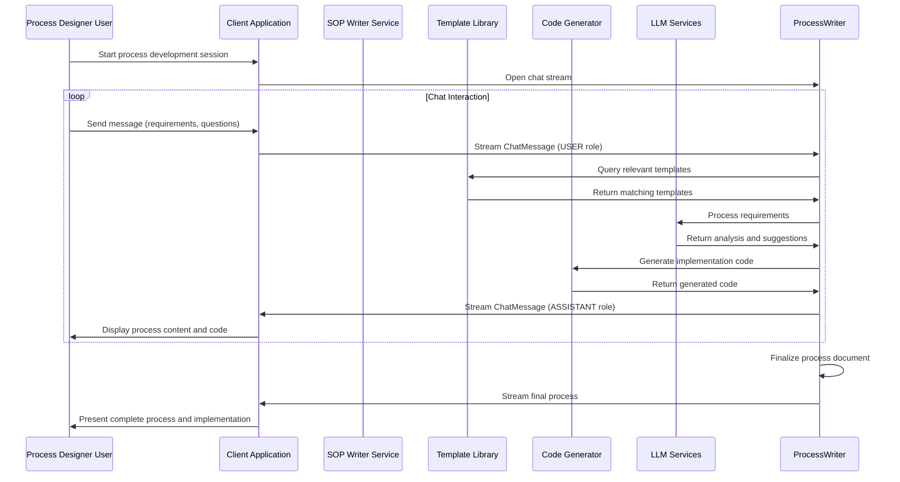

# Process Designer - Process Writing and Process Design

**Namespace**: `threads`  
**Technology**: Python, AI/ML, Agent Frameworks  
**Purpose**: Design and develop Processes through AI-powered chat interface and process design assistance

## Overview

Process Designer is an AI-powered service that specializes in creating Processes through conversational interfaces. It combines the capabilities of process design, process writing, and code generation to provide comprehensive assistance for automation development within the Voyager platform. The service integrates spy-writer functionality for complete process development workflows.

## Responsibilities

### Process Writing and Documentation
- **Process Generation**: Generate comprehensive Processes from natural language requirements
- **Process Documentation**: Create detailed process documentation and workflow descriptions
- **Template Creation**: Create reusable process templates for common automation patterns
- **Documentation Standards**: Ensure processes follow established documentation standards and best practices

### Process Design and Development
- **Multi-Agent Architecture**: Design architecture for multi-agent systems and interactions
- **Agent Behavior Modeling**: Model agent behaviors, capabilities, and interaction patterns
- **Communication Protocols**: Design communication protocols between agents
- **Coordination Mechanisms**: Design coordination and collaboration mechanisms

### Code Generation and Development
- **SPy Program Generation**: Generate complete SPy programs from process requirements
- **Function Generation**: Generate specific functions and code blocks for SPy programs
- **Code Completion**: Provide intelligent code completion and suggestions
- **Integration Code**: Generate code for system integrations and API connections

### Optimization and Analysis
- **Performance Analysis**: Analyze process and code performance characteristics
- **Process Optimization**: Optimize processes for efficiency and reliability
- **Resource Management**: Optimize resource usage and allocation
- **Quality Assurance**: Ensure generated SOPs and code meet quality standards

## Architecture

### Services within Namespace

#### Process Designer Pod
The Process Designer Pod contains the core SOP writing and process design functionality:

##### Process Writer Service
- **Purpose**: Core process writing and process design through chat interface
- **Technology**: Kubernetes Service (K8 Service), Kubernetes Deployment (K8 Deployment), Python application
- **Function**: Provides AI-powered process writing and process design assistance through streaming chat
- **Integration**: Integrates with Threads for persistent chat sessions and with other agent services

**APIs**:
- **gRPC Streaming**: Real-time chat interface following sopwriter.proto specification
- **REST via Gateway**: `/api/v1/process-designer` endpoints for process operations

##### Process Designer gRPC Transcoder
- **Purpose**: Protocol translation and gateway integration
- **Technology**: Envoy application
- **Function**: Translates between REST and gRPC protocols for external API access

**APIs**:
- **REST via Gateway**: Process writing operations accessible through Envoy Gateway

#### Process Template Library
- **Purpose**: Repository of process templates and process patterns
- **Technology**: Knowledge base and template storage
- **Function**: Maintains library of process templates, process patterns, and best practices
- **Access**: Used by Process Designer for template-based process generation

#### Code Generation Engine
- **Purpose**: Advanced AI-powered code generation engine integrated with SOP writing
- **Technology**: Large language models and code analysis tools
- **Function**: Generates high-quality SPy code from process requirements and specifications
- **Capabilities**: Natural language understanding, code synthesis, optimization

## Key Features

### Conversational Process Development
- **Real-time Chat Interface**: Interactive process development through streaming chat
- **Context-Aware Responses**: Maintain conversation context for coherent process development
- **Multi-turn Conversations**: Support complex process development across multiple interactions
- **User Role Support**: Handle USER, ASSISTANT, and SYSTEM roles in conversations

### Intelligent Process Generation
- **Natural Language Processing**: Understand process requirements written in natural language
- **Process Understanding**: Deep understanding of business processes and automation requirements
- **Template-Based Generation**: Use proven process templates for consistent documentation
- **Adaptive Learning**: Learn from user feedback and improve process quality

### Integrated Code Generation
- **Process-to-Code Translation**: Generate SPy code directly from process specifications
- **Implementation Guidance**: Provide step-by-step implementation guidance
- **Code Documentation**: Generate comprehensive code documentation aligned with processes
- **Testing Integration**: Generate test cases that validate process compliance

### Quality Assurance
- **Process Validation**: Validate processes for completeness and clarity
- **Process Analysis**: Analyze processes for efficiency and potential issues
- **Best Practice Compliance**: Ensure processes follow established best practices
- **Version Control**: Track process versions and changes over time

## Data Flow



## API Specifications

### gRPC Streaming API (sopwriter.proto)

```protobuf
syntax = "proto3";
package sopwriter.v1;

import "threads/v1/threads.proto";

message ChatMessage {
  string thread_id = 1;
  threads.v1.Role role = 2; // USER | ASSISTANT | SYSTEM
  string content = 3;       // markdown/plain text
  string client_msg_id = 4; // optional client-generated id
}

service ProcessWriter {
  rpc Chat(stream ChatMessage) returns (stream ChatMessage);
}
```

#### Chat Service Implementation
The Chat service provides bidirectional streaming for real-time process development:

**Request Stream (Client to Server)**:
- **USER messages**: Requirements, questions, feedback from the user
- **SYSTEM messages**: Context updates, configuration changes
- **thread_id**: Links messages to specific process development sessions
- **client_msg_id**: Optional client-generated ID for message correlation

**Response Stream (Server to Client)**:
- **ASSISTANT messages**: Process content, code snippets, guidance, questions
- **Structured responses**: Processes formatted in markdown with embedded code blocks
- **Real-time feedback**: Immediate responses to user inputs

### REST APIs (via Gateway)

#### Process Development Session
```http
POST /api/v1/process-designer/sessions
Content-Type: application/json

{
  "title": "Customer Onboarding Process",
  "requirements": "Create process for automated customer onboarding process",
  "context": {
    "business_domain": "SaaS",
    "complexity": "medium",
    "integrations": ["crm", "email", "billing"]
  }
}

Response: 201 Created
{
  "session_id": "session-uuid",
  "thread_id": "thread-uuid",
  "websocket_url": "wss://api.voyager.com/v1/process-designer/sessions/session-uuid/chat",
  "status": "active"
}
```

#### WebSocket Chat Interface
```javascript
// WebSocket connection for real-time process development
const ws = new WebSocket('wss://api.voyager.com/v1/process-designer/sessions/session-uuid/chat');

// Send user message
ws.send(JSON.stringify({
  thread_id: "thread-uuid",
  role: "USER",
  content: "I need to create a process for processing refund requests",
  client_msg_id: "msg-123"
}));

// Receive assistant response
ws.onmessage = (event) => {
  const message = JSON.parse(event.data);
  // message.role = "ASSISTANT"
  // message.content = "I'll help you create a comprehensive refund processing process..."
};
```

## Process Generation Patterns

### Standard Process Structure
```markdown
# [Process Name] - Process Documentation

## Overview
- **Purpose**: [Clear statement of what this process accomplishes]
- **Scope**: [What is included/excluded]
- **Owner**: [Process owner or team]
- **Last Updated**: [Date]

## Prerequisites
- [Required systems, access, or conditions]
- [Dependencies on other processes]

## Process Steps

### Step 1: [Step Name]
**Objective**: [What this step accomplishes]
**Responsible**: [Who performs this step]
**Duration**: [Expected time]

**Actions**:
1. [Detailed action item]
2. [Another action item]

**Validation**:
- [How to verify step completion]
- [Expected outcomes]

**Code Implementation**:
```spy
# Generated SPy code for this step
define Step1Handler {
  execute(input_data) {
    # Implementation logic
    return processed_data
  }
}
```

### Step 2: [Next Step]
[Continue pattern...]

## Error Handling
- [Common errors and resolutions]
- [Escalation procedures]

## Monitoring and Metrics
- [Key performance indicators]
- [Monitoring requirements]

## Related Documents
- [Links to related processes]
- [Reference materials]
```

### Integration Process Pattern
```markdown
# System Integration Process

## Integration Overview
- **Systems**: [List of integrated systems]
- **Data Flow**: [Direction and type of data]
- **Frequency**: [How often integration runs]

## Authentication Setup
```spy
# Authentication configuration
define IntegrationAuth {
  setup_credentials() {
    api_key = get_secret("external_api_key")
    oauth_token = refresh_oauth_token()
    return AuthConfig(api_key, oauth_token)
  }
}
```

## Data Mapping
| Source Field | Target Field | Transformation |
|--------------|--------------|----------------|
| customer_id  | external_id  | string         |
| email        | contact_email| lowercase      |

## Error Recovery
```spy
# Error handling implementation
define ErrorHandler {
  handle_integration_error(error, context) {
    if error.type == "rate_limit" {
      implement_backoff_strategy()
    } else if error.type == "auth_failure" {
      refresh_authentication()
      retry_operation()
    }
  }
}
```
```

## Integration Points

### With Thread Manager
- **Session Management**: Create and manage process development sessions
- **Conversation Persistence**: Store chat history and process development progress
- **Context Continuity**: Maintain context across multiple sessions
- **Collaboration**: Support multiple users working on processes

### With Agent Service
- **Agent Configuration**: Generate processes for agent setup and configuration
- **Multi-Agent Workflows**: Create processes for multi-agent coordination
- **Agent Templates**: Use agent specifications in process generation
- **Deployment Processes**: Generate processes for agent deployment and management

### With LLM Services
- **AI-Powered Writing**: Leverage LLM services for intelligent process generation
- **Natural Language Processing**: Process and understand user requirements
- **Code Generation**: Generate implementation code from process specifications
- **Documentation Enhancement**: Improve process clarity and completeness

### With Spy Mapper
- **Process Analysis**: Use process maps to inform process creation
- **Workflow Understanding**: Understand existing workflows for process optimization
- **Gap Analysis**: Identify gaps between current and desired processes
- **Process Optimization**: Optimize processes during process development

## Performance and Scaling

### Real-time Performance
- **Streaming Optimization**: Optimize streaming response times for chat interface
- **Context Management**: Efficient management of conversation context
- **Template Caching**: Cache frequently used process templates
- **Incremental Generation**: Generate processes incrementally for better user experience

### Scalability Features
- **Session Isolation**: Isolate process development sessions for concurrent users
- **Resource Management**: Manage computational resources for process generation
- **Load Balancing**: Distribute chat sessions across multiple instances
- **Horizontal Scaling**: Scale service instances based on demand

## Security Considerations

### Chat Security
- **Message Encryption**: Encrypt chat messages in transit and at rest
- **Session Authentication**: Authenticate and authorize process development sessions
- **Access Control**: Control access to sensitive process content
- **Audit Logging**: Log all process development activities

### Content Security
- **Process Confidentiality**: Protect proprietary process information
- **Code Security**: Generate secure code implementations
- **Version Control**: Secure versioning of process documents
- **Data Protection**: Protect sensitive data referenced in processes

## Monitoring and Analytics

### Chat Analytics
- **Session Metrics**: Track process development session duration and success rates
- **User Interaction**: Analyze user interaction patterns during process development
- **Content Quality**: Monitor quality metrics of generated processes
- **Response Time**: Track response times for chat interactions

### Process Quality Metrics
- **Completeness Score**: Measure completeness of generated processes
- **Clarity Index**: Assess clarity and readability of process content
- **Implementation Success**: Track success rate of process implementations
- **User Satisfaction**: Monitor user satisfaction with generated processes

### Usage Analytics
- **Popular Templates**: Identify most used process templates and patterns
- **Feature Adoption**: Track adoption of new process generation features
- **Process Categories**: Analyze types of processes being documented
- **Improvement Opportunities**: Identify opportunities for service enhancement