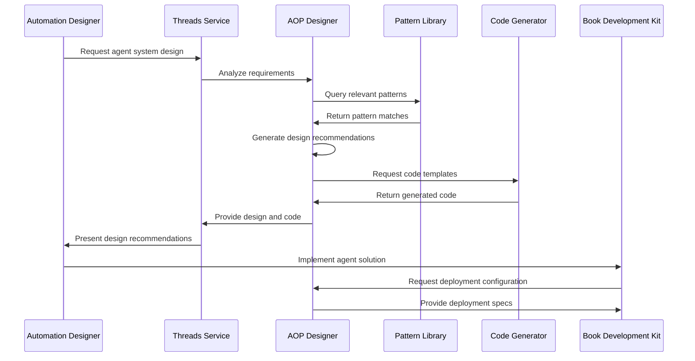

# Process Designer - Process Design and Development

**Namespace**: `threads`  
**Technology**: Python, AI/ML, Agent Frameworks  
**Purpose**: Design and develop Processes and multi-agent coordination systems

## Overview

AOP Designer (Agent Operating Procedure Designer) is an AI-powered service that assists in designing, developing, and optimizing Processes. It provides intelligent assistance for creating multi-agent coordination systems, designing agent interactions, and implementing agent-based automation workflows within the Voyager platform.

## Responsibilities

### Agent System Design
- **Multi-Agent Architecture**: Design architecture for multi-agent systems and interactions
- **Agent Behavior Modeling**: Model agent behaviors, capabilities, and interaction patterns
- **Communication Protocols**: Design communication protocols between agents
- **Coordination Mechanisms**: Design coordination and collaboration mechanisms

### Development Assistance
- **Code Generation**: Generate agent code and implementation templates
- **Pattern Recognition**: Identify and suggest proven agent design patterns
- **Best Practices**: Provide guidance on agent development best practices
- **Testing Strategies**: Suggest testing approaches for agent systems

### Optimization and Analysis
- **Performance Analysis**: Analyze agent system performance and bottlenecks
- **Interaction Optimization**: Optimize agent interactions and communication
- **Resource Management**: Optimize agent resource usage and allocation
- **Scalability Planning**: Plan for agent system scalability and growth

## Architecture

### Services within Namespace

#### AOP Designer Pod
The AOP Designer Pod contains the core agent design functionality:

##### AOP Designer Service
- **Purpose**: Core agent-oriented programming design and assistance
- **Technology**: Kubernetes Service (K8 Service), Kubernetes Deployment (K8 Deployment), Python application
- **Function**: Provides AI-powered assistance for agent system design and development
- **Integration**: Integrates with Threads for chat-based interaction and with other agent services

**APIs**:
- **gRPC**: Agent design consultation, code generation, pattern analysis
- **REST via Gateway**: `/api/v1/aop-designer` endpoints for design assistance

##### AOP Designer gRPC Transcoder
- **Purpose**: Protocol translation and gateway integration
- **Technology**: Envoy application
- **Function**: Translates between REST and gRPC protocols for external API access

**APIs**:
- **REST via Gateway**: Agent design operations accessible through Envoy Gateway

#### Agent Pattern Library
- **Purpose**: Repository of proven agent design patterns and templates
- **Technology**: Knowledge base and pattern storage
- **Function**: Maintains library of agent patterns, templates, and best practices
- **Access**: Used by AOP Designer for pattern suggestions and code generation

## Key Features

### Intelligent Design Assistance
- **Requirements Analysis**: Analyze automation requirements and suggest agent-based solutions
- **Architecture Recommendations**: Recommend appropriate agent architectures and patterns
- **Component Identification**: Identify potential agents and their responsibilities
- **Interaction Design**: Design agent interaction patterns and communication flows

### Code Generation and Templates
- **Agent Templates**: Generate agent implementation templates based on requirements
- **Communication Code**: Generate code for inter-agent communication and coordination
- **Configuration Files**: Generate configuration files for agent deployment
- **Test Scaffolding**: Generate test frameworks and validation code

### Pattern Recognition and Suggestions
- **Design Pattern Matching**: Match requirements to proven design patterns
- **Anti-Pattern Detection**: Detect and warn about potential anti-patterns
- **Best Practice Recommendations**: Suggest best practices for agent development
- **Architecture Reviews**: Provide automated architecture review and feedback

### Multi-Agent System Support
- **Agent Orchestration**: Design agent orchestration and workflow patterns
- **Load Balancing**: Design load balancing strategies for agent workloads
- **Fault Tolerance**: Design fault tolerance and recovery mechanisms
- **State Management**: Design state management approaches for agent systems

## Data Flow



## API Specifications

### gRPC APIs

#### Design Consultation
```protobuf
service AOPDesigner {
  rpc AnalyzeRequirements(AnalyzeRequirementsRequest) returns (AnalyzeRequirementsResponse);
  rpc DesignAgentSystem(DesignAgentSystemRequest) returns (DesignAgentSystemResponse);
  rpc GenerateAgentCode(GenerateAgentCodeRequest) returns (GenerateAgentCodeResponse);
  rpc OptimizeAgentSystem(OptimizeAgentSystemRequest) returns (OptimizeAgentSystemResponse);
  rpc ValidateDesign(ValidateDesignRequest) returns (ValidateDesignResponse);
}

message AnalyzeRequirementsRequest {
  string project_id = 1;
  string requirements_text = 2;
  repeated string existing_systems = 3;
  map<string, string> constraints = 4;
}

message DesignAgentSystemRequest {
  string project_id = 1;
  AgentSystemRequirements requirements = 2;
  DesignPreferences preferences = 3;
  repeated string target_platforms = 4;
}

message AgentSystemRequirements {
  repeated AgentRole roles = 1;
  repeated InteractionPattern interactions = 2;
  repeated string business_rules = 3;
  PerformanceRequirements performance = 4;
}

message AgentRole {
  string name = 1;
  string description = 2;
  repeated string capabilities = 3;
  repeated string responsibilities = 4;
  map<string, string> properties = 5;
}
```

#### Code Generation
```protobuf
rpc GenerateAgentCode(GenerateAgentCodeRequest) returns (GenerateAgentCodeResponse);
rpc GenerateTestCode(GenerateTestCodeRequest) returns (GenerateTestCodeResponse);

message GenerateAgentCodeRequest {
  string agent_specification = 1;
  string target_language = 2;
  string framework = 3;
  repeated string dependencies = 4;
  CodeStyle style_preferences = 5;
}

message GenerateAgentCodeResponse {
  repeated GeneratedFile files = 1;
  repeated string dependencies = 2;
  string documentation = 3;
  repeated ValidationIssue issues = 4;
}

message GeneratedFile {
  string filename = 1;
  string content = 2;
  string file_type = 3;
  map<string, string> metadata = 4;
}
```

### REST APIs (via Gateway)

#### Design Consultation
```http
POST /api/v1/aop-designer/analyze-requirements
Content-Type: application/json

{
  "project_id": "automation-project-123",
  "requirements_text": "Automate customer support ticket routing with intelligent prioritization and escalation",
  "existing_systems": ["zendesk", "salesforce", "slack"],
  "constraints": {
    "response_time": "< 30 seconds",
    "availability": "99.9%",
    "languages": ["python", "javascript"]
  }
}

Response: 200 OK
{
  "analysis_id": "analysis-uuid",
  "recommended_agents": [
    {
      "name": "TicketClassifier",
      "role": "Classify and categorize incoming tickets",
      "capabilities": ["nlp", "classification", "priority_scoring"],
      "estimated_complexity": "medium"
    },
    {
      "name": "EscalationManager",
      "role": "Handle ticket escalation and routing",
      "capabilities": ["rule_engine", "notification", "workflow"],
      "estimated_complexity": "low"
    }
  ],
  "architecture_recommendations": {
    "pattern": "pipeline",
    "communication": "message_queue",
    "state_management": "distributed"
  }
}
```

#### Code Generation
```http
POST /api/v1/aop-designer/generate-code
Content-Type: application/json

{
  "agent_specification": {
    "name": "TicketClassifier",
    "type": "classifier",
    "input_channels": ["webhook", "email"],
    "output_channels": ["ticket_queue"],
    "capabilities": ["nlp", "priority_scoring"]
  },
  "target_language": "python",
  "framework": "voyager-agent",
  "style_preferences": {
    "async": true,
    "typing": "strict",
    "documentation": "comprehensive"
  }
}

Response: 201 Created
{
  "generation_id": "gen-uuid",
  "files": [
    {
      "filename": "ticket_classifier.py",
      "content": "# Generated TicketClassifier Agent\nclass TicketClassifier(VoyagerAgent):\n    ...",
      "file_type": "python"
    },
    {
      "filename": "test_ticket_classifier.py",
      "content": "# Generated tests for TicketClassifier\nimport pytest\n...",
      "file_type": "python_test"
    }
  ],
  "documentation": "Generated agent for ticket classification with NLP capabilities...",
  "next_steps": [
    "Review generated code",
    "Customize business logic",
    "Run tests",
    "Deploy to staging"
  ]
}
```

## Agent Design Patterns

### Communication Patterns

#### Message Passing Pattern
```python
# Example generated code for message passing
class MessageBasedAgent(VoyagerAgent):
    async def handle_message(self, message: AgentMessage):
        # Process message
        result = await self.process(message.payload)
        
        # Send response
        await self.send_message(
            target=message.sender,
            payload=result,
            message_type="response"
        )
```

#### Event-Driven Pattern
```python
# Example generated code for event-driven agents
class EventDrivenAgent(VoyagerAgent):
    @event_handler("ticket.created")
    async def on_ticket_created(self, event: TicketCreatedEvent):
        # Handle ticket creation event
        classification = await self.classify_ticket(event.ticket)
        
        # Emit classification event
        await self.emit_event(
            "ticket.classified",
            TicketClassifiedEvent(
                ticket_id=event.ticket.id,
                classification=classification
            )
        )
```

### Coordination Patterns

#### Pipeline Pattern
```yaml
# Generated pipeline configuration
agent_pipeline:
  name: "ticket_processing_pipeline"
  stages:
    - agent: "TicketReceiver"
      timeout: 5s
    - agent: "TicketClassifier"
      timeout: 30s
      retry_policy:
        max_attempts: 3
        backoff: exponential
    - agent: "TicketRouter"
      timeout: 10s
  error_handling:
    strategy: "circuit_breaker"
    fallback_agent: "ErrorHandler"
```

## Integration Points

### With Threads Service
- **Chat Interface**: Provides chat-based interface for design consultation
- **Conversation Context**: Maintains conversation context for ongoing design sessions
- **User Preferences**: Integrates with user preferences and design history
- **Collaboration**: Supports collaborative design sessions with multiple users

### With BDK (Book Development Kit)
- **Agent Deployment**: Integrates with BDK for agent deployment and lifecycle management
- **Configuration Management**: Provides agent configuration templates for BDK
- **Testing Integration**: Integrates with BDK testing frameworks
- **Version Control**: Supports version control for agent designs and implementations

### With Other Agent Services
- **Spy Mapper Integration**: Collaborates with Spy Mapper for process mapping
- **Spy Writer Integration**: Collaborates with Spy Writer for code generation
- **Pattern Sharing**: Shares design patterns and best practices with other agent services

### With LLM Services
- **AI-Powered Analysis**: Uses LLM services for intelligent requirement analysis
- **Code Generation**: Leverages LLM for advanced code generation capabilities
- **Natural Language Processing**: Uses NLP capabilities for requirement understanding
- **Documentation Generation**: Uses LLM for generating comprehensive documentation

## Performance and Scaling

### Response Time Optimization
- **Pattern Caching**: Cache frequently used design patterns and templates
- **Code Template Cache**: Cache generated code templates for reuse
- **Parallel Processing**: Process multiple design requests in parallel
- **Incremental Generation**: Support incremental code generation and updates

### Scalability Features
- **Horizontal Scaling**: Scale AOP Designer instances based on demand
- **Load Balancing**: Distribute design requests across multiple instances
- **Resource Management**: Efficient resource management for code generation
- **Stateless Design**: Stateless design for easy scaling and deployment

### Quality Assurance
- **Design Validation**: Validate generated designs against best practices
- **Code Quality Checks**: Perform code quality checks on generated code
- **Pattern Verification**: Verify pattern applicability and correctness
- **Performance Estimation**: Estimate performance characteristics of designed systems

## Security Considerations

### Code Security
- **Secure Code Generation**: Generate secure code following security best practices
- **Vulnerability Scanning**: Scan generated code for potential vulnerabilities
- **Access Control**: Control access to sensitive design patterns and templates
- **Audit Logging**: Log all design activities and code generation requests

### Data Protection
- **Requirements Privacy**: Protect sensitive requirement information
- **Design Confidentiality**: Ensure confidentiality of proprietary designs
- **Code Ownership**: Maintain clear code ownership and licensing
- **Intellectual Property**: Respect intellectual property rights in patterns and code

## Monitoring and Observability

### Design Analytics
- **Design Success Rate**: Track success rate of generated designs
- **Pattern Usage**: Monitor usage of different design patterns
- **User Satisfaction**: Track user satisfaction with design recommendations
- **Code Quality Metrics**: Monitor quality metrics of generated code

### Performance Monitoring
- **Response Time**: Monitor design consultation response times
- **Generation Speed**: Track code generation speed and efficiency
- **Resource Usage**: Monitor computational resource usage
- **Error Rates**: Track error rates and failure modes

### Usage Analytics
- **Popular Patterns**: Identify most popular design patterns and templates
- **User Behavior**: Analyze user interaction patterns and preferences
- **Feature Adoption**: Track adoption of new features and capabilities
- **Improvement Opportunities**: Identify opportunities for service improvement
