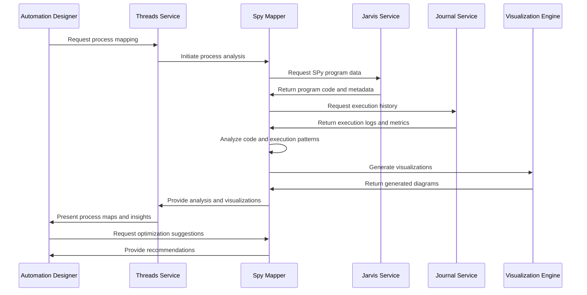

# Spy Mapper - SPy Program Analysis and Process Mapping

**Namespace**: `threads`  
**Technology**: Python, AI/ML, Process Analysis  
**Purpose**: Analyze and map SPy programs, processes, and execution flows for optimization and understanding

## Overview

Spy Mapper is an AI-powered service that specializes in analyzing SPy programs and mapping complex business processes. It provides intelligent assistance for understanding existing automation flows, identifying optimization opportunities, and creating visual representations of process execution patterns within the Voyager platform.

## Responsibilities

### SPy Program Analysis
- **Code Analysis**: Analyze SPy program code structure, logic, and execution patterns
- **Dependency Mapping**: Map dependencies between SPy programs and external systems
- **Execution Flow Mapping**: Map execution flows and decision points within programs
- **Performance Analysis**: Analyze performance characteristics and bottlenecks

### Process Mapping
- **Business Process Mapping**: Map high-level business processes to SPy implementations
- **Data Flow Analysis**: Analyze data flow patterns through processes
- **Integration Point Identification**: Identify integration points with external systems
- **Process Optimization**: Identify opportunities for process optimization and improvement

### Visualization and Documentation
- **Process Diagrams**: Generate visual process diagrams and flowcharts
- **Execution Maps**: Create execution maps showing program flow and decision points
- **Dependency Graphs**: Generate dependency graphs for complex system interactions
- **Documentation Generation**: Generate comprehensive documentation for mapped processes

## Architecture

### Services within Namespace

#### Spy Mapper Pod
The Spy Mapper Pod contains the core process mapping functionality:

##### Spy Mapper Service
- **Purpose**: Core SPy program analysis and process mapping
- **Technology**: Kubernetes Service (K8 Service), Kubernetes Deployment (K8 Deployment), Python application
- **Function**: Provides AI-powered analysis and mapping of SPy programs and processes
- **Integration**: Integrates with Jarvis for execution data and Journal for historical analysis

**APIs**:
- **gRPC**: Program analysis, process mapping, visualization generation
- **REST via Gateway**: `/api/v1/spy-mapper` endpoints for mapping services

##### Spy Mapper gRPC Transcoder
- **Purpose**: Protocol translation and gateway integration
- **Technology**: Envoy application
- **Function**: Translates between REST and gRPC protocols for external API access

**APIs**:
- **REST via Gateway**: Process mapping operations accessible through Envoy Gateway

#### Analysis Engine
- **Purpose**: Advanced analysis engine for code and process analysis
- **Technology**: Machine learning models and static analysis tools
- **Function**: Performs deep analysis of SPy programs and execution patterns
- **Capabilities**: Pattern recognition, complexity analysis, optimization suggestions

#### Visualization Engine
- **Purpose**: Generate visual representations of processes and execution flows
- **Technology**: Graph generation and visualization libraries
- **Function**: Creates diagrams, flowcharts, and interactive visualizations
- **Output Formats**: SVG, PNG, PDF, interactive web formats

## Key Features

### Intelligent Code Analysis
- **Static Analysis**: Perform static analysis of SPy program code
- **Dynamic Analysis**: Analyze runtime behavior and execution patterns
- **Complexity Metrics**: Calculate complexity metrics and maintainability scores
- **Quality Assessment**: Assess code quality and identify improvement areas

### Process Discovery
- **Automatic Process Discovery**: Automatically discover processes from execution logs
- **Pattern Recognition**: Recognize common process patterns and workflows
- **Variant Analysis**: Identify process variants and execution branches
- **Bottleneck Detection**: Detect performance bottlenecks and inefficiencies

### Visual Mapping
- **Interactive Diagrams**: Generate interactive process diagrams
- **Multi-Level Views**: Provide different levels of detail for complex processes
- **Real-Time Updates**: Update visualizations based on real-time execution data
- **Customizable Views**: Customize visualizations based on user preferences

### Optimization Recommendations
- **Performance Optimization**: Suggest performance improvements and optimizations
- **Process Simplification**: Recommend process simplification opportunities
- **Resource Optimization**: Identify resource optimization opportunities
- **Best Practice Suggestions**: Suggest adherence to best practices and patterns

## Data Flow



## API Specifications

### gRPC APIs

#### Program Analysis
```protobuf
service SpyMapper {
  rpc AnalyzeSpyProgram(AnalyzeSpyProgramRequest) returns (AnalyzeSpyProgramResponse);
  rpc MapProcess(MapProcessRequest) returns (MapProcessResponse);
  rpc GenerateVisualization(GenerateVisualizationRequest) returns (GenerateVisualizationResponse);
  rpc OptimizeProcess(OptimizeProcessRequest) returns (OptimizeProcessResponse);
  rpc DiscoverProcesses(DiscoverProcessesRequest) returns (DiscoverProcessesResponse);
}

message AnalyzeSpyProgramRequest {
  string program_id = 1;
  string source_code = 2;
  AnalysisOptions options = 3;
  repeated string focus_areas = 4;
}

message AnalyzeSpyProgramResponse {
  string analysis_id = 1;
  ProgramAnalysis analysis = 2;
  repeated AnalysisInsight insights = 3;
  ComplexityMetrics complexity = 4;
  repeated OptimizationSuggestion suggestions = 5;
}

message ProgramAnalysis {
  repeated FunctionNode functions = 1;
  repeated DataFlow data_flows = 2;
  repeated ControlFlow control_flows = 3;
  repeated ExternalDependency dependencies = 4;
}

message FunctionNode {
  string name = 1;
  string description = 2;
  repeated string inputs = 3;
  repeated string outputs = 4;
  ComplexityMetrics complexity = 5;
  map<string, string> metadata = 6;
}
```

#### Process Mapping
```protobuf
rpc MapProcess(MapProcessRequest) returns (MapProcessResponse);
rpc GenerateProcessDiagram(GenerateProcessDiagramRequest) returns (GenerateProcessDiagramResponse);

message MapProcessRequest {
  string process_id = 1;
  repeated string spy_programs = 2;
  TimeRange analysis_period = 3;
  MappingOptions options = 4;
}

message MapProcessResponse {
  string mapping_id = 1;
  ProcessMap process_map = 2;
  repeated ProcessInsight insights = 3;
  PerformanceMetrics performance = 4;
  repeated ProcessVariant variants = 5;
}

message ProcessMap {
  repeated ProcessStep steps = 1;
  repeated ProcessFlow flows = 2;
  repeated DecisionPoint decision_points = 3;
  repeated IntegrationPoint integrations = 4;
}

message ProcessStep {
  string id = 1;
  string name = 2;
  string description = 3;
  string type = 4; // manual, automated, decision, integration
  Duration average_duration = 5;
  repeated string inputs = 6;
  repeated string outputs = 7;
}
```

### REST APIs (via Gateway)

#### Program Analysis
```http
POST /api/v1/spy-mapper/analyze-program
Content-Type: application/json

{
  "program_id": "customer-support-automation",
  "source_code": "# SPy program code here",
  "options": {
    "include_performance_analysis": true,
    "include_dependency_analysis": true,
    "generate_documentation": true
  },
  "focus_areas": ["error_handling", "performance", "maintainability"]
}

Response: 200 OK
{
  "analysis_id": "analysis-uuid",
  "analysis": {
    "functions": [
      {
        "name": "process_ticket",
        "description": "Main ticket processing function",
        "complexity": {
          "cyclomatic_complexity": 8,
          "cognitive_complexity": 12,
          "maintainability_index": 75
        },
        "performance": {
          "average_execution_time": "2.5s",
          "memory_usage": "45MB"
        }
      }
    ],
    "data_flows": [
      {
        "source": "ticket_input",
        "target": "classification_engine",
        "data_type": "ticket_data",
        "transformation": "normalization"
      }
    ]
  },
  "insights": [
    {
      "type": "optimization",
      "message": "Function 'process_ticket' has high complexity, consider breaking into smaller functions",
      "severity": "medium",
      "suggested_action": "refactor"
    }
  ]
}
```

#### Process Mapping
```http
POST /api/v1/spy-mapper/map-process
Content-Type: application/json

{
  "process_id": "customer-onboarding",
  "spy_programs": ["onboarding-step-1", "onboarding-step-2", "onboarding-validation"],
  "analysis_period": {
    "start_date": "2024-01-01T00:00:00Z",
    "end_date": "2024-01-31T23:59:59Z"
  },
  "options": {
    "include_variants": true,
    "include_performance_metrics": true,
    "generate_diagram": true
  }
}

Response: 200 OK
{
  "mapping_id": "mapping-uuid",
  "process_map": {
    "steps": [
      {
        "id": "initial_data_collection",
        "name": "Collect Initial Customer Data",
        "type": "automated",
        "average_duration": "30s",
        "success_rate": 0.98
      },
      {
        "id": "validation_check",
        "name": "Validate Customer Information",
        "type": "automated",
        "average_duration": "15s",
        "success_rate": 0.95
      }
    ],
    "flows": [
      {
        "from": "initial_data_collection",
        "to": "validation_check",
        "condition": "data_complete",
        "frequency": 0.98
      }
    ]
  },
  "performance": {
    "average_completion_time": "5.2 minutes",
    "success_rate": 0.92,
    "most_common_failure_point": "validation_check"
  },
  "diagram_url": "/api/v1/spy-mapper/diagrams/mapping-uuid"
}
```

#### Visualization Generation
```http
POST /api/v1/spy-mapper/generate-visualization
Content-Type: application/json

{
  "mapping_id": "mapping-uuid",
  "visualization_type": "process_flow",
  "format": "svg",
  "options": {
    "include_metrics": true,
    "show_decision_points": true,
    "highlight_bottlenecks": true,
    "color_scheme": "performance"
  }
}

Response: 200 OK
{
  "visualization_id": "viz-uuid",
  "download_url": "/api/v1/spy-mapper/visualizations/viz-uuid/download",
  "preview_url": "/api/v1/spy-mapper/visualizations/viz-uuid/preview",
  "metadata": {
    "format": "svg",
    "size": "1024x768",
    "created_at": "2024-01-15T10:30:00Z"
  }
}
```

## Analysis Capabilities

### Static Code Analysis
- **Syntax Analysis**: Parse and analyze SPy program syntax and structure
- **Control Flow Analysis**: Analyze control flow patterns and complexity
- **Data Flow Analysis**: Track data flow through program execution
- **Dependency Analysis**: Identify and map external dependencies

### Dynamic Analysis
- **Execution Pattern Analysis**: Analyze runtime execution patterns from logs
- **Performance Profiling**: Profile performance characteristics and bottlenecks
- **Resource Usage Analysis**: Analyze memory, CPU, and I/O usage patterns
- **Error Pattern Analysis**: Identify common error patterns and failure modes

### Process Discovery
- **Automatic Process Extraction**: Extract processes from execution logs
- **Process Variant Detection**: Detect different execution variants of the same process
- **Process Mining**: Apply process mining techniques to discover hidden patterns
- **Conformance Checking**: Check process conformance against expected models

## Visualization Types

### Process Flow Diagrams
```mermaid
# Example generated process flow
flowchart TD
    A[Start: Ticket Received] --> B{Validate Ticket}
    B -->|Valid| C[Classify Ticket]
    B -->|Invalid| D[Reject Ticket]
    C --> E{Priority Level}
    E -->|High| F[Escalate Immediately]
    E -->|Medium| G[Route to Queue]
    E -->|Low| H[Schedule for Later]
    F --> I[Notify Manager]
    G --> J[Assign to Agent]
    H --> K[Add to Backlog]
```

### Execution Heat Maps
- **Performance Heat Maps**: Show performance hotspots and bottlenecks
- **Error Heat Maps**: Visualize error frequency and distribution
- **Usage Heat Maps**: Show most frequently executed paths
- **Resource Heat Maps**: Visualize resource usage patterns

### Dependency Graphs
- **Service Dependencies**: Show dependencies between different services
- **Data Dependencies**: Map data dependencies and flow patterns
- **Temporal Dependencies**: Show time-based dependencies and sequences
- **Circular Dependencies**: Identify and highlight circular dependencies

## Integration Points

### With Jarvis (SPy Execution Engine)
- **Execution Data**: Access SPy program execution data and metadata
- **Performance Metrics**: Retrieve performance metrics and execution statistics
- **Code Repository**: Access SPy program source code and versions
- **Runtime Information**: Get runtime environment and configuration data

### With Business Journal (Data Service)
- **Execution Logs**: Access historical execution logs and telemetry
- **Performance History**: Retrieve historical performance data
- **Error Logs**: Access error logs and exception information
- **Trend Analysis**: Perform trend analysis on historical data

### With Threads Service
- **Chat Interface**: Provide chat-based interface for mapping requests
- **Interactive Exploration**: Support interactive exploration of process maps
- **Collaborative Analysis**: Enable collaborative process analysis sessions
- **Sharing Capabilities**: Share process maps and insights with team members

### With BDK (Book Development Kit)
- **Process Documentation**: Generate process documentation for BDK
- **Optimization Recommendations**: Provide optimization recommendations for book development
- **Template Generation**: Generate process templates for common patterns
- **Best Practice Guidelines**: Provide best practice guidelines based on analysis

## Performance Optimization

### Analysis Performance
- **Incremental Analysis**: Support incremental analysis for large codebases
- **Parallel Processing**: Process multiple programs in parallel
- **Caching**: Cache analysis results for frequently analyzed programs
- **Optimization Algorithms**: Use efficient algorithms for complex analysis tasks

### Visualization Performance
- **Progressive Rendering**: Render complex diagrams progressively
- **Level of Detail**: Provide different levels of detail based on zoom level
- **Streaming Updates**: Stream updates for real-time visualizations
- **Compression**: Compress large diagrams for efficient transfer

### Scalability Features
- **Horizontal Scaling**: Scale analysis services across multiple instances
- **Load Balancing**: Distribute analysis workload efficiently
- **Resource Management**: Manage computational resources for analysis tasks
- **Queue Management**: Manage analysis queues for fair resource allocation

## Quality Assurance

### Analysis Accuracy
- **Validation Rules**: Apply validation rules to ensure analysis accuracy
- **Cross-Validation**: Cross-validate results using multiple analysis methods
- **Expert Review**: Support expert review of analysis results
- **Feedback Loop**: Incorporate user feedback to improve analysis quality

### Visualization Quality
- **Layout Algorithms**: Use advanced layout algorithms for clear visualizations
- **Color Theory**: Apply color theory principles for effective visualizations
- **Accessibility**: Ensure visualizations are accessible to all users
- **Interactive Features**: Provide interactive features for exploration

## Security and Privacy

### Data Protection
- **Code Privacy**: Protect sensitive code information during analysis
- **Execution Privacy**: Ensure privacy of execution logs and performance data
- **Access Control**: Control access to analysis results and visualizations
- **Data Retention**: Implement appropriate data retention policies

### Secure Analysis
- **Sandboxed Analysis**: Perform analysis in sandboxed environments
- **Input Validation**: Validate all inputs to prevent security issues
- **Output Sanitization**: Sanitize outputs to prevent information leakage
- **Audit Logging**: Log all analysis activities for security auditing

## Monitoring and Analytics

### Usage Monitoring
- **Analysis Requests**: Monitor frequency and types of analysis requests
- **User Behavior**: Track user interaction patterns with visualizations
- **Performance Metrics**: Monitor analysis and visualization performance
- **Error Tracking**: Track and analyze errors and failures

### Insight Generation
- **Pattern Discovery**: Discover patterns in analysis usage and results
- **Trend Analysis**: Analyze trends in process evolution and optimization
- **Recommendation Effectiveness**: Track effectiveness of optimization recommendations
- **User Satisfaction**: Monitor user satisfaction with analysis results
