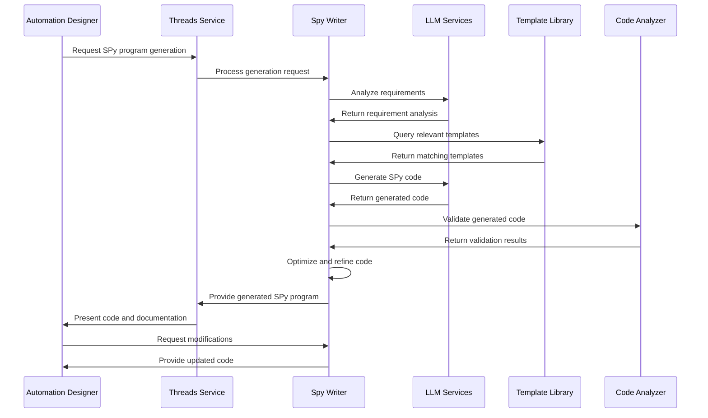

# Spy Writer - SPy Program Generation and Code Development

**Namespace**: `threads`  
**Technology**: Python, AI/ML, Code Generation  
**Purpose**: Generate and develop SPy programs through AI-powered code generation and development assistance

## Overview

Spy Writer is an AI-powered service that specializes in generating SPy programs and providing intelligent code development assistance. It leverages advanced AI models to understand requirements, generate efficient SPy code, and provide guidance on best practices for automation development within the Voyager platform.

## Responsibilities

### Code Generation
- **SPy Program Generation**: Generate complete SPy programs from natural language requirements
- **Function Generation**: Generate specific functions and code blocks for SPy programs
- **Template Creation**: Create reusable templates for common automation patterns
- **Code Completion**: Provide intelligent code completion and suggestions

### Development Assistance
- **Requirement Analysis**: Analyze and understand automation requirements
- **Architecture Guidance**: Provide guidance on SPy program architecture and design
- **Best Practice Recommendations**: Suggest best practices for SPy development
- **Code Review**: Perform automated code review and provide improvement suggestions

### Optimization and Enhancement
- **Performance Optimization**: Optimize SPy programs for better performance
- **Code Refactoring**: Suggest and implement code refactoring improvements
- **Error Handling**: Generate robust error handling and recovery code
- **Testing Code**: Generate comprehensive test cases and validation code

## Architecture

### Services within Namespace

#### Spy Writer Pod
The Spy Writer Pod contains the core code generation functionality:

##### Spy Writer Service
- **Purpose**: Core SPy program generation and development assistance
- **Technology**: Kubernetes Service (K8 Service), Kubernetes Deployment (K8 Deployment), Python application
- **Function**: Provides AI-powered SPy code generation and development guidance
- **Integration**: Integrates with LLM services for advanced code generation capabilities

**APIs**:
- **gRPC**: Code generation, requirement analysis, development assistance
- **REST via Gateway**: `/api/v1/spy-writer` endpoints for code generation services

##### Spy Writer gRPC Transcoder
- **Purpose**: Protocol translation and gateway integration
- **Technology**: Envoy application
- **Function**: Translates between REST and gRPC protocols for external API access

**APIs**:
- **REST via Gateway**: Code generation operations accessible through Envoy Gateway

#### Code Generation Engine
- **Purpose**: Advanced AI-powered code generation engine
- **Technology**: Large language models and code analysis tools
- **Function**: Generates high-quality SPy code from requirements and specifications
- **Capabilities**: Natural language understanding, code synthesis, optimization

#### Template Library
- **Purpose**: Repository of SPy program templates and patterns
- **Technology**: Template storage and management system
- **Function**: Maintains library of proven SPy patterns and code templates
- **Access**: Used by Spy Writer for template-based code generation

#### Code Analyzer
- **Purpose**: Static and dynamic code analysis for quality assurance
- **Technology**: Code analysis tools and quality metrics
- **Function**: Analyzes generated code for quality, performance, and correctness
- **Features**: Syntax validation, performance analysis, best practice checking

## Key Features

### Intelligent Code Generation
- **Natural Language Processing**: Understand requirements written in natural language
- **Context-Aware Generation**: Generate code that considers existing codebase context
- **Multi-Language Support**: Support for multiple programming languages and SPy dialects
- **Incremental Generation**: Generate code incrementally with user feedback

### Advanced AI Capabilities
- **Requirement Understanding**: Deep understanding of automation requirements and business logic
- **Pattern Recognition**: Recognize and apply proven automation patterns
- **Code Synthesis**: Synthesize complex code structures from high-level specifications
- **Adaptive Learning**: Learn from user feedback and improve generation quality

### Quality Assurance
- **Code Validation**: Validate generated code for syntax and semantic correctness
- **Performance Analysis**: Analyze generated code for performance characteristics
- **Security Scanning**: Scan generated code for potential security vulnerabilities
- **Best Practice Compliance**: Ensure generated code follows established best practices

### Development Support
- **Interactive Development**: Support interactive development with real-time feedback
- **Documentation Generation**: Generate comprehensive documentation for SPy programs
- **Test Case Generation**: Generate comprehensive test cases and validation scenarios
- **Debugging Assistance**: Provide debugging assistance and error diagnosis

## Data Flow



## API Specifications

### gRPC APIs

#### Code Generation
```protobuf
service SpyWriter {
  rpc GenerateSpyProgram(GenerateSpyProgramRequest) returns (GenerateSpyProgramResponse);
  rpc AnalyzeRequirements(AnalyzeRequirementsRequest) returns (AnalyzeRequirementsResponse);
  rpc OptimizeCode(OptimizeCodeRequest) returns (OptimizeCodeResponse);
  rpc GenerateTests(GenerateTestsRequest) returns (GenerateTestsResponse);
  rpc ValidateCode(ValidateCodeRequest) returns (ValidateCodeResponse);
}

message GenerateSpyProgramRequest {
  string project_id = 1;
  string requirements = 2;
  GenerationOptions options = 3;
  repeated string existing_programs = 4;
  map<string, string> context = 5;
}

message GenerateSpyProgramResponse {
  string generation_id = 1;
  GeneratedProgram program = 2;
  repeated GenerationInsight insights = 3;
  QualityMetrics quality = 4;
  repeated string suggestions = 5;
}

message GeneratedProgram {
  string name = 1;
  string description = 2;
  string source_code = 3;
  repeated GeneratedFunction functions = 4;
  repeated string dependencies = 5;
  string documentation = 6;
  repeated TestCase test_cases = 7;
}

message GenerationOptions {
  string target_language = 1;
  string complexity_level = 2; // simple, intermediate, advanced
  bool include_error_handling = 3;
  bool include_logging = 4;
  bool include_tests = 5;
  repeated string optimization_targets = 6; // performance, readability, maintainability
}
```

#### Code Analysis and Optimization
```protobuf
rpc OptimizeCode(OptimizeCodeRequest) returns (OptimizeCodeResponse);
rpc RefactorCode(RefactorCodeRequest) returns (RefactorCodeResponse);

message OptimizeCodeRequest {
  string source_code = 1;
  repeated string optimization_goals = 2;
  PerformanceConstraints constraints = 3;
  bool preserve_functionality = 4;
}

message OptimizeCodeResponse {
  string optimized_code = 1;
  repeated Optimization optimizations = 2;
  PerformanceImpact performance_impact = 3;
  repeated string warnings = 4;
}

message Optimization {
  string type = 1; // performance, memory, readability
  string description = 2;
  string original_snippet = 3;
  string optimized_snippet = 4;
  float impact_score = 5;
}

message PerformanceImpact {
  float execution_time_improvement = 1;
  float memory_usage_improvement = 2;
  float maintainability_score = 3;
  float reliability_score = 4;
}
```

### REST APIs (via Gateway)

#### Program Generation
```http
POST /api/v1/spy-writer/generate-program
Content-Type: application/json

{
  "project_id": "automation-project-123",
  "requirements": "Create a SPy program that processes customer support tickets from Zendesk, classifies them by urgency and topic, and routes them to appropriate support teams",
  "options": {
    "target_language": "spy",
    "complexity_level": "intermediate",
    "include_error_handling": true,
    "include_logging": true,
    "include_tests": true,
    "optimization_targets": ["performance", "maintainability"]
  },
  "context": {
    "existing_systems": "zendesk, slack, jira",
    "team_size": "5",
    "expected_volume": "1000 tickets/day"
  }
}

Response: 201 Created
{
  "generation_id": "gen-uuid",
  "program": {
    "name": "TicketProcessingProgram",
    "description": "Automated ticket processing and routing system",
    "source_code": "# Generated SPy Program\ndefine TicketProcessor {\n  # Main processing logic\n  process_ticket(ticket) {\n    classification = classify_ticket(ticket)\n    urgency = determine_urgency(ticket)\n    route_ticket(ticket, classification, urgency)\n  }\n  \n  # Classification logic\n  classify_ticket(ticket) {\n    # NLP-based classification\n    ...\n  }\n}",
    "functions": [
      {
        "name": "process_ticket",
        "description": "Main ticket processing function",
        "parameters": ["ticket"],
        "return_type": "ProcessingResult"
      }
    ],
    "dependencies": ["zendesk_api", "nlp_classifier", "routing_engine"],
    "documentation": "# Ticket Processing Program\n\nThis program automates the processing of customer support tickets...",
    "test_cases": [
      {
        "name": "test_high_priority_ticket",
        "description": "Test processing of high priority tickets",
        "input": "sample_high_priority_ticket",
        "expected_output": "escalated_to_senior_team"
      }
    ]
  },
  "quality": {
    "code_quality_score": 0.92,
    "maintainability_index": 85,
    "test_coverage": 0.95,
    "performance_score": 0.88
  },
  "suggestions": [
    "Consider adding retry logic for external API calls",
    "Add monitoring and alerting for failed classifications",
    "Implement rate limiting for API requests"
  ]
}
```

#### Code Optimization
```http
POST /api/v1/spy-writer/optimize-code
Content-Type: application/json

{
  "source_code": "# Existing SPy code to optimize",
  "optimization_goals": ["performance", "memory_efficiency"],
  "constraints": {
    "max_execution_time": "5 seconds",
    "max_memory_usage": "100MB",
    "maintain_api_compatibility": true
  },
  "preserve_functionality": true
}

Response: 200 OK
{
  "optimized_code": "# Optimized SPy code with improvements",
  "optimizations": [
    {
      "type": "performance",
      "description": "Replaced nested loops with vectorized operations",
      "original_snippet": "for item in items:\n  for value in item.values:\n    process(value)",
      "optimized_snippet": "vectorized_process(flatten(items.values))",
      "impact_score": 0.75
    }
  ],
  "performance_impact": {
    "execution_time_improvement": 0.45,
    "memory_usage_improvement": 0.30,
    "maintainability_score": 0.85,
    "reliability_score": 0.92
  },
  "warnings": [
    "Optimization may affect debugging capabilities",
    "Consider adding performance monitoring"
  ]
}
```

#### Requirement Analysis
```http
POST /api/v1/spy-writer/analyze-requirements
Content-Type: application/json

{
  "requirements_text": "We need to automate our customer onboarding process. Currently, when a new customer signs up, we manually verify their information, set up their account, send welcome emails, and configure their initial settings. This process takes about 2 hours per customer and is error-prone.",
  "analysis_options": {
    "identify_automation_points": true,
    "suggest_architecture": true,
    "estimate_complexity": true,
    "identify_risks": true
  }
}

Response: 200 OK
{
  "analysis_id": "analysis-uuid",
  "automation_points": [
    {
      "name": "Information Verification",
      "description": "Automated verification of customer information against external databases",
      "complexity": "medium",
      "estimated_effort": "2-3 days"
    },
    {
      "name": "Account Setup",
      "description": "Automated account creation and configuration",
      "complexity": "low",
      "estimated_effort": "1 day"
    },
    {
      "name": "Welcome Email Sequence",
      "description": "Automated email sequence based on customer type",
      "complexity": "low",
      "estimated_effort": "0.5 days"
    }
  ],
  "suggested_architecture": {
    "pattern": "pipeline",
    "components": ["verification_service", "account_manager", "notification_service"],
    "integration_points": ["crm_system", "email_service", "identity_provider"]
  },
  "complexity_estimate": {
    "overall_complexity": "medium",
    "estimated_development_time": "1-2 weeks",
    "risk_level": "low",
    "confidence": 0.85
  },
  "risks": [
    {
      "type": "data_quality",
      "description": "Inconsistent customer data format may affect automation",
      "mitigation": "Implement robust data validation and normalization"
    }
  ]
}
```

## Code Generation Patterns

### Basic SPy Program Structure
```spy
# Generated SPy program template
define AutomationProgram {
  # Configuration and setup
  configure() {
    # Initialize connections and settings
    setup_logging()
    validate_configuration()
  }
  
  # Main execution logic
  execute(input_data) {
    try {
      # Process input data
      processed_data = process_input(input_data)
      
      # Execute business logic
      result = execute_business_logic(processed_data)
      
      # Handle output
      return format_output(result)
    } catch (error) {
      # Error handling
      log_error(error)
      handle_error(error)
    }
  }
  
  # Cleanup and finalization
  cleanup() {
    # Close connections and cleanup resources
    close_connections()
    finalize_logging()
  }
}
```

### Advanced Integration Pattern
```spy
# Generated integration pattern
define IntegrationProgram {
  # External system connections
  connect_external_systems() {
    zendesk_client = connect_zendesk(config.zendesk_api_key)
    slack_client = connect_slack(config.slack_token)
    database = connect_database(config.db_connection_string)
  }
  
  # Data synchronization logic
  synchronize_data() {
    tickets = zendesk_client.get_tickets(filter="new")
    
    for ticket in tickets {
      # Process each ticket
      processed_ticket = process_ticket(ticket)
      
      # Update systems
      database.save_ticket(processed_ticket)
      
      if processed_ticket.priority == "high" {
        slack_client.send_alert(processed_ticket)
      }
    }
  }
  
  # Error handling with retry logic
  retry_with_backoff(operation, max_retries=3) {
    for attempt in range(max_retries) {
      try {
        return operation()
      } catch (TemporaryError as error) {
        if attempt < max_retries - 1 {
          wait_time = calculate_backoff(attempt)
          sleep(wait_time)
        } else {
          throw error
        }
      }
    }
  }
}
```

## Integration Points

### With LLM Services
- **Code Generation**: Leverage LLM services for advanced code generation capabilities
- **Natural Language Understanding**: Use NLP for requirement analysis and understanding
- **Documentation Generation**: Generate comprehensive documentation using LLM
- **Code Explanation**: Provide natural language explanations of generated code

### With Threads Service
- **Chat Interface**: Provide chat-based interface for code generation requests
- **Interactive Development**: Support interactive development sessions
- **Collaborative Coding**: Enable collaborative code development and review
- **Real-time Assistance**: Provide real-time coding assistance and suggestions

### With Jarvis (SPy Execution Engine)
- **Code Deployment**: Integrate with Jarvis for code deployment and execution via Jeeves and Object Service
- **Performance Feedback**: Receive performance feedback for generated code
- **Execution Monitoring**: Monitor execution of generated SPy programs
- **Optimization Insights**: Use execution data for code optimization

### With BDK (Book Development Kit)
- **Book Integration**: Generate SPy code that integrates with book frameworks
- **Template Management**: Manage SPy templates within BDK ecosystem
- **Lifecycle Management**: Support SPy program lifecycle management
- **Version Control**: Integrate with BDK version control systems

### With Spy Mapper
- **Process Understanding**: Use process maps to understand automation requirements
- **Code Optimization**: Optimize generated code based on process analysis
- **Pattern Recognition**: Recognize common patterns for code generation
- **Architecture Guidance**: Provide architecture guidance based on process complexity

## Quality Assurance

### Code Quality Metrics
- **Cyclomatic Complexity**: Measure and optimize code complexity
- **Maintainability Index**: Calculate maintainability scores for generated code
- **Test Coverage**: Ensure comprehensive test coverage for generated code
- **Performance Benchmarks**: Benchmark performance of generated code

### Validation and Testing
- **Syntax Validation**: Validate syntax of generated SPy code
- **Semantic Analysis**: Perform semantic analysis to ensure correctness
- **Integration Testing**: Test integration with external systems
- **Performance Testing**: Test performance characteristics of generated code

### Best Practice Compliance
- **Coding Standards**: Ensure compliance with established coding standards
- **Security Guidelines**: Follow security best practices in generated code
- **Documentation Standards**: Generate documentation following established standards
- **Error Handling**: Include comprehensive error handling in generated code

## Performance Optimization

### Generation Performance
- **Template Caching**: Cache frequently used code templates
- **Incremental Generation**: Support incremental code generation for large programs
- **Parallel Processing**: Process multiple generation requests in parallel
- **Response Time Optimization**: Optimize response times for generation requests

### Code Performance
- **Algorithm Optimization**: Generate optimized algorithms and data structures
- **Resource Management**: Include efficient resource management in generated code
- **Caching Strategies**: Implement appropriate caching strategies in generated code
- **Asynchronous Operations**: Use asynchronous operations where appropriate

### Scalability Features
- **Horizontal Scaling**: Scale generation services across multiple instances
- **Load Balancing**: Distribute generation workload efficiently
- **Resource Allocation**: Manage computational resources for code generation
- **Queue Management**: Manage generation queues for optimal performance

## Security Considerations

### Code Security
- **Secure Coding Practices**: Generate code following secure coding practices
- **Input Validation**: Include comprehensive input validation in generated code
- **Access Control**: Implement appropriate access control mechanisms
- **Encryption**: Use encryption for sensitive data handling

### Generation Security
- **Input Sanitization**: Sanitize all inputs to prevent code injection
- **Output Validation**: Validate generated code to prevent security vulnerabilities
- **Access Control**: Control access to code generation capabilities
- **Audit Logging**: Log all code generation activities for security auditing

## Monitoring and Analytics

### Generation Analytics
- **Request Patterns**: Analyze patterns in code generation requests
- **Success Rates**: Monitor success rates of code generation
- **Quality Metrics**: Track quality metrics of generated code
- **User Satisfaction**: Monitor user satisfaction with generated code

### Performance Monitoring
- **Generation Speed**: Monitor speed of code generation
- **Resource Usage**: Monitor computational resource usage
- **Error Rates**: Track error rates and failure modes
- **Optimization Impact**: Monitor impact of code optimizations

### Usage Analytics
- **Popular Patterns**: Identify most popular code patterns and templates
- **Feature Adoption**: Track adoption of new generation features
- **User Behavior**: Analyze user interaction patterns
- **Improvement Opportunities**: Identify opportunities for service improvement
