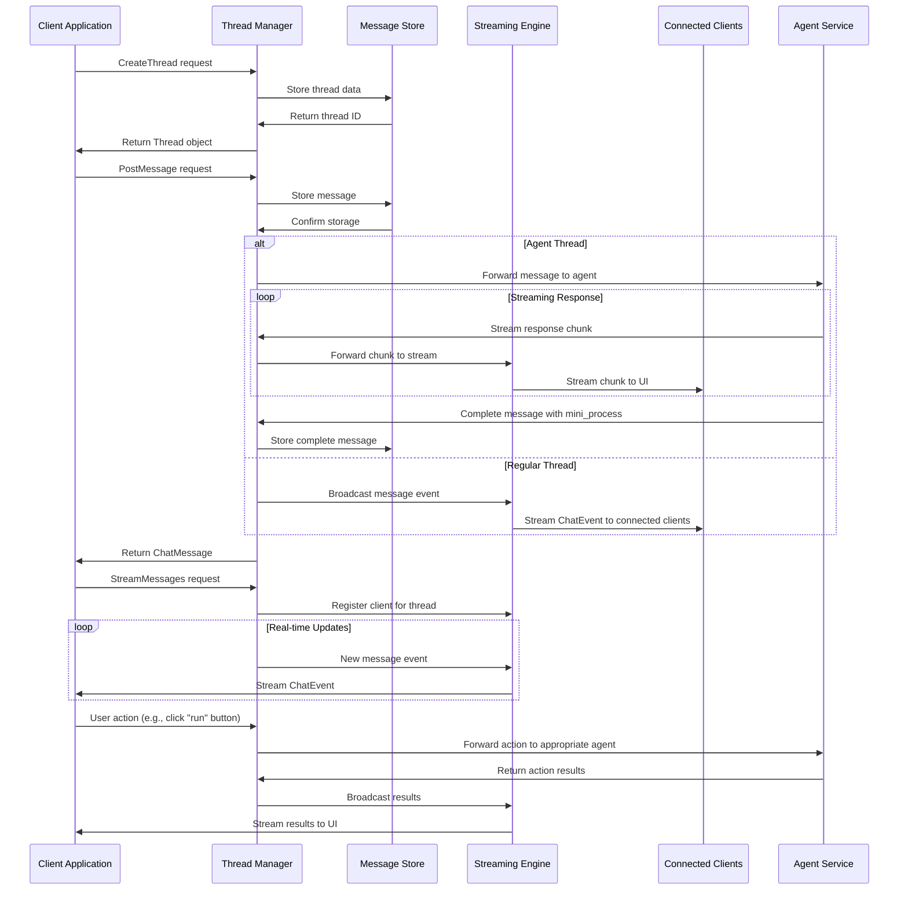

# Thread Manager - Chat Thread and Message Management

**Namespace**: `threads`  
**Technology**: Python, gRPC, Database  
**Purpose**: Manage chat threads and messages for conversational AI services and user interactions

## Overview

Thread Manager is a core service that provides comprehensive thread and message management capabilities for the Voyager platform's conversational AI systems. It handles the creation, persistence, and retrieval of chat threads and messages, supporting both real-time and historical chat interactions across all agent services.

## Responsibilities

### Thread Management
- **Thread Creation**: Create new chat threads with titles and metadata
- **Thread Retrieval**: Retrieve thread information and metadata
- **Thread Lifecycle**: Manage thread lifecycle from creation to archival
- **Metadata Management**: Handle thread metadata for client/session correlation

### Message Management
- **Message Posting**: Post messages to threads with role-based categorization
- **Message Retrieval**: Retrieve messages from threads with pagination support
- **Message Streaming**: Provide real-time message streaming for live chat interfaces
- **Message Visibility**: Control message visibility (PUBLIC/HIDDEN) for UI filtering

### Real-time Communication
- **Live Message Streaming**: Stream new messages to connected clients in real-time
- **Agent Response Streaming**: Forward streaming responses from agents to UI in real-time
- **Event Broadcasting**: Broadcast chat events to subscribed clients
- **Connection Management**: Manage WebSocket connections for real-time features
- **Presence Tracking**: Track active participants in chat threads

### Data Persistence and Action Coordination
- **Message Storage**: Persist all messages with full content and metadata
- **Mini-Process Storage**: Store mini_processes attached to messages
- **Thread Storage**: Store thread information and relationship data
- **Action Coordination**: Forward user actions to appropriate agent services
- **Audit Trail**: Maintain complete audit trail of all chat activities
- **Data Integrity**: Ensure data consistency and integrity across operations

## Architecture

### Services within Namespace

#### Thread Manager Pod
The Thread Manager Pod contains the core thread and message management functionality:

##### Thread Manager Service
- **Purpose**: Core thread and message management operations
- **Technology**: Kubernetes Service (K8 Service), Kubernetes Deployment (K8 Deployment), Python application
- **Function**: Implements threads.proto gRPC service specification
- **Integration**: Integrates with database for persistence and provides gRPC APIs

**APIs**:
- **gRPC**: Full threads.proto implementation for thread and message operations
- **REST via Gateway**: `/api/v1/threads` endpoints for HTTP access

##### Thread Manager gRPC Transcoder
- **Purpose**: Protocol translation and gateway integration
- **Technology**: Envoy application
- **Function**: Translates between REST and gRPC protocols for external API access

**APIs**:
- **REST via Gateway**: Thread operations accessible through Envoy Gateway

#### Message Store
- **Purpose**: Persistent storage for threads and messages
- **Technology**: PostgreSQL database with optimized schemas
- **Function**: Stores all thread and message data with indexing for performance
- **Features**: Full-text search, pagination support, archival capabilities

#### Streaming Engine
- **Purpose**: Real-time message streaming and event distribution
- **Technology**: WebSocket server with connection pooling
- **Function**: Manages real-time connections and streams chat events
- **Capabilities**: Connection multiplexing, automatic reconnection, backpressure handling

## Key Features

### Thread Operations
- **Thread Creation**: Create threads with optional titles and metadata
- **Thread Retrieval**: Get thread information by ID
- **Metadata Support**: Store and retrieve arbitrary metadata for threads
- **Thread Correlation**: Support client/session correlation through metadata

### Message Operations
- **Role-based Messages**: Support USER, ASSISTANT, and SYSTEM message roles
- **Rich Content**: Support markdown/plain text content with structured attachments
- **Message Visibility**: Control message visibility for UI filtering
- **Idempotency**: Support idempotency keys for reliable message posting

### Streaming Capabilities
- **Real-time Streaming**: Stream new messages as they are posted
- **Historical Streaming**: Stream messages from specific timestamps
- **Event-based Updates**: Provide event-based updates for chat state changes
- **Connection Management**: Robust connection management with automatic recovery

### Advanced Features
- **Pagination**: Efficient pagination for message listing
- **Full-text Search**: Search messages within threads
- **Message Attachments**: Support structured data attachments (mini_process)
- **Action Buttons**: Support interactive buttons (run, edit, validate) on mini_processes
- **Agent Action Routing**: Route user actions to appropriate agent services
- **Bulk Operations**: Support bulk message operations for performance

## Data Flow



## API Specifications

### gRPC APIs (threads.proto)

```protobuf
syntax = "proto3";
package threads.v1;

import "google/protobuf/struct.proto";

enum Role { ROLE_UNSPECIFIED = 0; USER = 1; ASSISTANT = 2; SYSTEM = 3; }
enum Visibility { VISIBILITY_UNSPECIFIED = 0; PUBLIC = 1; HIDDEN = 2; }

message ThreadRef { string thread_id = 1; }

message Thread {
  string thread_id = 1;
  string title = 2;
  int64 created_at_ms = 3;
  map<string,string> metadata = 4; // e.g., client/session correlation
}

message ChatMessage {
  string message_id = 1;
  string thread_id = 2;
  Role role = 3;
  string content = 4;                     // markdown/plain text
  google.protobuf.Struct mini_process = 7;    // optional structured attachment
  Visibility visibility = 8;              // PUBLIC by default; HIDDEN not shown in UI
  int64 created_at_ms = 6;
}

service Threads {
  rpc CreateThread(CreateThreadRequest) returns (CreateThreadResponse);
  rpc GetThread(GetThreadRequest) returns (GetThreadResponse);
  rpc PostMessage(PostMessageRequest) returns (PostMessageResponse);
  rpc ListMessages(ListMessagesRequest) returns (ListMessagesResponse);
  rpc StreamMessages(StreamMessagesRequest) returns (stream ChatEvent);
  rpc ExecuteAction(ExecuteActionRequest) returns (ExecuteActionResponse);
}
```

#### Thread Management
```protobuf
message CreateThreadRequest { 
  string title = 1; 
  map<string,string> metadata = 2; 
}
message CreateThreadResponse { Thread thread = 1; }

message GetThreadRequest { string thread_id = 1; }
message GetThreadResponse { Thread thread = 1; }
```

#### Message Management
```protobuf
message PostMessageRequest {
  string thread_id = 1;
  Role role = 2;
  string content = 3;
  string idempotency_key = 5;           // optional client de-dupe
  google.protobuf.Struct mini_process = 8;  // optional structured attachment
  Visibility visibility = 9;            // PUBLIC | HIDDEN
}

// Agent action requests
message ExecuteActionRequest {
  string thread_id = 1;
  string message_id = 2;               // message containing the actionable content
  string action = 3;                   // "run", "edit", "validate", etc.
  map<string, string> parameters = 4;  // action-specific parameters
}
message ExecuteActionResponse {
  string execution_id = 1;
  google.protobuf.Struct result = 2;
  string status = 3;                   // "success", "error", "pending"
  string message = 4;                  // human-readable status message
}
message PostMessageResponse { ChatMessage message = 1; }

message ListMessagesRequest { 
  string thread_id = 1; 
  int32 page_size = 2; 
  string page_token = 3; 
}
message ListMessagesResponse { 
  repeated ChatMessage messages = 1; 
  string next_page_token = 2; 
}
```

#### Real-time Streaming
```protobuf
message StreamMessagesRequest { 
  string thread_id = 1; 
  int64 after_timestamp_ms = 2; 
}
message ChatEvent { 
  oneof event { 
    ChatMessage message = 1; 
  } 
}
```

### REST APIs (via Gateway)

#### Thread Operations
```http
POST /api/v1/threads
Content-Type: application/json

{
  "title": "Customer Support Session",
  "metadata": {
    "session_id": "sess_123",
    "user_id": "user_456",
    "agent_type": "support"
  }
}

Response: 201 Created
{
  "thread": {
    "thread_id": "thread_789",
    "title": "Customer Support Session",
    "created_at_ms": 1699123456789,
    "metadata": {
      "session_id": "sess_123",
      "user_id": "user_456",
      "agent_type": "support"
    }
  }
}
```

```http
GET /api/v1/threads/{thread_id}

Response: 200 OK
{
  "thread": {
    "thread_id": "thread_789",
    "title": "Customer Support Session",
    "created_at_ms": 1699123456789,
    "metadata": {
      "session_id": "sess_123",
      "user_id": "user_456",
      "agent_type": "support"
    }
  }
}
```

#### Message Operations
```http
POST /api/v1/threads/{thread_id}/messages
Content-Type: application/json

{
  "role": "USER",
  "content": "I need help with my account settings",
  "visibility": "PUBLIC",
  "idempotency_key": "msg_unique_123"
}

Response: 201 Created
{
  "message": {
    "message_id": "msg_abc123",
    "thread_id": "thread_789",
    "role": "USER",
    "content": "I need help with my account settings",
    "visibility": "PUBLIC",
    "created_at_ms": 1699123456890
  }
}
```

```http
GET /api/v1/threads/{thread_id}/messages?page_size=50&page_token=next_page_123

Response: 200 OK
{
  "messages": [
    {
      "message_id": "msg_abc123",
      "thread_id": "thread_789",
      "role": "USER",
      "content": "I need help with my account settings",
      "visibility": "PUBLIC",
      "created_at_ms": 1699123456890
    },
    {
      "message_id": "msg_def456",
      "thread_id": "thread_789",
      "role": "ASSISTANT",
      "content": "I'd be happy to help you with your account settings. What specific area would you like to modify?",
      "visibility": "PUBLIC",
      "created_at_ms": 1699123456895
    }
  ],
  "next_page_token": "next_page_456"
}
```

#### Real-time Streaming
```http
GET /api/v1/threads/{thread_id}/stream?after_timestamp_ms=1699123456890
Accept: text/event-stream

Response: 200 OK
Content-Type: text/event-stream

data: {"event":{"message":{"message_id":"msg_new789","thread_id":"thread_789","role":"ASSISTANT","content":"Here's how you can update your settings...","visibility":"PUBLIC","created_at_ms":1699123456900}}}

data: {"event":{"message":{"message_id":"msg_new790","thread_id":"thread_789","role":"USER","content":"Thank you, that's exactly what I needed!","visibility":"PUBLIC","created_at_ms":1699123456905}}}
```

## Database Schema

### Threads Table
```sql
CREATE TABLE threads (
    thread_id VARCHAR(255) PRIMARY KEY,
    title VARCHAR(1000),
    created_at_ms BIGINT NOT NULL,
    metadata JSONB,
    updated_at_ms BIGINT NOT NULL,
    INDEX idx_threads_created_at (created_at_ms),
    INDEX idx_threads_metadata (metadata)
);
```

### Messages Table
```sql
CREATE TABLE messages (
    message_id VARCHAR(255) PRIMARY KEY,
    thread_id VARCHAR(255) NOT NULL,
    role VARCHAR(20) NOT NULL,
    content TEXT NOT NULL,
    mini_sop JSONB,
    visibility VARCHAR(20) DEFAULT 'PUBLIC',
    created_at_ms BIGINT NOT NULL,
    idempotency_key VARCHAR(255),
    FOREIGN KEY (thread_id) REFERENCES threads(thread_id),
    INDEX idx_messages_thread_id (thread_id),
    INDEX idx_messages_created_at (created_at_ms),
    INDEX idx_messages_visibility (visibility),
    UNIQUE KEY uk_idempotency (thread_id, idempotency_key)
);
```

## Integration Points

### With Agent Service
- **Agent Thread Creation**: Support agent-specific thread creation
- **Streaming Coordination**: Forward streaming agent responses to UI in real-time
- **Action Routing**: Route user actions (run, edit, validate) to appropriate agents
- **Agent Message Routing**: Route messages to appropriate agents
- **Agent Context**: Maintain agent context within threads
- **Multi-Agent Conversations**: Support conversations involving multiple agents

### With Process Designer
- **Process Development Sessions**: Manage threads for process development conversations
- **Streaming Integration**: Provide streaming support for real-time process writing
- **Context Persistence**: Maintain conversation context across process development sessions
- **Collaborative Editing**: Support multiple users collaborating on process development

### With Spy Mapper
- **Process Analysis Sessions**: Manage threads for process mapping conversations
- **Workflow Documentation**: Store process mapping discussions and decisions
- **Analysis History**: Maintain history of process analysis conversations
- **Knowledge Capture**: Capture process insights from conversations

### With LLM Services
- **AI Response Integration**: Integrate with LLM services for AI-generated responses
- **Context Management**: Provide conversation context to LLM services
- **Response Streaming**: Stream AI responses in real-time
- **Multi-turn Conversations**: Support complex multi-turn AI conversations

## Performance Optimization

### Message Storage
- **Partitioning**: Partition messages by thread_id or date for performance
- **Indexing**: Optimize database indexes for common query patterns
- **Archival**: Archive old messages to maintain performance
- **Caching**: Cache frequently accessed threads and recent messages

### Streaming Performance
- **Connection Pooling**: Pool WebSocket connections for efficiency
- **Message Batching**: Batch messages for improved throughput
- **Backpressure Handling**: Handle backpressure in streaming scenarios
- **Connection Limits**: Implement connection limits and rate limiting

### Scalability Features
- **Horizontal Scaling**: Scale thread manager instances across multiple pods
- **Database Sharding**: Shard database by thread_id for scalability
- **Load Balancing**: Distribute requests across multiple instances
- **Read Replicas**: Use read replicas for improved read performance

## Security Considerations

### Access Control
- **Thread Access Control**: Control access to threads based on user permissions
- **Message Visibility**: Enforce message visibility rules
- **Audit Logging**: Log all thread and message operations
- **Data Encryption**: Encrypt sensitive message content

### Data Protection
- **PII Handling**: Handle personally identifiable information appropriately
- **Message Retention**: Implement message retention policies
- **Data Anonymization**: Support data anonymization for compliance
- **Secure Deletion**: Securely delete messages when required

### API Security
- **Authentication**: Authenticate all API requests
- **Authorization**: Authorize access to specific threads and operations
- **Rate Limiting**: Implement rate limiting to prevent abuse
- **Input Validation**: Validate all input data for security

## Monitoring and Observability

### Performance Metrics
- **Response Time**: Monitor API response times
- **Throughput**: Track message posting and retrieval throughput
- **Connection Count**: Monitor active streaming connections
- **Database Performance**: Monitor database query performance

### Business Metrics
- **Thread Creation Rate**: Track thread creation patterns
- **Message Volume**: Monitor message volume and patterns
- **User Engagement**: Track user engagement metrics
- **Feature Usage**: Monitor usage of different features

### Health Monitoring
- **Service Health**: Monitor service health and availability
- **Database Health**: Monitor database connection and performance
- **Streaming Health**: Monitor streaming connection health
- **Error Rates**: Track error rates and failure patterns

### Alerting
- **Performance Alerts**: Alert on performance degradation
- **Error Alerts**: Alert on high error rates
- **Capacity Alerts**: Alert on resource utilization
- **Business Alerts**: Alert on unusual business metrics

## Error Handling

### Message Posting Errors
- **Duplicate Detection**: Handle duplicate messages using idempotency keys
- **Validation Errors**: Provide clear validation error messages
- **Storage Failures**: Handle database storage failures gracefully
- **Rate Limit Errors**: Handle rate limiting with appropriate backoff

### Streaming Errors
- **Connection Failures**: Handle WebSocket connection failures
- **Reconnection Logic**: Implement automatic reconnection with exponential backoff
- **Message Loss Prevention**: Ensure no message loss during connection issues
- **Client Error Handling**: Provide clear error messages to streaming clients

### Data Consistency
- **Transaction Management**: Use database transactions for consistency
- **Conflict Resolution**: Handle concurrent modification conflicts
- **Data Integrity**: Maintain referential integrity between threads and messages
- **Recovery Procedures**: Implement recovery procedures for data corruption
