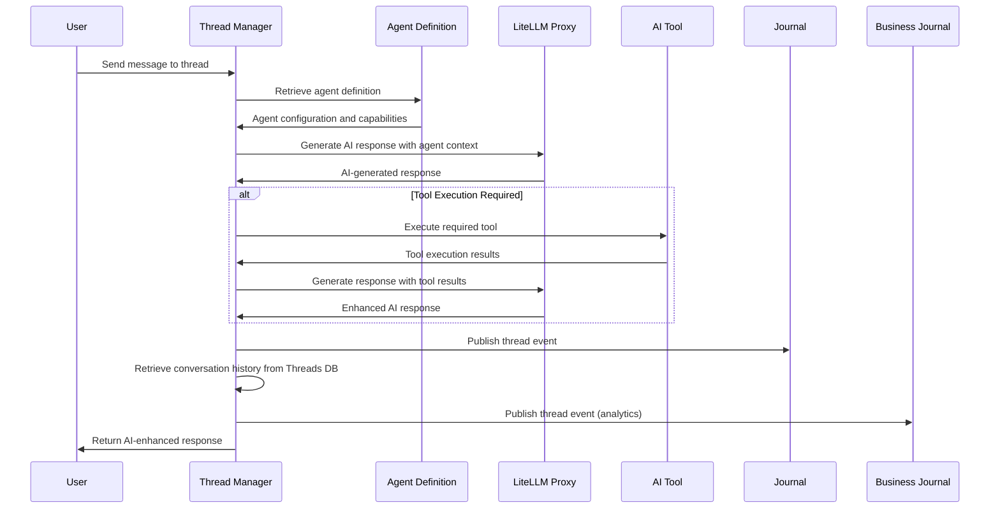

# Threads - AI-Powered Chat Management and Agent Orchestration

**Namespace**: `threads`  
**Technology**: Rust, PostgreSQL, Envoy, AI Agents  
**Purpose**: Intelligent chat conversation management with AI agent orchestration

## Overview

Threads serves as the central hub for AI-powered chat conversations, providing sophisticated conversation management with intelligent agent orchestration. It manages chat threads, coordinates AI agents and tools, and provides seamless integration between human users and AI assistants for process design and automation.

## Responsibilities

- **Conversation Management**: Persistent storage and management of chat conversations and messages
- **Agent Orchestration**: Coordinate and manage AI agents for different conversation contexts
- **Tool Integration**: Integrate and manage AI tools for process design and automation
- **Process Authoring**: Support AI-assisted process authoring through specialized agents
- **Intelligence Routing**: Route conversations to appropriate agents based on context and intent
- **Data Integration**: Integration with Journal and LLM services for comprehensive conversation intelligence

## Architecture

### Services within Namespace

#### Thread Manager Pod
The Thread Manager Pod contains the core conversation management functionality:

##### Thread Manager Service
- **Purpose**: Core chat thread management, persistence, and AI agent orchestration
- **Technology**: Kubernetes Service (K8 Service), Kubernetes Deployment (K8 Deployment), Rust application
- **Database**: PostgreSQL Threads Database for conversation persistence
- **AI Integration**: LiteLLM Proxy for AI model access and agent completions
- **Event Integration**: Kafka producer for thread and conversation events

**APIs**:
- **gRPC**:
  - `CreateThread`: Initialize new conversation thread with optional agent assignment
  - `GetThread`: Retrieve thread details, metadata, and agent configuration
  - `PostMessage`: Add new message to thread with AI processing
  - `ListMessages`: Retrieve message history with AI-generated insights
  - `StreamMessages`: Real-time message streaming with AI responses
  - `InvokeAgent`: Directly invoke specific AI agents for conversation assistance
  - `CallTool`: Execute AI tools within conversation context

##### Thread Manager gRPC Transcoder
- **Purpose**: Protocol translation and gateway integration
- **Technology**: Envoy application
- **Function**: Translates between REST and gRPC protocols for external API access

**APIs**:
- **REST via Gateway**:
  - `POST /threads`: Create new thread with agent configuration
  - `GET /threads/{id}`: Retrieve thread details and AI insights
  - `GET /threads/{id}/messages`: List messages with AI analysis
  - `POST /threads/{id}/messages`: Post new message with AI processing
  - `POST /threads/{id}/agents/{agent_id}/invoke`: Invoke specific AI agent
  - `POST /threads/{id}/tools/{tool_id}/execute`: Execute AI tool
- **WebSocket**:
  - `/threads/{id}/messages/stream`: Real-time messaging with AI responses
  - `/threads/{id}/agents/stream`: Real-time agent interaction stream

#### AI Agent Definitions (CRDs)
Custom Resource Definitions for managing AI agents within the Threads namespace:

##### Agent Definition CRD
- **Purpose**: Define AI agents with their capabilities, prompts, and tool access
- **Technology**: Kubernetes Custom Resource Definition
- **Function**: Store agent configurations, system prompts, and tool associations

##### Process Designer Agent
- **Purpose**: Assist with Process design and development
- **Technology**: Kubernetes Resource, AI Agent
- **Function**: Specialized agent for process design, architecture, and automation guidance
- **Tools**: References SPy Mapper Tool and SPy Writer Tool for comprehensive process development

##### SPy Mapper Agent
- **Purpose**: Map business requirements to SPy (Python subset) code structures
- **Technology**: Kubernetes Resource, AI Agent
- **Function**: Analyze requirements and generate SPy code mappings and structures
- **Integration**: Uses SPy Mapper System Prompt for specialized mapping capabilities

##### SPy Writer Agent
- **Purpose**: Generate and refine SPy code based on business requirements
- **Technology**: Kubernetes Resource, AI Agent
- **Function**: Write, edit, and optimize SPy code for process automation
- **Tools**: References Procedure Selection Tool for intelligent procedure recommendations

#### AI Tool Definitions (CRDs)
Custom Resource Definitions for managing AI tools:

##### Tool Definition CRD
- **Purpose**: Define AI tools with their capabilities, parameters, and approval requirements
- **Technology**: Kubernetes Custom Resource Definition
- **Function**: Store tool configurations, descriptions, and execution requirements

##### SPy Mapper Tool
- **Purpose**: Tool for mapping business processes to SPy code structures
- **Technology**: Kubernetes Resource, AI Tool
- **Function**: Provides structured mapping capabilities for process-to-code translation
- **Agent Integration**: Used by SPy Mapper Agent for process analysis

##### SPy Writer Tool
- **Purpose**: Tool for writing and generating SPy code
- **Technology**: Kubernetes Resource, AI Tool
- **Function**: Generates, edits, and optimizes SPy code based on requirements
- **Agent Integration**: Used by SPy Writer Agent for code generation

##### Book Management Tool
- **Purpose**: Tool for managing and configuring books within the BDK system
- **Technology**: Kubernetes Resource, AI Tool
- **Function**: Provides book management capabilities for AI agents
- **Integration**: Links to BDK namespace for book lifecycle management

##### Process Management Tool
- **Purpose**: Tool for managing process definitions and workflows
- **Technology**: Kubernetes Resource, AI Tool
- **Function**: Provides process management capabilities for AI agents
- **Integration**: Links to Grimoire namespace for process management

##### Procedure Selection Tool
- **Purpose**: Tool for intelligent selection of procedures and best practices
- **Technology**: Kubernetes Resource, AI Tool
- **Function**: Recommends appropriate procedures based on context and requirements
- **Integration**: Used by SPy Writer Agent for intelligent code generation

#### AI Prompt Definitions (CRDs)
Specialized prompt definitions for AI agents:

##### Process Writer System Prompt
- **Purpose**: System prompt for Process Designer Agent
- **Technology**: Kubernetes Resource, AI Prompt
- **Function**: Provides specialized prompting for Process design

##### SPy Mapper System Prompt
- **Purpose**: System prompt for SPy Mapper Agent
- **Technology**: Kubernetes Resource, AI Prompt
- **Function**: Provides specialized prompting for business-to-code mapping

##### SPy Writer System Prompt
- **Purpose**: System prompt for SPy Writer Agent
- **Technology**: Kubernetes Resource, AI Prompt
- **Function**: Provides specialized prompting for SPy code generation and optimization

#### Threads Database
- **Purpose**: Persistent storage for conversation data and AI interaction history
- **Technology**: PostgreSQL
- **Data**: Threads, messages, agent interactions, tool executions, conversation context
- **Access**: Exclusively via Thread Manager Service

## Key Features

### Intelligent Agent Orchestration
- **Context-Aware Routing**: Automatically route conversations to appropriate AI agents based on context
- **Multi-Agent Coordination**: Coordinate multiple agents within a single conversation
- **Agent Specialization**: Leverage specialized agents for specific domains (process design, code generation)
- **Dynamic Agent Selection**: Dynamically select agents based on conversation flow and user intent

### AI-Powered Conversation Management
- **Intelligent Threading**: AI-powered conversation threading and context management
- **Conversation Analysis**: Real-time analysis of conversation content and intent
- **Response Generation**: Generate intelligent responses using specialized AI models
- **Context Preservation**: Maintain conversation context across multiple interactions

### Process Authoring Integration
- **Process Design**: Support for Process design through AI assistance
- **Code Generation**: Generate SPy code directly from conversation requirements
- **Iterative Development**: Support iterative process development through conversation
- **Best Practice Guidance**: Provide best practice recommendations through AI agents

### Tool Integration
- **Dynamic Tool Access**: Dynamically access and execute AI tools based on conversation needs
- **Tool Approval Workflow**: Support approval workflows for tool executions requiring permission
- **Tool Result Integration**: Seamlessly integrate tool execution results into conversations
- **Multi-Tool Coordination**: Coordinate multiple tool executions within conversation context

## Data Flow



## Database Schema

### Enhanced Threads Table
```sql
threads (
    id UUID PRIMARY KEY,
    title VARCHAR(255),
    description TEXT,
    agent_id VARCHAR(255), -- Reference to assigned AI agent
    agent_config JSONB, -- Agent-specific configuration
    context JSONB, -- Conversation context and metadata
    created_by UUID NOT NULL REFERENCES users(id),
    created_at TIMESTAMP NOT NULL,
    updated_at TIMESTAMP NOT NULL,
    last_message_at TIMESTAMP,
    status VARCHAR(50) DEFAULT 'active', -- active, archived, completed
    thread_type VARCHAR(50) DEFAULT 'conversation', -- conversation, process_design, code_generation
    ai_insights JSONB -- AI-generated insights about the conversation
)
```

### Enhanced Messages Table
```sql
messages (
    id UUID PRIMARY KEY,
    thread_id UUID NOT NULL REFERENCES threads(id),
    sender_type VARCHAR(50) NOT NULL, -- user, agent, system, tool
    sender_id VARCHAR(255), -- User ID, Agent ID, or Tool ID
    content TEXT NOT NULL,
    message_type VARCHAR(50) DEFAULT 'text', -- text, code, tool_result, agent_response
    metadata JSONB, -- Message-specific metadata
    ai_analysis JSONB, -- AI analysis of message content
    tool_executions JSONB[], -- Array of tool execution records
    created_at TIMESTAMP NOT NULL,
    parent_message_id UUID REFERENCES messages(id), -- For threaded responses
    is_hidden BOOLEAN DEFAULT FALSE,
    attachments JSONB -- Structured attachments and rich content
)
```

### Agent Interactions Table
```sql
agent_interactions (
    id UUID PRIMARY KEY,
    thread_id UUID NOT NULL REFERENCES threads(id),
    message_id UUID REFERENCES messages(id),
    agent_id VARCHAR(255) NOT NULL,
    interaction_type VARCHAR(50) NOT NULL, -- invoke, tool_call, completion
    input_data JSONB NOT NULL,
    output_data JSONB,
    execution_time_ms INTEGER,
    status VARCHAR(50) DEFAULT 'pending', -- pending, completed, failed
    error_message TEXT,
    created_at TIMESTAMP NOT NULL,
    completed_at TIMESTAMP
)
```

### Tool Executions Table
```sql
tool_executions (
    id UUID PRIMARY KEY,
    thread_id UUID NOT NULL REFERENCES threads(id),
    message_id UUID REFERENCES messages(id),
    tool_id VARCHAR(255) NOT NULL,
    agent_id VARCHAR(255), -- Agent that initiated the tool execution
    input_parameters JSONB NOT NULL,
    output_result JSONB,
    execution_status VARCHAR(50) DEFAULT 'pending', -- pending, approved, executing, completed, failed
    approval_required BOOLEAN DEFAULT FALSE,
    approved_by UUID REFERENCES users(id),
    approved_at TIMESTAMP,
    execution_time_ms INTEGER,
    error_message TEXT,
    created_at TIMESTAMP NOT NULL,
    completed_at TIMESTAMP
)
```

## API Specifications

### Enhanced gRPC APIs

#### Thread Management with AI
```protobuf
service ThreadManager {
  rpc CreateThread(CreateThreadRequest) returns (CreateThreadResponse);
  rpc GetThread(GetThreadRequest) returns (GetThreadResponse);
  rpc UpdateThread(UpdateThreadRequest) returns (UpdateThreadResponse);
  rpc ArchiveThread(ArchiveThreadRequest) returns (ArchiveThreadResponse);
  rpc PostMessage(PostMessageRequest) returns (PostMessageResponse);
  rpc ListMessages(ListMessagesRequest) returns (ListMessagesResponse);
  rpc StreamMessages(StreamMessagesRequest) returns (stream MessageEvent);
  
  // AI Agent Integration
  rpc InvokeAgent(InvokeAgentRequest) returns (InvokeAgentResponse);
  rpc GetAgentCapabilities(GetAgentCapabilitiesRequest) returns (GetAgentCapabilitiesResponse);
  rpc ListAvailableAgents(ListAvailableAgentsRequest) returns (ListAvailableAgentsResponse);
  
  // Tool Integration
  rpc ExecuteTool(ExecuteToolRequest) returns (ExecuteToolResponse);
  rpc ListAvailableTools(ListAvailableToolsRequest) returns (ListAvailableToolsResponse);
  rpc GetToolDefinition(GetToolDefinitionRequest) returns (GetToolDefinitionResponse);
  
  // Analytics and Insights
  rpc GetConversationInsights(GetConversationInsightsRequest) returns (GetConversationInsightsResponse);
  rpc AnalyzeMessage(AnalyzeMessageRequest) returns (AnalyzeMessageResponse);
}

message CreateThreadRequest {
  string title = 1;
  string description = 2;
  string agent_id = 3; // Optional initial agent assignment
  map<string, string> agent_config = 4;
  string thread_type = 5; // conversation, process_design, code_generation
  map<string, string> context = 6;
}

message InvokeAgentRequest {
  string thread_id = 1;
  string agent_id = 2;
  string prompt = 3;
  map<string, string> parameters = 4;
  repeated string tool_permissions = 5; // Tools the agent can access
}

message ExecuteToolRequest {
  string thread_id = 1;
  string tool_id = 2;
  map<string, string> parameters = 3;
  string initiated_by_agent = 4; // Agent that requested the tool execution
  bool require_approval = 5;
}
```

#### Agent Management
```protobuf
rpc CreateAgentDefinition(CreateAgentDefinitionRequest) returns (CreateAgentDefinitionResponse);
rpc UpdateAgentDefinition(UpdateAgentDefinitionRequest) returns (UpdateAgentDefinitionResponse);
rpc GetAgentDefinition(GetAgentDefinitionRequest) returns (GetAgentDefinitionResponse);

message CreateAgentDefinitionRequest {
  string name = 1;
  string description = 2;
  string system_prompt_id = 3;
  repeated string tool_ids = 4;
  AgentCapabilities capabilities = 5;
  bool is_public = 6; // Whether agent is available to all users
}

message AgentCapabilities {
  bool can_generate_code = 1;
  bool can_analyze_processes = 2;
  bool can_execute_tools = 3;
  bool requires_approval = 4;
  repeated string specialized_domains = 5;
}
```

### Enhanced REST APIs

#### AI-Enhanced Thread Operations
```http
POST /threads
Content-Type: application/json

{
  "title": "Customer Support Process Design",
  "description": "Design an automated customer support process",
  "agent_id": "process-designer-agent",
  "thread_type": "process_design",
  "context": {
    "domain": "customer_support",
    "complexity": "medium",
    "integration_points": ["zendesk", "slack"]
  }
}

Response: 201 Created
{
  "thread_id": "uuid",
  "title": "Customer Support Process Design",
  "agent_id": "process-designer-agent",
  "agent_capabilities": {
    "can_generate_code": true,
    "can_analyze_processes": true,
    "specialized_domains": ["process_design", "automation"]
  },
  "created_at": "2024-01-01T00:00:00Z"
}
```

#### Agent Invocation
```http
POST /threads/{thread_id}/agents/{agent_id}/invoke
Content-Type: application/json

{
  "prompt": "I need to create a process that automatically handles customer support tickets from Zendesk",
  "parameters": {
    "ticket_type": "technical_support",
    "priority": "high",
    "sla_hours": "4"
  },
  "tool_permissions": ["spy_mapper_tool", "spy_writer_tool", "process_management_tool"]
}

Response: 200 OK
{
  "interaction_id": "uuid",
  "agent_response": "I'll help you design a customer support process. Let me start by mapping your requirements to a process structure...",
  "tool_executions": [
    {
      "tool_id": "spy_mapper_tool",
      "status": "completed",
      "result": {
        "process_structure": "...",
        "key_components": ["ticket_ingestion", "priority_routing", "sla_tracking"]
      }
    }
  ],
  "next_steps": ["Generate SPy code", "Configure Zendesk integration"],
  "created_at": "2024-01-01T00:00:00Z"
}
```

#### Tool Execution
```http
POST /threads/{thread_id}/tools/{tool_id}/execute
Content-Type: application/json

{
  "parameters": {
    "process_description": "Handle customer support tickets with automatic priority routing",
    "integrations": ["zendesk", "slack"],
    "sla_requirements": {
      "response_time": "1 hour",
      "resolution_time": "4 hours"
    }
  },
  "initiated_by_agent": "spy-writer-agent",
  "require_approval": false
}

Response: 200 OK
{
  "execution_id": "uuid",
  "status": "executing",
  "tool_id": "spy_writer_tool",
  "estimated_completion": "2024-01-01T00:05:00Z"
}
```

## Integration Points

### With LLM Services
- **Model Access**: Access AI models through LiteLLM Proxy for agent completions
- **Prompt Management**: Retrieve and manage system prompts for different agents
- **Model Evaluation**: Evaluate agent performance using Model Evaluation CRDs
- **Cost Tracking**: Track LLM usage costs per conversation and agent

### With Business Journal
- **Conversation History**: Retrieve conversation history and context for AI processing
- **Trend Analysis**: Analyze conversation trends and patterns
- **Knowledge Base**: Build knowledge base from conversation interactions
- **Insights Generation**: Generate insights from historical conversation data

### With BDK (Book Development Kit)
- **Book Integration**: Integrate book management capabilities into conversations
- **Process Deployment**: Deploy processes created through AI-assisted design
- **Book Configuration**: Configure books through conversational interfaces
- **Lifecycle Management**: Manage book lifecycle through AI agents

### With Grimoire (Process Management)
- **Process Design**: Create and manage processes through AI-assisted conversations
- **Code Generation**: Generate SPy code directly from conversation requirements
- **Process Analysis**: Analyze existing processes for optimization opportunities
- **Best Practices**: Apply process design best practices through AI guidance

## AI Agent Specifications

### Process Designer Agent
```yaml
apiVersion: threads.voyager.io/v1
kind: AgentDefinition
metadata:
  name: process-designer-agent
  namespace: threads
spec:
  name: "Process Designer"
  description: "Process design specialist"
  system_prompt_ref:
    name: "process-writer-system-prompt"
  tools:
    - name: "spy-mapper-tool"
      required: false
    - name: "spy-writer-tool"
      required: false
    - name: "process-management-tool"
      required: false
  capabilities:
    can_generate_code: true
    can_analyze_processes: true
    can_execute_tools: true
    requires_approval: false
    specialized_domains:
      - "process_design"
      - "automation"
      - "workflow_optimization"
  configuration:
    max_tool_executions: 10
    conversation_memory: "medium"
    response_style: "detailed"
```

### SPy Mapper Agent
```yaml
apiVersion: threads.voyager.io/v1
kind: AgentDefinition
metadata:
  name: spy-mapper-agent
  namespace: threads
spec:
  name: "SPy Mapper"
  description: "Business requirement to SPy code mapping specialist"
  system_prompt_ref:
    name: "spy-mapper-system-prompt"
  tools:
    - name: "spy-mapper-tool"
      required: true
  capabilities:
    can_generate_code: true
    can_analyze_processes: true
    specialized_domains:
      - "code_mapping"
      - "requirement_analysis"
      - "spy_language"
```

### SPy Writer Agent
```yaml
apiVersion: threads.voyager.io/v1
kind: AgentDefinition
metadata:
  name: spy-writer-agent
  namespace: threads
spec:
  name: "SPy Writer"
  description: "SPy code generation and optimization specialist"
  system_prompt_ref:
    name: "spy-writer-system-prompt"
  tools:
    - name: "spy-writer-tool"
      required: true
    - name: "procedure-selection-tool"
      required: false
  capabilities:
    can_generate_code: true
    can_execute_tools: true
    specialized_domains:
      - "code_generation"
      - "spy_language"
      - "optimization"
```

## Security Considerations

### Agent Security
- **Agent Isolation**: Ensure proper isolation between different AI agents
- **Tool Permission Management**: Fine-grained permission management for tool access
- **Approval Workflows**: Implement approval workflows for sensitive tool executions
- **Audit Logging**: Comprehensive audit logging for all agent interactions

### Data Privacy
- **Conversation Encryption**: Encrypt sensitive conversation data at rest and in transit
- **PII Protection**: Protect personally identifiable information in conversations
- **Data Retention**: Implement appropriate data retention policies for conversations
- **Access Control**: Fine-grained access control for conversation data

### AI Safety
- **Output Filtering**: Filter AI-generated content for safety and appropriateness
- **Hallucination Detection**: Detect and handle AI hallucinations and inaccuracies
- **Bias Mitigation**: Implement bias detection and mitigation strategies
- **Human Oversight**: Ensure appropriate human oversight for AI operations

## Performance and Optimization

### Conversation Performance
- **Real-time Processing**: Optimize for real-time conversation processing
- **Response Latency**: Minimize AI response latency through caching and optimization
- **Concurrent Conversations**: Support high numbers of concurrent conversations
- **Message Throughput**: Optimize message processing throughput

### AI Performance
- **Model Caching**: Cache AI model responses for common queries
- **Agent Optimization**: Optimize agent performance through prompt engineering
- **Tool Execution**: Optimize tool execution performance and resource usage
- **Context Management**: Efficient conversation context management

### Resource Management
- **Memory Usage**: Optimize memory usage for conversation and context storage
- **CPU Utilization**: Efficient CPU utilization for AI processing
- **Database Performance**: Optimize database queries for conversation data
- **Scaling**: Horizontal scaling for increased conversation load

## Monitoring and Analytics

### Conversation Analytics
- **Usage Patterns**: Analyze conversation usage patterns and trends
- **Agent Performance**: Monitor AI agent performance and effectiveness
- **Tool Usage**: Track tool usage and success rates
- **User Satisfaction**: Measure user satisfaction with AI-assisted conversations

### AI Metrics
- **Response Quality**: Measure AI response quality and relevance
- **Completion Rates**: Track conversation completion rates
- **Error Rates**: Monitor AI error rates and failure patterns
- **Cost Analysis**: Analyze AI usage costs and optimization opportunities

### Operational Metrics
- **System Performance**: Monitor system performance and resource usage
- **Availability**: Track service availability and uptime
- **Error Monitoring**: Comprehensive error monitoring and alerting
- **Capacity Planning**: Capacity planning for conversation and AI workloads