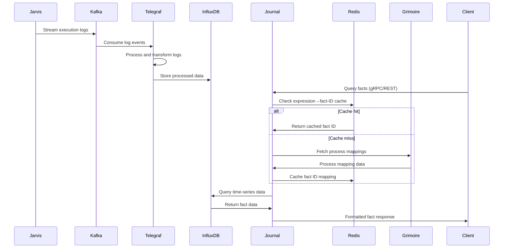

# Business Journal - Dynamic Fact Querying and Expression Mapping

**Namespace**: `journal`  
**Technology**: Rust, InfluxDB, Telegraf  
**Purpose**: Dynamic fact querying and expression-to-fact-ID mapping

## Overview

Business Journal is the data processing and querying service that handles execution logs and provides dynamic fact querying capabilities. It persists facts in InfluxDB, maintains expression-to-fact-ID mappings using Grimoire, and processes execution logs through a sophisticated data pipeline from Jarvis via Telegraf.

## Responsibilities

- Persist execution facts in InfluxDB time-series storage
- Provide dynamic fact querying from persisted data
- Maintain expression-to-fact-ID mapping for stable fact identification using Grimoire mappings
- Process execution logs from Jarvis through Telegraf pipeline
- Serve historical fact data and execution context
- Support real-time fact queries and filtering

## Architecture

### Services within Namespace

#### Business Journal Service
- **Purpose**: Core fact querying and mapping service
- **Technology**: Kubernetes Service (K8 Service), Rust application
- **Database**: InfluxDB for time-series data storage
- **Cache**: Redis for expression→fact-ID mappings

**APIs**:
- **gRPC**:
  - `ListFacts`: Enumerate facts with filtering
  - `GetFactHistory`: Retrieve fact change history
  - `QueryFacts`: Execute complex fact queries

##### Business Journal gRPC Transcoder
- **Purpose**: Protocol translation and gateway integration
- **Technology**: Envoy application
- **Function**: Translates between REST and gRPC protocols

**REST APIs via Gateway**:
- `GET /runs/{run_id}/executions/{execution_number}/facts[?type=&parent_fact_id=]`
- `GET /threads/{thread_id}/executions/{execution_number}/facts[?type=&parent_fact_id=]`
- `GET /runs/{run_id}/facts/{fact_id}/history[?page_size=&page_token=]`
- `GET /runs/{run_id}/facts:latest[?fact_ids=&type=&page_size=&page_token=]`

#### InfluxDB Bucket
- **Purpose**: Time-series storage for execution logs
- **Technology**: InfluxDB time-series database
- **Data**: Raw execution logs, telemetry data, fact measurements
- **Access**: Queried by Business Journal Service via InfluxDB client

#### Telegraf
- **Purpose**: Data ingestion and processing pipeline
- **Technology**: Telegraf application
- **Function**: 
  - Consume execution logs from Kafka
  - Process and transform log data
  - Store processed logs into InfluxDB bucket
  - Handle data normalization and enrichment

## Data Flow



## Key Features

### Dynamic Fact Querying
- **InfluxDB Persistence**: Facts are persisted in InfluxDB time-series storage for historical analysis
- **Real-time Queries**: Query current and historical fact states from persisted data
- **Flexible Filtering**: Support for type, parent fact, and custom filters
- **Pagination**: Efficient handling of large result sets

### Expression-to-Fact-ID Mapping
- **Grimoire Integration**: Retrieves expression→fact-ID mappings from Grimoire service
- **Stable IDs**: Ensures consistent fact IDs across executions using Grimoire mappings
- **Cache Management**: Redis caching for frequently accessed mappings with TTL and invalidation
- **Dynamic Resolution**: Resolves expressions to stable fact IDs for InfluxDB queries

### Data Pipeline Processing
- **Kafka Integration**: Consumes execution logs from Kafka topics
- **Telegraf Processing**: Automated data processing and transformation
- **InfluxDB Storage**: Efficient time-series storage for historical queries
- **Real-time Processing**: Near real-time data availability

### Time-Series Capabilities
- **Historical Analysis**: Query facts across time ranges
- **Trend Analysis**: Support for temporal fact analysis
- **Aggregation**: Time-based aggregations and rollups
- **Retention Policies**: Configurable data retention for optimization

## Database Design

### InfluxDB Schema

#### Measurements
```influxql
-- Execution logs measurement
execution_logs,
    run_id=<run_id>,
    execution_id=<execution_id>,
    fact_type=<type>,
    fact_id=<stable_id>
  value=<fact_value>,
  metadata=<json_metadata>
  <timestamp>

-- Fact changes measurement  
fact_changes,
    run_id=<run_id>,
    fact_id=<fact_id>,
    change_type=<create|update|delete>
  old_value=<previous_value>,
  new_value=<current_value>,
  change_metadata=<json>
  <timestamp>
```

#### Retention Policies
- **Recent Data**: 30 days full resolution
- **Historical Data**: 1 year aggregated data
- **Archive**: Long-term compressed storage

### Redis Cache Schema

#### Expression Mappings
```redis
# Expression to fact ID mapping
expression:{hash} -> fact_id
TTL: 1 hour

# Process mapping cache
process:{process_id}:mapping -> {json_mapping}
TTL: 24 hours

# Fact metadata cache
fact:{fact_id}:metadata -> {json_metadata}
TTL: 30 minutes
```

## API Specifications

### gRPC APIs

#### ListFacts
```protobuf
service BusinessJournal {
  rpc ListFacts(ListFactsRequest) returns (ListFactsResponse);
}

message ListFactsRequest {
  string run_id = 1;
  int32 execution_number = 2;
  string fact_type = 3;
  string parent_fact_id = 4;
  int32 page_size = 5;
  string page_token = 6;
}

message ListFactsResponse {
  repeated Fact facts = 1;
  string next_page_token = 2;
  int32 total_count = 3;
}
```

#### GetFactHistory
```protobuf
rpc GetFactHistory(GetFactHistoryRequest) returns (GetFactHistoryResponse);

message GetFactHistoryRequest {
  string run_id = 1;
  string fact_id = 2;
  google.protobuf.Timestamp start_time = 3;
  google.protobuf.Timestamp end_time = 4;
  int32 page_size = 5;
  string page_token = 6;
}

message GetFactHistoryResponse {
  repeated FactChange changes = 1;
  string next_page_token = 2;
}
```

#### QueryFacts
```protobuf
rpc QueryFacts(QueryFactsRequest) returns (QueryFactsResponse);

message QueryFactsRequest {
  string run_id = 1;
  string query_expression = 2;
  map<string, string> parameters = 3;
  google.protobuf.Timestamp start_time = 4;
  google.protobuf.Timestamp end_time = 5;
}

message QueryFactsResponse {
  repeated Fact results = 1;
  QueryMetadata metadata = 2;
}
```

### REST APIs (via Gateway)

#### List Execution Facts
```http
GET /runs/{run_id}/executions/{execution_number}/facts?type=user_data&parent_fact_id=uuid

Response: 200 OK
{
  "facts": [
    {
      "fact_id": "stable-fact-id",
      "type": "user_data", 
      "value": {...},
      "timestamp": "2024-01-01T00:00:00Z",
      "metadata": {...}
    }
  ],
  "next_page_token": "token",
  "total_count": 42
}
```

#### Get Fact History
```http
GET /runs/{run_id}/facts/{fact_id}/history?page_size=10&page_token=abc

Response: 200 OK
{
  "changes": [
    {
      "timestamp": "2024-01-01T00:00:00Z",
      "change_type": "update",
      "old_value": {...},
      "new_value": {...},
      "metadata": {...}
    }
  ],
  "next_page_token": "next_token"
}
```

#### Query Latest Facts
```http
GET /runs/{run_id}/facts:latest?fact_ids=id1,id2&type=result&page_size=20

Response: 200 OK
{
  "facts": [
    {
      "fact_id": "id1",
      "latest_value": {...},
      "last_updated": "2024-01-01T00:00:00Z",
      "version": 3
    }
  ],
  "page_token": "token"
}
```

## Integration Points

### With Jarvis
- **Log Consumption**: Receives execution logs via Kafka topics
- **No Direct Communication**: All integration through event streaming
- **Data Pipeline**: Processes raw logs into structured fact data

### With Grimoire
- **Process Mappings**: Fetches Process mappings for stable fact IDs
- **Expression Stability**: Uses Process data to ensure consistent fact identification
- **Metadata Enrichment**: Incorporates Process context into fact queries

### With Jeeves
- **Historical Queries**: Provides historic run data for orchestration
- **Execution Context**: Supplies fact context for run management
- **Integration**: Supports run-level fact queries and analysis

## Performance Optimization

### Caching Strategy
- **Redis Caching**: Multi-level caching for expressions and metadata
- **Cache Warming**: Proactive cache population for common queries
- **TTL Management**: Intelligent cache expiration based on usage patterns
- **Cache Invalidation**: Selective invalidation for data consistency

### Query Optimization
- **Index Strategy**: Optimized InfluxDB indexes for common query patterns
- **Query Planning**: Intelligent query optimization and execution planning
- **Aggregation**: Pre-computed aggregations for common analytics
- **Parallel Processing**: Concurrent query execution for complex requests

### Data Pipeline Efficiency
- **Batch Processing**: Efficient batch processing in Telegraf
- **Compression**: Data compression for storage efficiency
- **Partitioning**: Time-based partitioning for query performance
- **Retention**: Automated data lifecycle management

## Monitoring and Observability

### Query Performance
- **Query Latency**: Response time metrics for all query types
- **Throughput**: Queries per second and concurrency metrics
- **Cache Hit Rates**: Redis cache effectiveness metrics
- **Database Performance**: InfluxDB query performance monitoring

### Data Pipeline Health
- **Kafka Lag**: Consumer lag monitoring for real-time processing
- **Telegraf Metrics**: Data processing rates and error rates
- **Data Quality**: Validation and quality metrics for processed data
- **Storage Utilization**: InfluxDB storage and performance metrics

### System Health
- **Service Availability**: Uptime and health check monitoring
- **Resource Usage**: CPU, memory, and network utilization
- **Error Rates**: Error tracking across all service operations
- **Alerting**: Automated alerts for system anomalies

## Security Considerations

### Data Access Control
- **Run Isolation**: Clients can only access facts from their runs
- **Fact Privacy**: Sensitive fact data protection
- **Query Authorization**: Authorization checks for all fact queries
- **Audit Logging**: Comprehensive logging of all data access

### Data Integrity
- **Validation**: Input validation for all queries and data
- **Consistency**: Ensuring data consistency across the pipeline
- **Backup**: Regular backups of critical fact data
- **Recovery**: Disaster recovery procedures for data loss scenarios
