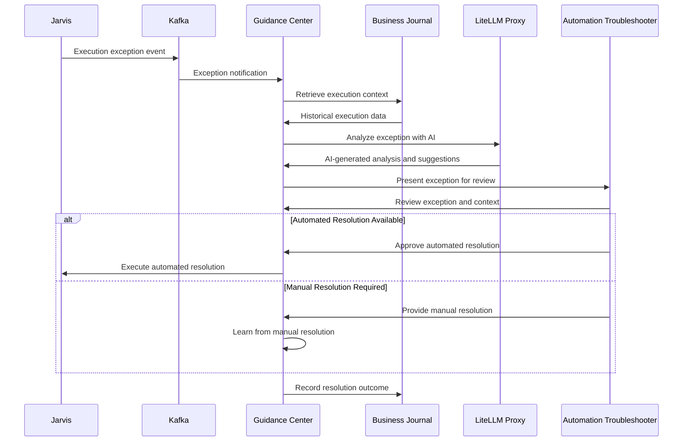

# Guidance Center - AI-Powered Exception Handling and Troubleshooting

**Namespace**: `guidance`  
**Technology**: Rust, LLM Integration, Business Intelligence  
**Purpose**: Exception handling service for Automation Troubleshooters with AI-powered analysis

## Overview

Guidance Center serves as the exception handling hub for the Voyager platform where executions that have hit exceptions are shown and handled by Automation Troubleshooters. It provides intelligent guidance for process execution issues, automated problem resolution, and comprehensive process intelligence through advanced AI analysis and planning capabilities.

## Responsibilities

- **Exception Processing**: Handle execution exceptions and failures for Automation Troubleshooter review
- **AI-Powered Analysis**: Provide AI-powered analysis and resolution recommendations for execution issues
- **Troubleshooter Interface**: Present failed executions to Automation Troubleshooters for resolution
- **Automated Problem Resolution**: Automatically resolve common issues and guide complex problem-solving
- **Context Gathering**: Collect and analyze relevant context from past runs and system state
- **Resolution Tracking**: Track resolution effectiveness and learn from outcomes

## Architecture

### Services within Namespace

#### Guidance Center Service
- **Purpose**: Core exception handling and troubleshooting service for Automation Troubleshooters
- **Technology**: Kubernetes Service (K8 Service), Rust application
- **AI Integration**: LiteLLM Proxy for advanced AI planning and reasoning capabilities
- **Intelligence**: Business Journal integration for historical context and pattern analysis

**Core Functions**:
- **Exception Display**: Present failed executions to Automation Troubleshooters
- **Problem Analysis**: Analyze process execution issues using AI and historical data
- **Resolution Generation**: Generate step-by-step resolution plans using AI reasoning
- **Context Synthesis**: Synthesize relevant context from multiple data sources
- **Resolution Tracking**: Track resolution attempts and outcomes

#### Guidance Context Component
- **Purpose**: Context gathering and analysis component within Guidance Center
- **Technology**: Internal component of Guidance Center service
- **Function**: Collect and analyze relevant context for troubleshooting scenarios
- **Data Sources**: Business Journal, run history, system metrics, and process state

**Context Sources**:
- **Past Runs**: Historical run data and execution patterns
- **System State**: Current system health and performance metrics
- **Process Metrics**: Process-specific performance and error metrics
- **Exception History**: Historical exception patterns and resolutions

## Key Features

### Exception Management for Troubleshooters
- **Exception Dashboard**: Display failed executions for Automation Troubleshooter review
- **Context Visualization**: Present comprehensive context around each exception
- **Resolution Workflow**: Guided workflow for troubleshooters to resolve issues
- **Knowledge Capture**: Capture troubleshooter expertise and solutions

### AI-Powered Problem Analysis
- **Intelligent Diagnosis**: Use AI to analyze complex process execution exceptions
- **Pattern Recognition**: Identify patterns in failures and performance issues
- **Root Cause Analysis**: Perform deep root cause analysis using AI reasoning
- **Historical Correlation**: Correlate current issues with historical exception patterns

### Automated Resolution Support
- **Resolution Suggestions**: Generate AI-powered resolution suggestions for troubleshooters
- **Automated Fixes**: Automatically apply fixes for common, well-understood issues
- **Guided Resolution**: Provide step-by-step guidance for complex issues
- **Resolution Validation**: Validate resolution effectiveness and learn from outcomes

### Context-Aware Intelligence
- **Historical Context**: Leverage historical run data for informed decision-making
- **Cross-Process Insights**: Generate insights across multiple processes and runs
- **System Integration**: Integrate context from all system components for comprehensive analysis
- **Dynamic Context**: Adapt context gathering based on issue type and severity

## Data Flow



## Integration Points

### With Jarvis (Execution Engine)
- **Exception Events**: Receives execution exception events via Kafka
- **Context Retrieval**: Gathers execution context and error details
- **Resolution Coordination**: Coordinates automated resolution attempts
- **Feedback Loop**: Provides feedback on resolution effectiveness

### With Business Journal
- **Historical Analysis**: Access historical run data for pattern analysis and context
- **Exception Patterns**: Identify trends in execution failures and issues
- **Success Pattern Analysis**: Analyze successful runs to identify best practices
- **Knowledge Base**: Build and maintain knowledge base from resolution outcomes

### With LiteLLM Proxy
- **AI Analysis**: Leverage advanced AI models for exception analysis and reasoning
- **Resolution Planning**: Use AI planning capabilities to generate resolution strategies
- **Pattern Recognition**: AI-powered pattern recognition for similar exceptions
- **Continuous Learning**: Improve AI guidance through feedback and learning

### With Automation Troubleshooters
- **Exception Presentation**: Present failed executions in user-friendly interface
- **Resolution Workflow**: Guide troubleshooters through resolution process
- **Knowledge Capture**: Capture troubleshooter expertise and best practices
- **Training Integration**: Integrate with troubleshooter training workflows

## API Specifications

### Guidance Center APIs

#### Exception Management
```protobuf
service GuidanceCenter {
  rpc ListExceptions(ListExceptionsRequest) returns (ListExceptionsResponse);
  rpc GetExceptionDetails(GetExceptionDetailsRequest) returns (GetExceptionDetailsResponse);
  rpc AnalyzeException(AnalyzeExceptionRequest) returns (AnalyzeExceptionResponse);
  rpc ResolveException(ResolveExceptionRequest) returns (ResolveExceptionResponse);
  rpc GetResolutionHistory(GetResolutionHistoryRequest) returns (GetResolutionHistoryResponse);
}

message ListExceptionsRequest {
  string troubleshooter_id = 1;
  ExceptionFilter filter = 2;
  int32 page_size = 3;
  string page_token = 4;
}

message ListExceptionsResponse {
  repeated ExecutionException exceptions = 1;
  string next_page_token = 2;
  int32 total_count = 3;
}

message ExecutionException {
  string exception_id = 1;
  string run_id = 2;
  string execution_id = 3;
  string exception_type = 4;
  string error_message = 5;
  google.protobuf.Timestamp occurred_at = 6;
  ExceptionSeverity severity = 7;
  ExceptionStatus status = 8;
}

enum ExceptionSeverity {
  LOW = 0;
  MEDIUM = 1;
  HIGH = 2;
  CRITICAL = 3;
}

enum ExceptionStatus {
  PENDING = 0;
  IN_REVIEW = 1;
  RESOLVING = 2;
  RESOLVED = 3;
  ESCALATED = 4;
}
```

#### Problem Analysis
```protobuf
message AnalyzeExceptionRequest {
  string exception_id = 1;
  bool include_historical_context = 2;
  bool generate_ai_suggestions = 3;
}

message AnalyzeExceptionResponse {
  string analysis_id = 1;
  ExceptionAnalysis analysis = 2;
  repeated ResolutionSuggestion suggestions = 3;
  repeated SimilarException similar_exceptions = 4;
}

message ExceptionAnalysis {
  string root_cause = 1;
  repeated string contributing_factors = 2;
  string impact_assessment = 3;
  repeated string affected_components = 4;
  double confidence_score = 5;
  map<string, string> context_data = 6;
}

message ResolutionSuggestion {
  string suggestion_id = 1;
  string description = 2;
  ResolutionType type = 3; // automatic, guided, manual
  repeated ResolutionStep steps = 4;
  double success_probability = 5;
  string estimated_time = 6;
}

enum ResolutionType {
  AUTOMATIC = 0;
  GUIDED = 1;
  MANUAL = 2;
}
```

## Exception Handling Workflow

### Exception Processing Pipeline
1. **Exception Detection**: Jarvis reports execution exceptions via Kafka
2. **Context Gathering**: Collect comprehensive context around the exception
3. **AI Analysis**: Analyze exception using AI models and historical patterns
4. **Troubleshooter Assignment**: Present exception to appropriate Automation Troubleshooter
5. **Resolution**: Guide troubleshooter through resolution process
6. **Learning**: Capture resolution knowledge for future use

### Troubleshooter Interface
- **Exception Dashboard**: Comprehensive dashboard showing pending and active exceptions
- **Context Visualization**: Rich visualization of execution context and error details
- **Resolution Tools**: Tools and workflows to assist with exception resolution
- **Knowledge Base**: Access to historical resolutions and best practices

### Resolution Tracking
- **Resolution Metrics**: Track time to resolution, success rates, and troubleshooter performance
- **Knowledge Capture**: Capture successful resolution patterns for automated application
- **Continuous Improvement**: Use resolution data to improve AI suggestions and automation

## AI-Powered Features

### Exception Analysis
- **Pattern Matching**: Match current exceptions to historical patterns
- **Root Cause Analysis**: AI-powered root cause analysis using execution context
- **Impact Assessment**: Assess the business impact of exceptions
- **Resolution Prediction**: Predict likely resolution approaches based on exception type

### Automated Resolution
- **Common Issue Detection**: Detect and automatically resolve common issues
- **Resolution Templates**: Generate resolution templates based on exception patterns
- **Guided Workflows**: Provide step-by-step guided resolution workflows
- **Quality Assurance**: Validate resolution effectiveness before implementation

## Performance and Monitoring

### Exception Processing Performance
- **Real-Time Processing**: Process exceptions in real-time for immediate troubleshooter attention
- **Context Gathering Speed**: Optimize context gathering for rapid troubleshooter response
- **AI Analysis Latency**: Minimize AI analysis time for faster insights
- **Resolution Tracking**: Track resolution progress and effectiveness

### Troubleshooter Productivity
- **Resolution Time**: Monitor time from exception to resolution
- **Success Rates**: Track resolution success rates by troubleshooter and exception type
- **Knowledge Utilization**: Monitor use of knowledge base and AI suggestions
- **Training Needs**: Identify training needs based on resolution patterns

### System Health
- **Exception Rates**: Monitor exception rates and trends across the platform
- **Resolution Effectiveness**: Track the effectiveness of different resolution approaches
- **Knowledge Base Growth**: Monitor growth and quality of the resolution knowledge base
- **AI Model Performance**: Track AI model accuracy and suggestion quality

## Security Considerations

### Data Protection
- **Execution Data Security**: Secure handling of sensitive execution and error data
- **Troubleshooter Access**: Role-based access control for troubleshooter interfaces
- **Audit Logging**: Comprehensive audit logging for all exception handling activities
- **Data Retention**: Appropriate data retention policies for exception and resolution data

### AI Safety
- **Resolution Validation**: Validate AI-suggested resolutions before implementation
- **Human Oversight**: Ensure human oversight for all critical resolution decisions
- **Bias Detection**: Detect and mitigate bias in AI analysis and suggestions
- **Safety Guardrails**: Implement safety guardrails for automated resolutions
