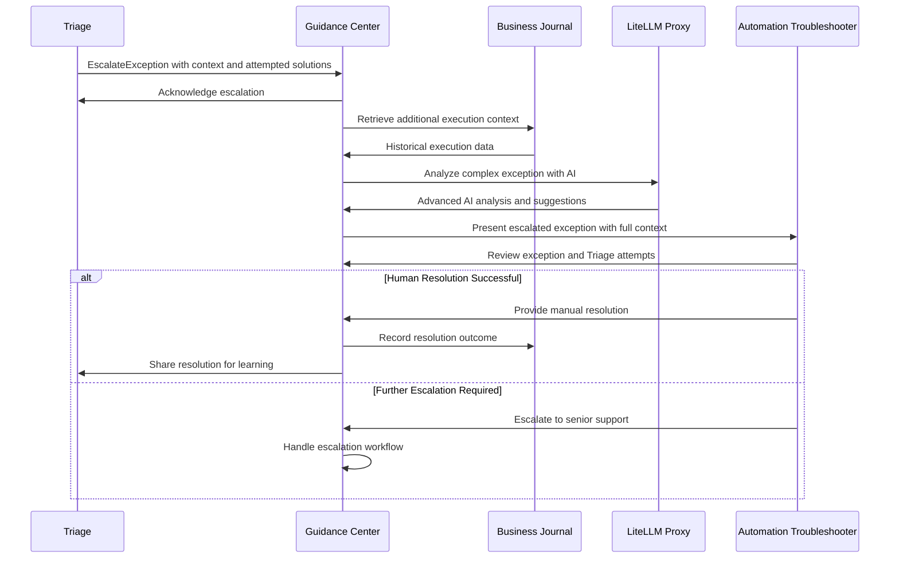

# Guidance Center - AI-Powered Exception Handling and Troubleshooting

**Namespace**: `guidance`  
**Technology**: Rust, LLM Integration, Business Intelligence  
**Purpose**: Exception handling service for Automation Troubleshooters with AI-powered analysis

## Overview

Guidance Center serves as the escalation hub for complex execution exceptions that cannot be resolved automatically by Triage. It provides intelligent guidance for process execution issues, AI-powered analysis, and comprehensive troubleshooting support for Automation Troubleshooters. Guidance Center receives pre-analyzed exceptions from Triage along with attempted solutions, enabling focused human intervention on the most challenging issues.

## Responsibilities

- **Escalated Exception Processing**: Handle complex exceptions escalated from Triage for human review
- **AI-Powered Analysis**: Provide advanced AI analysis and resolution recommendations beyond automated capabilities
- **Troubleshooter Interface**: Present escalated exceptions to Automation Troubleshooters with Triage context
- **Complex Problem Resolution**: Guide resolution of complex issues that automated systems cannot handle
- **Enhanced Context Analysis**: Build upon Triage analysis with deeper AI-powered insights
- **Resolution Tracking**: Track resolution effectiveness and provide feedback to Triage for learning
- **Knowledge Transfer**: Transfer successful human resolutions back to Triage for automation

## Architecture

### Services within Namespace

#### Guidance Center Service
- **Purpose**: Core exception handling and troubleshooting service for Automation Troubleshooters
- **Technology**: Kubernetes Service (K8 Service), Rust application
- **AI Integration**: LiteLLM Proxy for advanced AI planning and reasoning capabilities
- **Intelligence**: Business Journal integration for historical context and pattern analysis

**Core Functions**:
- **Exception Display**: Present failed executions to Automation Troubleshooters
- **Problem Analysis**: Analyze process execution issues using AI and historical data
- **Resolution Generation**: Generate step-by-step resolution plans using AI reasoning
- **Context Synthesis**: Synthesize relevant context from multiple data sources
- **Resolution Tracking**: Track resolution attempts and outcomes

#### Guidance Context Component
- **Purpose**: Context gathering and analysis component within Guidance Center
- **Technology**: Internal component of Guidance Center service
- **Function**: Collect and analyze relevant context for troubleshooting scenarios
- **Data Sources**: Business Journal, run history, system metrics, and process state

**Context Sources**:
- **Past Runs**: Historical run data and execution patterns
- **System State**: Current system health and performance metrics
- **Process Metrics**: Process-specific performance and error metrics
- **Exception History**: Historical exception patterns and resolutions

## Key Features

### Exception Management for Troubleshooters
- **Exception Dashboard**: Display failed executions for Automation Troubleshooter review
- **Context Visualization**: Present comprehensive context around each exception
- **Resolution Workflow**: Guided workflow for troubleshooters to resolve issues
- **Knowledge Capture**: Capture troubleshooter expertise and solutions

### AI-Powered Problem Analysis
- **Intelligent Diagnosis**: Use AI to analyze complex process execution exceptions
- **Pattern Recognition**: Identify patterns in failures and performance issues
- **Root Cause Analysis**: Perform deep root cause analysis using AI reasoning
- **Historical Correlation**: Correlate current issues with historical exception patterns

### Automated Resolution Support
- **Resolution Suggestions**: Generate AI-powered resolution suggestions for troubleshooters
- **Automated Fixes**: Automatically apply fixes for common, well-understood issues
- **Guided Resolution**: Provide step-by-step guidance for complex issues
- **Resolution Validation**: Validate resolution effectiveness and learn from outcomes

### Context-Aware Intelligence
- **Historical Context**: Leverage historical run data for informed decision-making
- **Cross-Process Insights**: Generate insights across multiple processes and runs
- **System Integration**: Integrate context from all system components for comprehensive analysis
- **Dynamic Context**: Adapt context gathering based on issue type and severity

## Data Flow



## Integration Points

### With Triage (Primary Integration)
- **Exception Escalation**: Receives escalated exceptions that automated recovery couldn't resolve
- **Context Inheritance**: Inherits complete exception analysis and attempted solutions from Triage
- **Resolution Feedback**: Provides resolution outcomes back to Triage for learning
- **Knowledge Transfer**: Transfers successful human resolutions to improve Triage automation

### With Business Journal
- **Historical Analysis**: Access historical run data for pattern analysis and context
- **Exception Patterns**: Identify trends in execution failures and issues
- **Success Pattern Analysis**: Analyze successful runs to identify best practices
- **Knowledge Base**: Build and maintain knowledge base from resolution outcomes

### With LiteLLM Proxy
- **AI Analysis**: Leverage advanced AI models for exception analysis and reasoning
- **Resolution Planning**: Use AI planning capabilities to generate resolution strategies
- **Pattern Recognition**: AI-powered pattern recognition for similar exceptions
- **Continuous Learning**: Improve AI guidance through feedback and learning

### With Automation Troubleshooters
- **Exception Presentation**: Present failed executions in user-friendly interface
- **Resolution Workflow**: Guide troubleshooters through resolution process
- **Knowledge Capture**: Capture troubleshooter expertise and best practices
- **Training Integration**: Integrate with troubleshooter training workflows

## API Specifications

### Guidance Center APIs

#### Exception Management
```protobuf
service GuidanceCenter {
  rpc AcceptEscalation(AcceptEscalationRequest) returns (AcceptEscalationResponse);
  rpc ListEscalatedExceptions(ListEscalatedExceptionsRequest) returns (ListEscalatedExceptionsResponse);
  rpc GetExceptionDetails(GetExceptionDetailsRequest) returns (GetExceptionDetailsResponse);
  rpc AnalyzeException(AnalyzeExceptionRequest) returns (AnalyzeExceptionResponse);
  rpc ResolveException(ResolveExceptionRequest) returns (ResolveExceptionResponse);
  rpc GetResolutionHistory(GetResolutionHistoryRequest) returns (GetResolutionHistoryResponse);
  rpc ShareResolution(ShareResolutionRequest) returns (ShareResolutionResponse);
}

message ListExceptionsRequest {
  string troubleshooter_id = 1;
  ExceptionFilter filter = 2;
  int32 page_size = 3;
  string page_token = 4;
}

message ListExceptionsResponse {
  repeated ExecutionException exceptions = 1;
  string next_page_token = 2;
  int32 total_count = 3;
}

message ExecutionException {
  string exception_id = 1;
  string run_id = 2;
  string execution_id = 3;
  string exception_type = 4;
  string error_message = 5;
  google.protobuf.Timestamp occurred_at = 6;
  ExceptionSeverity severity = 7;
  ExceptionStatus status = 8;
}

enum ExceptionSeverity {
  LOW = 0;
  MEDIUM = 1;
  HIGH = 2;
  CRITICAL = 3;
}

enum ExceptionStatus {
  PENDING = 0;
  IN_REVIEW = 1;
  RESOLVING = 2;
  RESOLVED = 3;
  ESCALATED = 4;
}
```

#### Problem Analysis
```protobuf
message AnalyzeExceptionRequest {
  string exception_id = 1;
  bool include_historical_context = 2;
  bool generate_ai_suggestions = 3;
}

message AnalyzeExceptionResponse {
  string analysis_id = 1;
  ExceptionAnalysis analysis = 2;
  repeated ResolutionSuggestion suggestions = 3;
  repeated SimilarException similar_exceptions = 4;
}

message ExceptionAnalysis {
  string root_cause = 1;
  repeated string contributing_factors = 2;
  string impact_assessment = 3;
  repeated string affected_components = 4;
  double confidence_score = 5;
  map<string, string> context_data = 6;
}

message ResolutionSuggestion {
  string suggestion_id = 1;
  string description = 2;
  ResolutionType type = 3; // automatic, guided, manual
  repeated ResolutionStep steps = 4;
  double success_probability = 5;
  string estimated_time = 6;
}

enum ResolutionType {
  AUTOMATIC = 0;
  GUIDED = 1;
  MANUAL = 2;
}

message AcceptEscalationRequest {
  string escalation_id = 1;
  string exception_id = 2;
  string run_id = 3;
  string execution_id = 4;
  ExceptionContext context = 5;
  repeated string attempted_solutions = 6;
  string escalation_reason = 7;
  string preferred_troubleshooter_id = 8;
}

message AcceptEscalationResponse {
  bool accepted = 1;
  string assigned_troubleshooter_id = 2;
  string guidance_exception_id = 3;
  google.protobuf.Timestamp accepted_at = 4;
}

message ShareResolutionRequest {
  string exception_id = 1;
  string resolution_id = 2;
  ResolutionOutcome outcome = 3;
  repeated ResolutionStep steps_taken = 4;
  string lessons_learned = 5;
}

message ShareResolutionResponse {
  bool accepted = 1;
  string learning_id = 2;
  google.protobuf.Timestamp shared_at = 3;
}
```

## Exception Handling Workflow

### Escalated Exception Processing Pipeline
1. **Escalation Reception**: Receive escalated exceptions from Triage with full context
2. **Enhanced Context Analysis**: Build upon Triage analysis with deeper AI insights
3. **Advanced AI Analysis**: Perform complex analysis using LLM capabilities
4. **Troubleshooter Assignment**: Assign to appropriate Automation Troubleshooter
5. **Guided Resolution**: Guide troubleshooter through complex resolution process
6. **Knowledge Transfer**: Share successful resolutions back to Triage for automation

### Troubleshooter Interface
- **Exception Dashboard**: Comprehensive dashboard showing pending and active exceptions
- **Context Visualization**: Rich visualization of execution context and error details
- **Resolution Tools**: Tools and workflows to assist with exception resolution
- **Knowledge Base**: Access to historical resolutions and best practices

### Resolution Tracking
- **Resolution Metrics**: Track time to resolution, success rates, and troubleshooter performance
- **Knowledge Capture**: Capture successful resolution patterns for automated application
- **Continuous Improvement**: Use resolution data to improve AI suggestions and automation

## AI-Powered Features

### Exception Analysis
- **Pattern Matching**: Match current exceptions to historical patterns
- **Root Cause Analysis**: AI-powered root cause analysis using execution context
- **Impact Assessment**: Assess the business impact of exceptions
- **Resolution Prediction**: Predict likely resolution approaches based on exception type

### Automated Resolution
- **Common Issue Detection**: Detect and automatically resolve common issues
- **Resolution Templates**: Generate resolution templates based on exception patterns
- **Guided Workflows**: Provide step-by-step guided resolution workflows
- **Quality Assurance**: Validate resolution effectiveness before implementation

## Performance and Monitoring

### Exception Processing Performance
- **Real-Time Processing**: Process exceptions in real-time for immediate troubleshooter attention
- **Context Gathering Speed**: Optimize context gathering for rapid troubleshooter response
- **AI Analysis Latency**: Minimize AI analysis time for faster insights
- **Resolution Tracking**: Track resolution progress and effectiveness

### Troubleshooter Productivity
- **Resolution Time**: Monitor time from exception to resolution
- **Success Rates**: Track resolution success rates by troubleshooter and exception type
- **Knowledge Utilization**: Monitor use of knowledge base and AI suggestions
- **Training Needs**: Identify training needs based on resolution patterns

### System Health
- **Exception Rates**: Monitor exception rates and trends across the platform
- **Resolution Effectiveness**: Track the effectiveness of different resolution approaches
- **Knowledge Base Growth**: Monitor growth and quality of the resolution knowledge base
- **AI Model Performance**: Track AI model accuracy and suggestion quality

## Security Considerations

### Data Protection
- **Execution Data Security**: Secure handling of sensitive execution and error data
- **Troubleshooter Access**: Role-based access control for troubleshooter interfaces
- **Audit Logging**: Comprehensive audit logging for all exception handling activities
- **Data Retention**: Appropriate data retention policies for exception and resolution data

### AI Safety
- **Resolution Validation**: Validate AI-suggested resolutions before implementation
- **Human Oversight**: Ensure human oversight for all critical resolution decisions
- **Bias Detection**: Detect and mitigate bias in AI analysis and suggestions
- **Safety Guardrails**: Implement safety guardrails for automated resolutions
