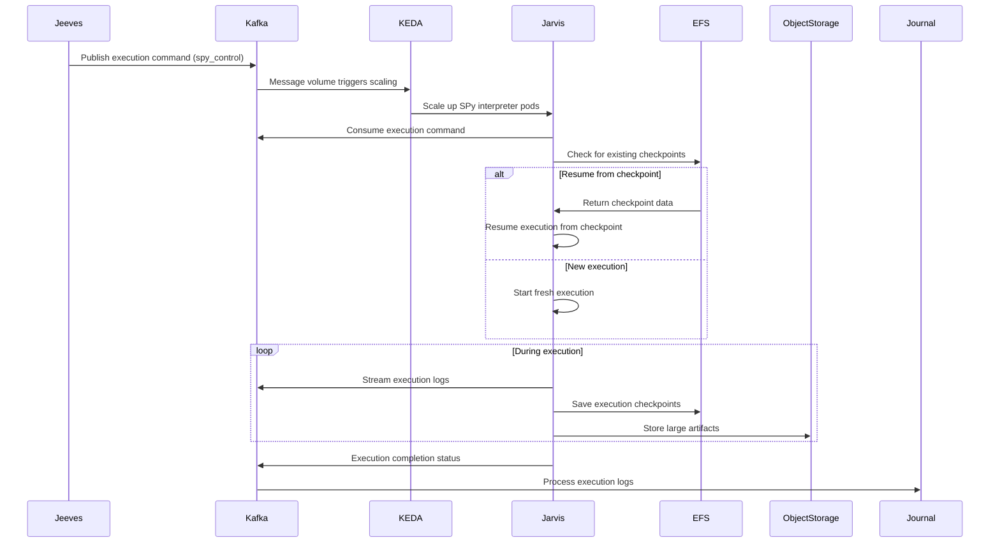

# Jarvis - SPy Program Execution Engine

**Namespace**: `jarvis`  
**Technology**: Rust, Kubernetes, KEDA  
**Purpose**: SPy program execution engine

## Overview

Jarvis is the core execution engine responsible for running SPy programs (Python subset). It operates as an event-driven system that scales based on workload demand, streams execution logs in real-time, and provides no direct API surface for debugging or monitoring.

## Responsibilities

- Execute SPy programs (Python subset) using REST interpreter
- Call Book functions for third-party integrations during execution
- Stream execution logs to Telegraf for InfluxDB processing
- Write large artifacts to Object Service for efficient handling
- Emit raw execution logs with expressions and variable values
- Manage execution checkpoints for resume capability

## Architecture

### Control Mechanism

Jarvis operates through Kafka-based control rather than direct API access:

- **Control Channel**: Kafka topic `spy_control`
- **Command Types**: Start and stop execution instructions
- **No Direct APIs**: No REST or WebSocket interfaces for execution control
- **Event-Driven**: All execution management via Kafka messaging

### Services within Namespace

#### SPy Interpreter
- **Purpose**: Core execution engine for SPy programs
- **Technology**: Kubernetes Service, Rust application
- **Function**: Execute SPy programs and stream execution logs
- **Scaling**: Managed by KEDA based on Kafka message volume

#### KEDA (Kubernetes Event Driven Autoscaler)
- **Purpose**: Event-driven autoscaling of SPy interpreter pods
- **Technology**: Kubernetes Deployment, KEDA controller
- **Function**: Watches Kafka topics and scales execution pods based on message volume
- **Integration**: Monitors `spy_control` topic for scaling decisions
- **Benefits**: Automatic scaling up during high load, scale down during idle periods

#### File System (EFS)
- **Purpose**: Persistent storage for execution checkpoints
- **Technology**: Amazon EFS mounted as Kubernetes Persistent Volume
- **Function**: Stores and retrieves execution checkpoints for resume capability
- **Benefits**: Enables execution resumption after interruptions or failures

## Data Flow

## Infrastructure Components

### Redis Cache
- **Purpose**: Execution state management
- **Usage**: Temporary state storage during execution
- **Benefits**: Fast access to execution context and intermediate results

### Kubernetes Service Mesh
- **Purpose**: Inter-service connectivity
- **Benefits**: Secure, encrypted communication with other services
- **Features**: Service discovery, load balancing, traffic management

### Object Service Integration
- **Purpose**: Large artifact storage via dedicated Object Service
- **Supported Operations**:
  - Upload large execution outputs and artifacts to Object Service
  - Object Service provides signed URLs for secure HTTP downloads through UI
  - Efficient handling of large execution results and file attachments

### Kafka Integration
- **Consumer Topics**: `spy_control` (execution commands)
- **Producer Topics**: Execution logs and status updates
- **Message Format**: Structured execution events with metadata

## Key Features

### Event-Driven Execution
- No direct API exposure for execution control
- All commands received via Kafka messaging
- Enables loose coupling with orchestration services

### Automatic Scaling
- KEDA monitors Kafka message volume
- Scales SPy interpreter pods up/down based on demand
- Cost-efficient resource utilization

### Checkpoint Support
- Automatic checkpoint creation during execution
- Resume capability after interruptions
- Stored on persistent EFS volumes

### Raw Log Streaming
- Streams execution logs without processing
- No concern for fact ID stability
- High-performance log emission for downstream processing

### Large Artifact Handling
- Direct integration with object storage
- Efficient handling of large execution outputs
- Signed URL generation for secure access

## Scaling Behavior

### Scale-Up Triggers
- High message volume in `spy_control` topic
- Configurable threshold for scaling decisions
- Rapid response to execution demand

### Scale-Down Behavior
- Automatic scale-down during low activity
- Configurable cooldown periods
- Resource optimization during idle periods

### Resource Limits
- Kubernetes resource quotas per pod
- Memory and CPU limits for predictable performance
- Network bandwidth considerations for log streaming

## Security Considerations

### Execution Isolation
- Each execution runs in isolated pods
- No cross-execution data leakage
- Clean environment for each SPy program

### Network Security
- Service mesh encryption for all communication
- No direct external access to execution pods
- Secure Kafka authentication

### Artifact Security
- Signed URLs for object storage access
- Time-limited access to execution artifacts
- Encryption at rest for stored artifacts

## Monitoring and Observability

### Execution Metrics
- Execution duration and success rates
- Resource utilization per execution
- Scaling events and pod lifecycle

### Log Streaming Metrics
- Log volume and streaming rates
- Kafka topic lag and throughput
- Downstream processing performance

### Health Checks
- Pod readiness and liveness probes
- Kafka connectivity monitoring
- EFS mount health verification

## Integration Points

### With Jeeves
- Receives execution commands via Kafka `spy_control` topic
- Reports execution status and completion via Kafka events
- Coordination for execution lifecycle management

### With Business Journal
- Streams raw execution logs to Telegraf for InfluxDB processing
- No direct communication - all via Kafka event streaming
- Enables fact persistence and dynamic querying

### With Object Service
- Stores large execution artifacts in dedicated Object Service
- Object Service provides signed URLs for secure UI downloads
- Efficient handling of large files and execution outputs

### With Books (via BDK)
- Calls Book functions during SPy program execution
- Integrates with customer-deployed Python skill collections
- Enables third-party system integrations through Book procedures

## Error Handling

### Execution Failures
- Automatic retry logic for transient failures
- Checkpoint-based recovery for resumable executions
- Error reporting via Kafka events

### Infrastructure Failures
- Pod restart capability with checkpoint recovery
- EFS failover for persistent storage
- Kafka reconnection logic

### Resource Exhaustion
- Graceful handling of memory/CPU limits
- Overflow protection for log streaming
- Backpressure mechanisms for high load
