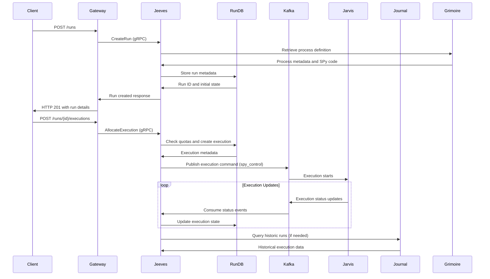

# Jeeves - Run Orchestration and Execution Metadata

**Namespace**: `jeeves`  
**Technology**: Rust, PostgreSQL, Envoy  
**Purpose**: Run orchestration and execution metadata persistence

## Overview

Jeeves serves as the orchestration layer for the execution system, managing the lifecycle of Runs and their Executions. It enforces client quotas, handles idempotent execution allocation, and maintains execution metadata in a dedicated database.

## Responsibilities

- Orchestrate Runs and their Executions across the system
- Enforce client quotas and implement backpressure mechanisms
- Handle idempotent execution allocation to prevent duplication
- Persist execution metadata in the Run Database
- Coordinate with Jarvis for actual program execution
- Manage run state and execution history

## Architecture

### Services within Namespace

#### Run Manager Pod
The Run Manager Pod contains two cooperating applications:

##### Run Manager Service
- **Purpose**: Core run orchestration and execution management
- **Technology**: Rust application, Kubernetes Service, Kubernetes Deployment
- **Database**: PostgreSQL Run Database
- **Event Integration**: Kafka producer/consumer

**APIs**:
- **gRPC**:
  - `CreateRun`: Initialize new run with metadata
  - `GetRun`: Retrieve run details and status
  - `AllocateExecution`: Create new execution within a run

##### Run Manager gRPC Transcoder
- **Purpose**: Protocol translation and gateway integration
- **Technology**: Envoy application
- **Function**: Translates between REST and gRPC protocols

**APIs**:
- **REST via Gateway**:
  - `POST /runs`: Create new run
  - `GET /runs/{id}`: Retrieve run details
  - `POST /runs/{id}/executions`: Create execution for run
  - `POST /threads/{id}/executions`: Create execution for thread (binds a thread to a run and allocates an execution; authorization validated via UOM)

#### Run Database
- **Purpose**: Persist execution metadata and run state
- **Technology**: PostgreSQL
- **Data**: Execution records, run metadata, large payload references, run state
- **Access**: Exclusively via Run Manager Service

## Data Flow



## Key Features

### Run Orchestration
- **Run Lifecycle**: Create, monitor, and manage run execution
- **Execution Allocation**: Assign executions to runs with proper metadata
- **State Management**: Track run and execution states through lifecycle
- **Coordination**: Interface between client requests and execution engine

### Quota Management
- **Client Quotas**: Enforce limits on concurrent executions per client
- **Backpressure**: Return `429/RESOURCE_EXHAUSTED` when quotas exceeded
- **Resource Management**: Monitor and control system resource utilization
- **Fair Usage**: Ensure equitable resource distribution across clients

### Idempotency
- **Idempotency Keys**: Use `idempotency_key` for duplicate request handling
- **Duplicate Prevention**: Ensure execution requests are processed exactly once
- **State Consistency**: Maintain consistent state across retry attempts
- **Client Safety**: Protect clients from accidental duplicate executions

### Metadata Persistence
- **Execution Records**: Store detailed execution metadata and results
- **Run State**: Maintain comprehensive run state information
- **Large Payloads**: Reference large payloads stored in object storage
- **Query Support**: Enable efficient querying of execution history

## Database Schema

### Runs Table
```sql
-- Run metadata and state
runs (
    id UUID PRIMARY KEY,
    process_id UUID NOT NULL,
    status VARCHAR(50) NOT NULL,
    created_at TIMESTAMP NOT NULL,
    updated_at TIMESTAMP NOT NULL,
    metadata JSONB,
    client_id UUID NOT NULL
)
```

### Executions Table
```sql
-- Individual execution records
executions (
    id UUID PRIMARY KEY,
    run_id UUID NOT NULL REFERENCES runs(id),
    execution_number INTEGER NOT NULL,
    status VARCHAR(50) NOT NULL,
    started_at TIMESTAMP,
    completed_at TIMESTAMP,
    idempotency_key VARCHAR(255) UNIQUE,
    metadata JSONB,
    artifact_refs JSONB
)
```

### Quotas Table
```sql
-- Client quota tracking
client_quotas (
    client_id UUID PRIMARY KEY,
    max_concurrent_executions INTEGER NOT NULL,
    current_executions INTEGER DEFAULT 0,
    last_updated TIMESTAMP NOT NULL
)
```

## API Specifications

### gRPC APIs

#### CreateRun
```protobuf
service RunManager {
  rpc CreateRun(CreateRunRequest) returns (CreateRunResponse);
}

message CreateRunRequest {
  string process_id = 1;
  map<string, string> metadata = 2;
  string client_id = 3;
}

message CreateRunResponse {
  string run_id = 1;
  string status = 2;
  google.protobuf.Timestamp created_at = 3;
}
```

#### GetRun
```protobuf
rpc GetRun(GetRunRequest) returns (GetRunResponse);

message GetRunRequest {
  string run_id = 1;
}

message GetRunResponse {
  string run_id = 1;
  string process_id = 2;
  string status = 3;
  repeated Execution executions = 4;
  map<string, string> metadata = 5;
}
```

#### AllocateExecution
```protobuf
rpc AllocateExecution(AllocateExecutionRequest) returns (AllocateExecutionResponse);

message AllocateExecutionRequest {
  string run_id = 1;
  string idempotency_key = 2;
  map<string, string> execution_metadata = 3;
}

message AllocateExecutionResponse {
  string execution_id = 1;
  int32 execution_number = 2;
  string status = 3;
}
```

### REST APIs (via Gateway)

#### Create Run
```http
POST /runs
Content-Type: application/json

{
  "process_id": "uuid",
  "metadata": {
    "key": "value"
  }
}

Response: 201 Created
{
  "run_id": "uuid",
  "status": "created",
  "created_at": "2024-01-01T00:00:00Z"
}
```

#### Get Run
```http
GET /runs/{run_id}

Response: 200 OK
{
  "run_id": "uuid",
  "process_id": "uuid",
  "status": "running",
  "executions": [...],
  "metadata": {...}
}
```

#### Create Execution
```http
POST /runs/{run_id}/executions
Content-Type: application/json
Idempotency-Key: client-generated-key

{
  "metadata": {
    "execution_context": "value"
  }
}

Response: 201 Created
{
  "execution_id": "uuid",
  "execution_number": 1,
  "status": "allocated"
}
```

## Integration Points

### With Jarvis
- **Command Channel**: Publishes execution commands to Kafka `spy_control` topic
- **Status Updates**: Consumes execution status updates from Kafka
- **Coordination**: Manages execution lifecycle with Jarvis

### With Journal
- **Historical Data**: Retrieves historic runs for context and analysis
- **Fact Queries**: Coordinates with Journal for execution-related facts
- **Data Flow**: Provides execution metadata for fact processing

- ### With Grimoire
- **Process Retrieval**: Fetches process definitions and SPy code
- **Process Validation**: Validates process existence before run creation
- **Metadata**: Retrieves process metadata for run context

### With Guidance Center
- **Troubleshooting**: Initiates troubleshooting workflows for failed executions
- **Human-in-the-loop**: Coordinates with guidance for complex scenarios
- **Decision Support**: Provides execution context for guidance decisions

## Security Considerations

### Quota Enforcement
- **Rate Limiting**: Prevent resource exhaustion through quota limits
- **Client Isolation**: Ensure clients cannot impact each other's quotas
- **Graceful Degradation**: Proper error responses when quotas exceeded

### Idempotency Security
- **Key Validation**: Secure handling of idempotency keys
- **Replay Attack Prevention**: Protect against malicious duplicate requests
- **State Consistency**: Ensure idempotent operations maintain data integrity

### Data Access
- **Client Isolation**: Clients can only access their own runs
- **Execution Privacy**: Execution metadata protected from unauthorized access
- **Audit Logging**: Comprehensive logging of all run operations

## Error Handling

### Quota Violations
```http
HTTP 429 Too Many Requests
{
  "error": "RESOURCE_EXHAUSTED",
  "message": "Client quota exceeded",
  "retry_after": "60s"
}
```

### Idempotency Conflicts
- **Duplicate Keys**: Return existing execution for duplicate idempotency keys
- **Consistency**: Ensure idempotent behavior across all operations
- **Client Communication**: Clear messaging about idempotency handling

### System Failures
- **Database Failures**: Graceful handling of database connectivity issues
- **Kafka Failures**: Retry logic for event publishing/consumption
- **Recovery**: Automatic recovery mechanisms for transient failures

## Performance Considerations

### Database Optimization
- **Indexing**: Proper indexes on run_id, client_id, and timestamps
- **Connection Pooling**: Efficient database connection management
- **Query Optimization**: Optimized queries for common access patterns

### Scaling
- **Horizontal Scaling**: Multiple Run Manager pods for load distribution
- **Database Scaling**: Read replicas for query performance
- **Cache Layer**: Redis caching for frequently accessed data

### Throughput
- **Batch Operations**: Batch processing for high-volume scenarios
- **Async Processing**: Non-blocking operations where possible
- **Resource Monitoring**: Continuous monitoring of system performance
