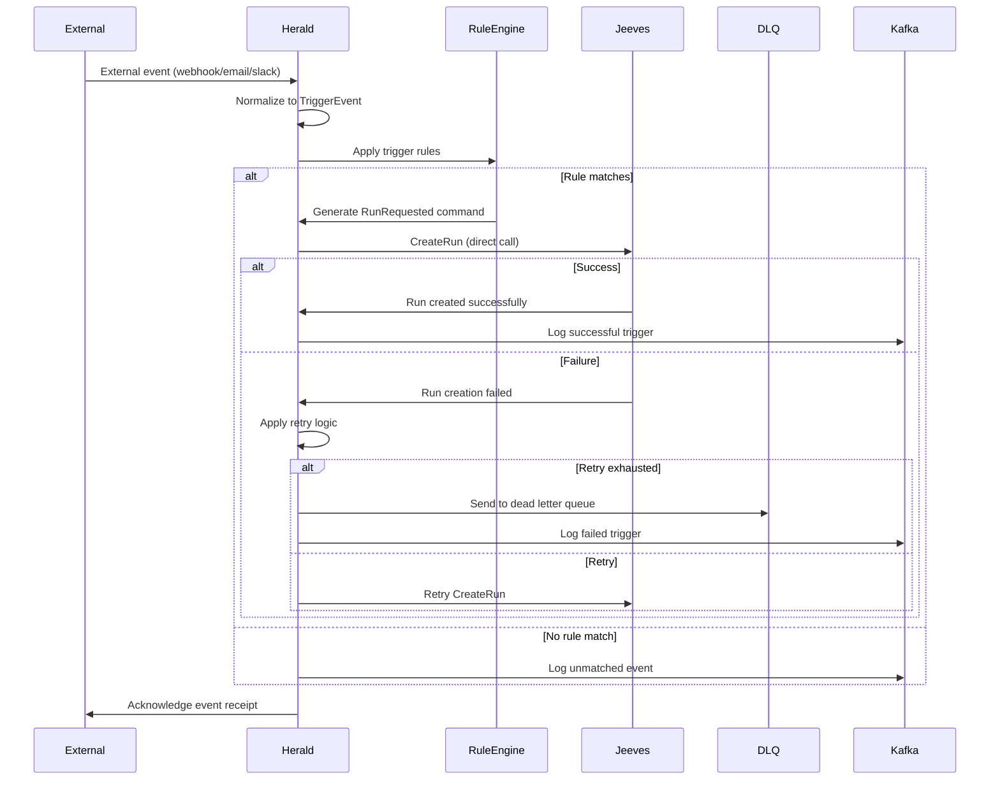

# Herald - External Event Ingestion and Trigger Routing

**Namespace**: `herald`  
**Technology**: Rust, Kubernetes  
**Purpose**: External event ingestion and trigger routing

## Overview

Herald serves as the gateway for external events, ingesting events from various sources (Slack, email, webhooks, schedules) and routing them through configurable rules to trigger process executions. It acts as the bridge between external systems and the Voyager execution pipeline.

## Responsibilities

- Ingest external events from multiple sources (Slack/email/webhook/schedule)
- Normalize diverse event formats to standardized `TriggerEvent` format
- Apply configurable rules to produce `RunRequested` commands
- Call `Jeeves.CreateRun` directly for process execution initiation
- Handle retries and dead letter queues for reliable event processing
- Manage webhook endpoints and external integration points

## Architecture

### Services within Namespace

#### Herald Service
- **Purpose**: Core trigger processing and event routing
- **Technology**: Kubernetes Service (K8 Service), Rust application
- **Integration**: Direct integration with Jeeves for run creation
- **Event Processing**: Kafka-based event processing pipeline

**APIs**:
- **gRPC**:
  - Rules CRUD operations for trigger management
  - `Simulate`: Test trigger rules with sample events
- **REST via Gateway**:
  - `/triggers/rules` - Complete CRUD operations for trigger rules
  - `/triggers/rules/{id}:simulate` - Simulate rule execution
  - `/triggers/webhooks/{source}` - Webhook endpoints for external systems

## Key Features

### Multi-Source Event Ingestion
- **Webhook Integration**: HTTP webhooks for external system integration
- **Email Processing**: Email-based trigger processing
- **Slack Integration**: Slack event and command processing
- **Scheduled Events**: Cron-based scheduled trigger execution
- **API Events**: Direct API-based event submission

### Event Normalization
- **Unified Format**: Converts all external events to standardized `TriggerEvent` format
- **Metadata Preservation**: Maintains source-specific metadata while normalizing structure
- **Context Enrichment**: Adds system context and routing information
- **Validation**: Input validation and schema enforcement for all event types

### Rule-Based Routing
- **Configurable Rules**: Flexible rule engine for event routing decisions
- **Pattern Matching**: Advanced pattern matching for event classification
- **Conditional Logic**: Support for complex conditional logic in rules
- **Priority Handling**: Rule priority and execution order management

### Reliable Processing
- **Retry Logic**: Intelligent retry mechanisms for failed event processing
- **Dead Letter Queues**: Dead letter queue handling for unprocessable events
- **Event Deduplication**: Duplicate event detection and handling
- **Error Recovery**: Automatic error recovery and escalation procedures

## Data Flow



## Event Types and Sources

### Webhook Events
- **Generic Webhooks**: Standard HTTP webhook processing
- **GitHub Webhooks**: Git repository events and CI/CD triggers
- **External API Events**: Third-party service notifications
- **Custom Integrations**: Customer-specific webhook implementations

### Email Events
- **Inbound Email**: Email-based trigger processing
- **Email Commands**: Command extraction from email content
- **Attachment Processing**: Handle email attachments and content
- **Email Routing**: Route emails based on sender, subject, and content

### Slack Events
- **Slash Commands**: Slack slash command processing
- **Message Events**: React to specific Slack messages and mentions
- **Channel Events**: Channel-based trigger events
- **User Actions**: User interaction-based triggers

### Scheduled Events
- **Cron Schedules**: Traditional cron-based scheduling
- **Interval Triggers**: Recurring interval-based triggers
- **One-time Events**: Single execution scheduled events
- **Calendar Integration**: Calendar-based event scheduling

## TriggerEvent Format

### Standardized Event Structure
```json
{
  "event_id": "uuid",
  "source": "webhook|email|slack|schedule",
  "source_id": "source-specific-identifier",
  "event_type": "repository.push|email.received|message.posted|schedule.triggered",
  "timestamp": "2024-01-01T00:00:00Z",
  "payload": {
    // Source-specific payload data
  },
  "metadata": {
    "source_version": "1.0",
    "content_type": "application/json",
    "user_agent": "GitHub-Hookshot/abc123",
    "ip_address": "192.168.1.1"
  },
  "context": {
    "organization_id": "uuid",
    "workspace_id": "uuid", 
    "user_id": "uuid"
  }
}
```

### Event Processing Pipeline
1. **Ingestion**: Receive raw event from external source
2. **Authentication**: Validate event source and authenticity
3. **Normalization**: Convert to standardized TriggerEvent format
4. **Enrichment**: Add context and metadata
5. **Rule Application**: Apply trigger rules for routing decisions
6. **Execution**: Generate and execute RunRequested commands

## Rule Engine

### Rule Definition
```json
{
  "rule_id": "uuid",
  "name": "GitHub Push to Main",
  "description": "Trigger deployment on push to main branch",
  "enabled": true,
  "priority": 100,
  "conditions": {
    "source": "webhook",
    "event_type": "repository.push",
    "payload": {
      "ref": "refs/heads/main",
      "repository.name": "production-app"
    }
  },
  "actions": [
    {
      "type": "create_run",
      "process_id": "deployment_process",
      "parameters": {
        "branch": "{{payload.ref}}",
        "commit": "{{payload.head_commit.id}}",
        "repository": "{{payload.repository.name}}"
      }
    }
  ],
  "retry_policy": {
    "max_attempts": 3,
    "backoff_strategy": "exponential",
    "initial_delay": "1s"
  }
}
```

### Rule Matching
- **Exact Match**: Exact value matching for specific fields
- **Pattern Matching**: Regex and glob pattern matching
- **Conditional Logic**: AND/OR logic for complex conditions
- **Template Variables**: Dynamic parameter substitution from event data

### Rule Actions
- **Create Run**: Trigger process execution via Jeeves
- **Send Notification**: Send notifications to users or channels
- **Forward Event**: Forward event to other systems
- **Custom Actions**: Execute custom actions and integrations

## API Specifications

### gRPC APIs

#### Rule Management
```protobuf
service Herald {
  rpc CreateRule(CreateRuleRequest) returns (CreateRuleResponse);
  rpc GetRule(GetRuleRequest) returns (GetRuleResponse);
  rpc UpdateRule(UpdateRuleRequest) returns (UpdateRuleResponse);
  rpc DeleteRule(DeleteRuleRequest) returns (DeleteRuleResponse);
  rpc ListRules(ListRulesRequest) returns (ListRulesResponse);
  rpc SimulateRule(SimulateRuleRequest) returns (SimulateRuleResponse);
}

message CreateRuleRequest {
  string name = 1;
  string description = 2;
  RuleConditions conditions = 3;
  repeated RuleAction actions = 4;
  RetryPolicy retry_policy = 5;
  int32 priority = 6;
}

message SimulateRuleRequest {
  string rule_id = 1;
  TriggerEvent sample_event = 2;
}

message SimulateRuleResponse {
  bool would_match = 1;
  repeated RuleAction actions_generated = 2;
  string simulation_details = 3;
}
```

### REST APIs (via Gateway)

#### Create Trigger Rule
```http
POST /triggers/rules
Content-Type: application/json

{
  "name": "Production Deployment",
  "description": "Deploy to production on main branch push",
  "conditions": {
    "source": "webhook",
    "event_type": "repository.push",
    "payload_conditions": {
      "ref": "refs/heads/main",
      "repository.name": "production-app"
    }
  },
  "actions": [
    {
      "type": "create_run",
      "process_id": "deployment_process",
      "parameters": {
        "environment": "production",
        "commit": "{{payload.head_commit.id}}"
      }
    }
  ],
  "priority": 100,
  "enabled": true
}

Response: 201 Created
{
  "rule_id": "uuid",
  "created_at": "2024-01-01T00:00:00Z"
}
```

#### Simulate Rule
```http
POST /triggers/rules/uuid:simulate
Content-Type: application/json

{
  "sample_event": {
    "source": "webhook",
    "event_type": "repository.push",
    "payload": {
      "ref": "refs/heads/main",
      "repository": {"name": "production-app"},
      "head_commit": {"id": "abc123"}
    }
  }
}

Response: 200 OK
{
  "would_match": true,
  "actions_generated": [
    {
      "type": "create_run",
      "process_id": "deployment_process",
      "parameters": {
        "environment": "production",
        "commit": "abc123"
      }
    }
  ],
  "simulation_details": "Rule matched on source=webhook, event_type=repository.push, ref=refs/heads/main"
}
```

#### Webhook Endpoints
```http
POST /triggers/webhooks/github
Content-Type: application/json
X-GitHub-Event: push
X-GitHub-Delivery: uuid

{
  "ref": "refs/heads/main",
  "repository": {
    "name": "production-app"
  },
  "head_commit": {
    "id": "abc123",
    "message": "Fix critical bug"
  }
}

Response: 200 OK
{
  "event_id": "uuid",
  "processed": true,
  "rules_matched": 1,
  "runs_created": 1
}
```

## Integration Points

### With Jeeves
- **Direct Integration**: Direct gRPC calls to `Jeeves.CreateRun`
- **Run Creation**: Initiates process executions based on trigger rules
- **Parameter Passing**: Passes event-derived parameters to process executions
- **Error Handling**: Handles run creation failures and retries

### With External Systems
- **Webhook Providers**: Receives webhooks from GitHub, GitLab, external APIs
- **Email Systems**: Integrates with email servers for email-based triggers
- **Slack API**: Integrates with Slack for message and command processing
- **Scheduling Systems**: Integrates with cron and scheduling systems

### With Kafka
- **Event Logging**: Logs all trigger events and processing results
- **Audit Trail**: Maintains comprehensive audit trail of trigger processing
- **Monitoring**: Publishes metrics and monitoring data
- **Dead Letter Queue**: Publishes failed events to dead letter topics

### With Object Service
- **Artifact References**: Include object IDs in events when attachments are present
- **No Direct Execution Calls**: Object Service is independent of Jarvis execution

## Thread Execution Support

### Resume-Only Mode
- **Thread Context**: Special handling for thread-based executions
- **Resume Logic**: Only resume existing thread executions, never create new threads
- **Context Preservation**: Preserve thread context across trigger events
- **State Management**: Manage thread state for resume operations

### Thread-Specific Rules
- **Thread Triggers**: Rules specifically for thread-based events
- **Context Matching**: Match rules based on thread context and state
- **Resume Conditions**: Conditions for when to resume thread executions
- **Thread Parameters**: Thread-specific parameter handling

## Error Handling and Reliability

### Retry Mechanisms
- **Exponential Backoff**: Intelligent retry with exponential backoff
- **Configurable Policies**: Per-rule retry policy configuration
- **Circuit Breaker**: Circuit breaker pattern for failing external services
- **Rate Limiting**: Rate limiting for external API calls

### Dead Letter Queue Processing
- **Unprocessable Events**: Handle events that cannot be processed
- **Manual Review**: Support for manual review and reprocessing
- **Error Analysis**: Analysis and categorization of failed events
- **Recovery Procedures**: Procedures for recovering from processing failures

### Event Deduplication
- **Duplicate Detection**: Detect and handle duplicate events
- **Idempotency**: Ensure idempotent processing of events
- **State Tracking**: Track processing state to prevent duplicates
- **Cleanup**: Automatic cleanup of old deduplication data

## Security Considerations

### Webhook Security
- **Signature Verification**: Verify webhook signatures from external sources
- **IP Whitelisting**: Restrict webhook sources to known IP ranges
- **Rate Limiting**: Protect against webhook flooding and abuse
- **Input Validation**: Comprehensive input validation for all webhook data

### Authentication and Authorization
- **API Key Management**: Secure API key management for external integrations
- **Token Validation**: Validate tokens and credentials from external sources
- **Access Control**: Fine-grained access control for rule management
- **Audit Logging**: Comprehensive audit logging for security monitoring

### Data Protection
- **Sensitive Data**: Protect sensitive data in event payloads
- **Encryption**: Encrypt sensitive trigger rule parameters
- **Data Retention**: Configurable data retention for event data
- **Compliance**: Ensure compliance with data protection regulations

## Performance and Scaling

### High Throughput Processing
- **Async Processing**: Asynchronous event processing for high throughput
- **Batch Processing**: Batch processing for high-volume events
- **Queue Management**: Efficient queue management for event processing
- **Load Balancing**: Load balancing across multiple Herald instances

### Resource Optimization
- **Memory Management**: Efficient memory usage for event processing
- **CPU Optimization**: Optimize CPU usage for rule evaluation
- **Network Efficiency**: Minimize network usage for external integrations
- **Storage Optimization**: Efficient storage of rule and event data

### Monitoring and Metrics
- **Processing Metrics**: Track event processing rates and latency
- **Rule Performance**: Monitor rule evaluation performance
- **Error Rates**: Track and analyze error rates and patterns
- **System Health**: Comprehensive system health monitoring

## Configuration Management

### Rule Configuration
- **Version Control**: Version control for trigger rules
- **Environment Management**: Environment-specific rule configuration
- **Hot Reloading**: Hot reloading of rule changes without restart
- **Validation**: Rule validation and testing before deployment

### External Integration Configuration
- **Connection Management**: Manage external system connections
- **Credential Management**: Secure credential management for integrations
- **Endpoint Configuration**: Configure external system endpoints
- **Health Checks**: Health checks for external system connectivity
