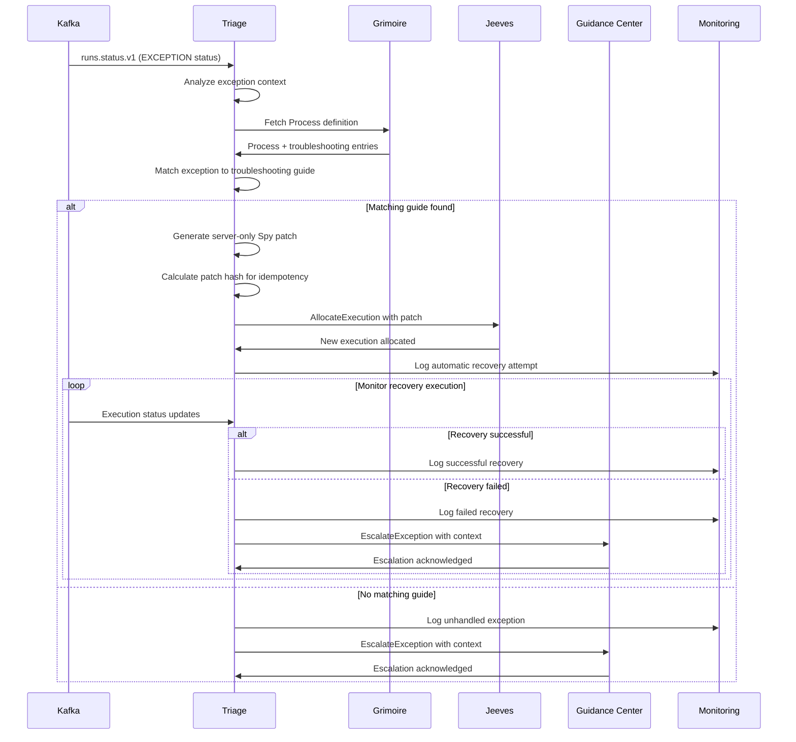

# Triage - Automated Exception Handling and Retry Logic

**Namespace**: `triage`  
**Technology**: Rust, Kubernetes  
**Purpose**: Automated exception handling and retry logic

## Overview

Triage serves as the first responder for all execution exceptions in the Voyager platform. It provides intelligent automated exception handling for failed process executions, analyzes execution failures, matches them against troubleshooting guides, and generates server-only Spy patches to automatically recover from common failure scenarios. When automatic recovery is not possible, Triage escalates exceptions to the Guidance Center for human intervention.

## Responsibilities

- **Primary Exception Handler**: Act as first responder for all execution exceptions
- Consume `runs.status.v1` events for `EXCEPTION` status monitoring
- Fetch canonical Process definitions and troubleshooting entries from Grimoire
- Match exception context to relevant troubleshooting guides and recovery procedures
- Generate server-only Spy patches for automatic failure recovery
- Request new executions with patches via Jeeves for automatic retry
- **Escalation Management**: Escalate unresolvable exceptions to Guidance Center
- Maintain idempotency for exception handling and patch generation

## Architecture

### Services within Namespace

#### Triage Service
- **Purpose**: Core exception handling and retry logic
- **Technology**: Kubernetes Service (K8 Service), Rust application
- **Integration**: Kafka consumer for exception events, direct integration with Jeeves and Grimoire
- **Security**: Server-only operation with no UI exposure of sensitive spy_code

**APIs**:
- **gRPC (internal)**:
  - `ProposePatch`: Generate patches for exception scenarios
  - `HandleException`: Process exception events and coordinate recovery
  - `EscalateException`: Escalate unresolvable exceptions to Guidance Center
- **REST**: None (internal service only)

## Key Features

### Intelligent Exception Analysis
- **Exception Classification**: Categorize exceptions by type, context, and impact
- **Pattern Recognition**: Identify recurring exception patterns and root causes
- **Context Analysis**: Analyze execution context and environmental factors
- **Severity Assessment**: Assess exception severity and recovery priority

### Automated Recovery
- **Patch Generation**: Generate server-only Spy code patches for common failures
- **Recovery Orchestration**: Orchestrate automatic recovery procedures
- **Retry Logic**: Intelligent retry mechanisms with backoff strategies
- **Success Validation**: Validate recovery success and escalate if needed

### Troubleshooting Integration
- **Knowledge Base**: Integration with Process troubleshooting guides
- **Pattern Matching**: Match exceptions to known troubleshooting scenarios
- **Solution Application**: Automatically apply known solutions to exceptions
- **Learning**: Learn from successful recoveries to improve future handling

### Escalation Management
- **Escalation Criteria**: Define criteria for escalating exceptions to human intervention
- **Context Preservation**: Preserve complete exception context for escalated cases
- **Escalation Tracking**: Track escalation patterns and resolution outcomes
- **Feedback Integration**: Integrate human resolution feedback for improved automation

### Security and Isolation
- **Server-Only Operation**: Never expose spy_code to UI or external systems
- **Patch Isolation**: Server-only patches with no client visibility
- **Secure Processing**: Secure handling of sensitive execution context
- **Audit Trail**: Comprehensive audit trail of all exception handling

## Data Flow



## Exception Processing Pipeline

### Exception Detection
1. **Event Consumption**: Consume `runs.status.v1` events from Kafka
2. **Status Filtering**: Filter for `EXCEPTION` status events
3. **Context Extraction**: Extract execution context and error details
4. **Deduplication**: Ensure idempotent processing of exception events

### Analysis and Matching
1. **Exception Classification**: Classify exception by type and characteristics
2. **Process Retrieval**: Fetch Process definition and troubleshooting data
3. **Pattern Matching**: Match exception patterns to troubleshooting guides
4. **Solution Identification**: Identify applicable solutions and patches

### Patch Generation
1. **Spy Patch Creation**: Generate server-only Spy code patches
2. **Patch Validation**: Validate patch syntax and safety
3. **Idempotency Key**: Generate idempotency key for patch uniqueness
4. **Security Review**: Ensure patches don't expose sensitive information

### Recovery Execution
1. **Execution Request**: Request new execution with patch via Jeeves
2. **Monitoring**: Monitor recovery execution progress
3. **Success Validation**: Validate recovery success criteria
4. **Escalation**: Escalate to human intervention if recovery fails

## Process Flow Details

### Exception Event Structure
```json
{
  "event_type": "runs.status.v1",
  "run_id": "uuid",
  "execution_id": "uuid",
  "status": "EXCEPTION",
  "exception_details": {
    "exception_type": "NetworkTimeoutException",
    "message": "Connection timeout after 30 seconds",
    "stack_trace": "...",
    "execution_context": {
      "step": "api_call_external_service",
      "parameters": {...},
      "environment": "production"
    }
  },
  "timestamp": "2024-01-01T00:00:00Z",
  "metadata": {
    "owner_type": "run",
    "owner_id": "uuid",
    "execution_number": 1
  }
}
```

### Troubleshooting Guide Format
```json
{
  "guide_id": "network_timeout_recovery",
  "process_id": "uuid",
  "exception_patterns": [
    {
      "exception_type": "NetworkTimeoutException",
      "message_pattern": "Connection timeout after \\d+ seconds",
      "context_conditions": {
        "step": "api_call_.*",
        "environment": "production"
      }
    }
  ],
  "recovery_strategies": [
    {
      "strategy_id": "retry_with_backoff",
      "description": "Retry with exponential backoff",
      "spy_patch": "# Retry logic with exponential backoff\nretry_count = 3\nfor attempt in range(retry_count):\n    try:\n        result = api_call()\n        break\n    except NetworkTimeoutException:\n        if attempt == retry_count - 1:\n            raise\n        time.sleep(2 ** attempt)",
      "conditions": {
        "max_retry_attempts": 3,
        "applicable_steps": ["api_call_.*"]
      }
    }
  ]
}
```

### Patch Application Process
```python
# Example server-only patch generation
def generate_patch(exception_context, troubleshooting_guide):
    patch_template = troubleshooting_guide.recovery_strategies[0].spy_patch
    
    # Customize patch based on exception context
    patch = patch_template.format(
        timeout_value=exception_context.parameters.get('timeout', 30),
        retry_count=3,
        backoff_base=2
    )
    
    # Generate idempotency key
    patch_hash = hashlib.sha256(
        f"{exception_context.owner_id}:{exception_context.execution_number}:{patch}".encode()
    ).hexdigest()
    
    idempotency_key = f"{exception_context.owner_type}:{exception_context.owner_id}:{exception_context.execution_number}:{patch_hash}"
    
    return patch, idempotency_key
```

## Idempotency Management

### Idempotency Key Format
```
{owner_type}:{owner_id}:{failed_execution_number}:{patch_hash}
```

### Key Components
- **owner_type**: Type of execution owner (run, thread, etc.)
- **owner_id**: Unique identifier of the execution owner
- **failed_execution_number**: Execution number that failed
- **patch_hash**: SHA256 hash of the generated patch

### Deduplication Logic
- **Duplicate Detection**: Detect duplicate exception handling requests
- **State Tracking**: Track processing state for each idempotency key
- **Retry Prevention**: Prevent duplicate patch applications
- **Cleanup**: Automatic cleanup of old idempotency records

## API Specifications

### gRPC APIs (Internal)

#### ProposePatch
```protobuf
service Triage {
  rpc ProposePatch(ProposePatchRequest) returns (ProposePatchResponse);
  rpc HandleException(HandleExceptionRequest) returns (HandleExceptionResponse);
  rpc EscalateException(EscalateExceptionRequest) returns (EscalateExceptionResponse);
}

message ProposePatchRequest {
  string exception_id = 1;
  ExceptionContext context = 2;
  string process_id = 3;
  TroubleshootingGuide guide = 4;
}

message ProposePatchResponse {
  string patch_id = 1;
  string spy_patch = 2; // Server-only, never exposed to UI
  string idempotency_key = 3;
  PatchMetadata metadata = 4;
}

message HandleExceptionRequest {
  string run_id = 1;
  string execution_id = 2;
  ExceptionDetails exception = 3;
  string owner_type = 4;
  string owner_id = 5;
}

message ExceptionContext {
  string exception_type = 1;
  string message = 2;
  string stack_trace = 3;
  map<string, string> execution_context = 4;
  string environment = 5;
}

message EscalateExceptionRequest {
  string exception_id = 1;
  string run_id = 2;
  string execution_id = 3;
  ExceptionContext context = 4;
  string escalation_reason = 5;
  repeated string attempted_solutions = 6;
  string troubleshooter_id = 7; // Optional: preferred troubleshooter
}

message EscalateExceptionResponse {
  string escalation_id = 1;
  bool accepted = 2;
  string assigned_troubleshooter_id = 3;
  google.protobuf.Timestamp escalated_at = 4;
}
```

## Integration Points

### With Kafka
- **Event Consumption**: Consumes `runs.status.v1` events for exception monitoring
- **Status Filtering**: Filters events for `EXCEPTION` status
- **Real-time Processing**: Real-time exception event processing
- **Backpressure Handling**: Handles backpressure and queue management

### With Grimoire
- **Process Retrieval**: Fetches canonical Process definitions
- **Troubleshooting Data**: Retrieves troubleshooting entries and guides
- **Version Coordination**: Coordinates with specific Process versions
- **Guide Updates**: Receives updates to troubleshooting guides

### With Jeeves
- **Execution Allocation**: Requests new executions with patches via `AllocateExecution`
- **Idempotency**: Uses idempotency keys for duplicate prevention
- **Parameter Passing**: Passes patch parameters and context
- **Status Monitoring**: Monitors execution status for recovery validation

### With Guidance Center
- **Exception Escalation**: Escalates unresolvable exceptions for human intervention
- **Context Transfer**: Transfers complete exception context and attempted solutions
- **Resolution Feedback**: Receives feedback on human resolution outcomes
- **Learning Integration**: Integrates human solutions into automated recovery patterns

## Security Considerations

### Server-Only Operation
- **No UI Exposure**: Never expose spy_code patches to UI or external systems
- **Internal APIs**: All APIs are internal-only with no external access
- **Patch Isolation**: Server-only patches with no client visibility
- **Secure Storage**: Secure storage and handling of patches

### Sensitive Data Protection
- **Context Sanitization**: Sanitize sensitive data from exception context
- **Credential Protection**: Protect credentials and sensitive parameters
- **Audit Logging**: Comprehensive audit logging without sensitive data exposure
- **Access Control**: Strict access control for Triage operations

### Patch Security
- **Patch Validation**: Validate patch safety and security
- **Code Review**: Automated code review for generated patches
- **Injection Prevention**: Prevent code injection in patch generation
- **Sandbox Testing**: Test patches in sandbox environment before application

## Error Handling and Escalation

### Recovery Failure Handling
- **Retry Limits**: Maximum retry attempts for recovery procedures
- **Escalation Triggers**: Triggers for escalating to human intervention
- **Fallback Procedures**: Fallback procedures when automatic recovery fails
- **Notification**: Notify appropriate personnel of escalated failures

### Human Intervention Integration
- **Escalation Workflow**: Structured escalation workflow for complex failures
- **Context Preservation**: Preserve exception context for human analysis
- **Manual Override**: Support for manual override of automatic recovery
- **Learning Integration**: Integrate human solutions back into automatic recovery

### System Resilience
- **Service Isolation**: Isolate Triage failures from other system components
- **Graceful Degradation**: Graceful degradation when Triage is unavailable
- **Circuit Breaker**: Circuit breaker pattern for failing external dependencies
- **Recovery Monitoring**: Monitor system recovery and health

## Performance and Optimization

### Real-Time Processing
- **Low Latency**: Optimize for low-latency exception processing
- **Stream Processing**: Efficient stream processing of exception events
- **Parallel Processing**: Parallel processing of multiple exceptions
- **Resource Management**: Efficient resource management for processing

### Pattern Recognition Optimization
- **Caching**: Cache troubleshooting guides and patterns
- **Index Optimization**: Optimize pattern matching algorithms
- **Learning**: Machine learning for improved pattern recognition
- **Performance Metrics**: Monitor pattern matching performance

### Scalability
- **Horizontal Scaling**: Scale Triage service across multiple instances
- **Load Distribution**: Distribute exception processing load
- **Resource Allocation**: Dynamic resource allocation based on load
- **Capacity Planning**: Capacity planning for exception processing

## Monitoring and Observability

### Exception Metrics
- **Exception Rates**: Track exception rates by type and severity
- **Recovery Success**: Monitor automatic recovery success rates
- **Processing Latency**: Track exception processing latency
- **Escalation Rates**: Monitor escalation rates and patterns

### Recovery Analytics
- **Pattern Analysis**: Analyze exception patterns and trends
- **Recovery Effectiveness**: Assess effectiveness of recovery strategies
- **Guide Utilization**: Monitor troubleshooting guide usage
- **Improvement Opportunities**: Identify opportunities for improvement

### System Health
- **Service Health**: Monitor Triage service health and availability
- **Integration Health**: Monitor integration health with other services
- **Resource Utilization**: Track resource utilization and performance
- **Alert Management**: Automated alerting for system issues

## Continuous Improvement

### Learning and Adaptation
- **Success Analysis**: Analyze successful recoveries for pattern improvement
- **Failure Analysis**: Analyze recovery failures for guide improvement
- **Pattern Evolution**: Evolve exception patterns based on new failures
- **Guide Enhancement**: Continuously enhance troubleshooting guides

### Feedback Integration
- **Human Feedback**: Integrate feedback from human intervention cases
- **Recovery Results**: Learn from recovery execution results
- **System Feedback**: Integrate feedback from other system components
- **Automated Improvement**: Automated improvement of recovery strategies
