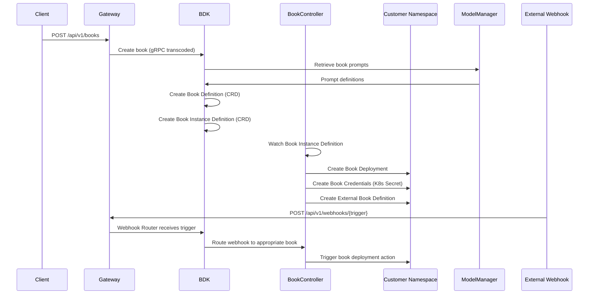

# BDK - Book Development Kit

**Namespace**: `bdk`  
**Technology**: Rust, Kubernetes Controllers, Envoy  
**Purpose**: Book management, instance creation, and webhook routing for external integrations

## Overview

BDK (Book Development Kit) serves as the comprehensive book management platform, handling book definitions, instance creation, and external integrations. It provides both library services for book management and controller-based automation for book lifecycle management.

## Responsibilities

- **Book Management**: Define and manage book descriptors and configurations
- **Instance Management**: Create and manage book instances with credentials
- **Webhook Routing**: Handle external webhook triggers and routing to book deployments
- **Library Services**: Provide gRPC transcoding and book library functionality
- **Lifecycle Automation**: Controller-based book and instance lifecycle management
- **Integration Coordination**: Coordinate with customer namespaces for book deployments

## Architecture

### Services within Namespace

#### BDK Library Pod
Contains the gRPC transcoder for external API access:

##### BDK Library gRPC Transcoder
- **Purpose**: Protocol translation and gateway integration
- **Technology**: Envoy application
- **Function**: Translates between REST and gRPC protocols for BDK operations
- **API Routing**: Receives `/api/v1/books` requests from HTTP router

#### Book Library Service
- **Purpose**: Core book management and library functionality
- **Technology**: Rust application, Kubernetes Service (K8 Service)
- **Integration**: Retrieves prompts from Model Manager, manages book lifecycle

**Data Flow**:
- Retrieves Book Descriptor from Book Definition
- Creates Book Instance via Book Instance Definition
- Creates book secrets in Book Credentials (customer namespaces)
- Creates external books and retrieves descriptors using External Book Definition

#### Book Controller
- **Purpose**: Orchestrate book lifecycle and instance management
- **Technology**: Rust application, K8 Control Manager, K8 Deployment
- **Function**: Manages book and book instance lifecycle operations

**Data Flow**:
- Watches Book Instance Definition for changes
- Manages Secondary Book Deployment (in customer namespaces)
- Manages Book Deployment with Tailscale (in customer namespaces)

#### Webhook Router
- **Purpose**: Route external webhook triggers to appropriate handlers
- **Technology**: Envoy application
- **Function**: Configures webhook endpoints and routes triggers to Book Controller
- **API Routing**: Receives `/api/v1/webhooks` requests from Envoy Gateway
- **Integration**: Handles external webhook integration points

### Custom Resource Definitions (CRDs)

#### Book Definition
- **Purpose**: Store book descriptors and configurations
- **Technology**: K8 CRD (Kubernetes Custom Resource Definition)
- **Function**: Defines book schemas, APIs, and metadata
- **Relationship**: Owned by Book Instance Definition

#### Book Instance Definition
- **Purpose**: Manage individual book instances with credentials
- **Technology**: K8 CRD (Kubernetes Custom Resource Definition)
- **Function**: Store instance-specific configurations and credentials
- **Data Flow**: Watches Book Controller for lifecycle management

## Key Features

### CRD-Based Management
- **Declarative Configuration**: Kubernetes-native book and instance definitions
- **Controller Pattern**: Automated lifecycle management through Kubernetes controllers
- **GitOps Integration**: Source control integration for book configurations
- **Schema Validation**: Built-in validation for book and instance definitions

### Multi-Deployment Support
- **Primary Deployments**: Standard book deployments in customer namespaces
- **Secondary Deployments**: Additional book instances for complex scenarios
- **Shared Deployments**: Cost-effective shared book instances
- **Tailscale Integration**: Secure networking for customer environments

### Webhook Integration
- **External Triggers**: Handle webhooks from external systems
- **Event Routing**: Route webhook events to appropriate book handlers
- **Trigger Processing**: Process webhook triggers for book deployments
- **Integration Management**: Manage external integration points

### Book Lifecycle Management
- **Automated Provisioning**: Automated book instance provisioning
- **Credential Management**: Secure credential creation and rotation
- **Health Monitoring**: Monitor book deployment health and status
- **Scaling**: Automatic scaling of book instances based on demand

## Data Flow



## Custom Resource Definitions

### Book Definition CRD
```yaml
apiVersion: bdk.voyager.io/v1
kind: BookDefinition
metadata:
  name: customer-support-book
  namespace: bdk
spec:
  name: "customer-support"
  version: "1.0.0"
  description: "Customer support automation book"
  schema:
    inputs:
      - name: "customer_id"
        type: "string"
        required: true
      - name: "issue_type"
        type: "string"
        enum: ["billing", "technical", "general"]
    outputs:
      - name: "resolution"
        type: "object"
        schema:
          status: "string"
          actions: "array"
  capabilities:
    - "ticket_creation"
    - "customer_lookup"
    - "escalation_management"
  runtime:
    language: "python"
    version: "3.11"
    requirements:
      - "requests>=2.28.0"
      - "pydantic>=1.10.0"
  integrations:
    - name: "zendesk"
      type: "webhook"
      config:
        endpoint: "/webhooks/zendesk"
    - name: "slack"
      type: "api"
      config:
        scopes: ["chat:write", "users:read"]
```

### Book Instance Definition CRD
```yaml
apiVersion: bdk.voyager.io/v1
kind: BookInstanceDefinition
metadata:
  name: acme-customer-support
  namespace: bdk
spec:
  bookRef:
    name: "customer-support-book"
    version: "1.0.0"
  customer:
    namespace: "customer-acme"
    organization_id: "org-uuid-123"
  deployment:
    type: "primary" # primary, secondary, shared
    replicas: 2
    resources:
      cpu: "500m"
      memory: "1Gi"
  networking:
    tailscale:
      enabled: true
      tailnet: "acme-corp"
  credentials:
    - name: "zendesk_api_key"
      type: "secret"
      source: "external" # external, generated, manual
    - name: "slack_bot_token"
      type: "secret"
      source: "external"
  configuration:
    environment: "production"
    log_level: "info"
    custom_settings:
      max_tickets_per_hour: 100
      escalation_threshold: 24
status:
  phase: "Ready" # Pending, Ready, Failed, Updating
  deployment_status:
    ready_replicas: 2
    total_replicas: 2
  last_updated: "2024-01-01T00:00:00Z"
  conditions:
    - type: "DeploymentReady"
      status: "True"
      last_transition: "2024-01-01T00:00:00Z"
```

## API Specifications

### REST APIs (via Gateway)

#### Book Management
```http
POST /api/v1/books
Content-Type: application/json

{
  "name": "customer-support",
  "version": "1.0.0",
  "description": "Customer support automation",
  "schema": {
    "inputs": [
      {
        "name": "customer_id",
        "type": "string",
        "required": true
      }
    ],
    "outputs": [
      {
        "name": "resolution",
        "type": "object"
      }
    ]
  },
  "capabilities": ["ticket_creation", "customer_lookup"],
  "runtime": {
    "language": "python",
    "version": "3.11"
  }
}

Response: 201 Created
{
  "book_id": "uuid",
  "name": "customer-support",
  "version": "1.0.0",
  "created_at": "2024-01-01T00:00:00Z"
}
```

#### Book Instance Management
```http
POST /api/v1/books/{book_id}/instances
Content-Type: application/json

{
  "customer_namespace": "customer-acme",
  "organization_id": "org-uuid-123",
  "deployment": {
    "type": "primary",
    "replicas": 2
  },
  "networking": {
    "tailscale": {
      "enabled": true,
      "tailnet": "acme-corp"
    }
  },
  "credentials": [
    {
      "name": "zendesk_api_key",
      "value": "encrypted_api_key"
    }
  ]
}

Response: 201 Created
{
  "instance_id": "uuid",
  "book_id": "uuid",
  "customer_namespace": "customer-acme",
  "status": "Pending",
  "created_at": "2024-01-01T00:00:00Z"
}
```

#### Webhook Management
```http
POST /api/v1/webhooks/{source}
Content-Type: application/json
X-Webhook-Source: zendesk
X-Webhook-Event: ticket.created

{
  "ticket": {
    "id": "12345",
    "subject": "Login issue",
    "customer_id": "customer-789",
    "priority": "high"
  },
  "timestamp": "2024-01-01T00:00:00Z"
}

Response: 200 OK
{
  "webhook_id": "uuid",
  "processed": true,
  "routed_to": "customer-acme/customer-support-book",
  "processing_time_ms": 150
}
```

## Book Deployment Types

### Primary Book Deployment
- **Purpose**: Main book deployment for customer workloads
- **Location**: Customer namespace (e.g., `customer-acme`)
- **Features**: Full functionality, dedicated resources, customer isolation
- **Networking**: Optional Tailscale sidecar for secure customer network access
- **Management**: Managed by Book Controller in BDK namespace

### Secondary Book Deployment
- **Purpose**: Additional book instances for complex scenarios
- **Use Cases**: Backup instances, different configurations, A/B testing
- **Management**: Coordinated with primary deployment for consistency
- **Resource Sharing**: Can share resources with primary deployment

### Shared Book Deployment
- **Purpose**: Cost-effective shared instances for common functionality
- **Multi-Tenancy**: Serves multiple customers with proper isolation
- **Resource Efficiency**: Shared infrastructure and operational costs
- **Security**: Strong tenant isolation and data protection

## Integration Points

### With Model Manager
- **Prompt Retrieval**: Book Library Service retrieves book prompts from Model Manager
- **Template Management**: Access to prompt templates and configurations
- **AI Integration**: Integration with AI models for book functionality
- **Version Coordination**: Coordinate prompt versions with book versions

### With Customer Namespaces
- **Deployment Management**: Create and manage book deployments in customer namespaces
- **Credential Management**: Create and manage book credentials as Kubernetes secrets
- **Network Configuration**: Configure Tailscale sidecars for secure networking
- **Resource Monitoring**: Monitor book deployment health and performance

### With Webhook Sources
- **External Integration**: Handle webhooks from external systems (GitHub, Zendesk, etc.)
- **Event Processing**: Process and route webhook events to appropriate books
- **Authentication**: Validate webhook authenticity and source
- **Rate Limiting**: Protect against webhook flooding and abuse

## Security Considerations

### Credential Management
- **Encrypted Storage**: Store book credentials as encrypted Kubernetes secrets
- **Access Control**: Fine-grained access control for credential access
- **Rotation**: Support for automatic credential rotation
- **Audit Logging**: Comprehensive audit logging for credential access

### Multi-Tenant Security
- **Namespace Isolation**: Strong isolation between customer namespaces
- **Resource Limits**: Enforce resource limits and quotas per customer
- **Network Security**: Secure networking with Tailscale integration
- **Data Isolation**: Ensure complete data isolation between tenants

### Webhook Security
- **Signature Verification**: Verify webhook signatures from external sources
- **Rate Limiting**: Protect against webhook abuse and flooding
- **Input Validation**: Comprehensive validation of webhook payloads
- **Source Authentication**: Authenticate webhook sources and origins

## Performance and Scaling

### Controller Performance
- **Watch Optimization**: Optimized Kubernetes resource watching
- **Batch Processing**: Batch processing for multiple resource changes
- **Resource Caching**: Cache frequently accessed resource data
- **Reconciliation**: Efficient reconciliation loops for resource management

### Book Deployment Scaling
- **Auto-Scaling**: Automatic scaling based on book workload demand
- **Resource Management**: Efficient resource allocation and management
- **Load Balancing**: Load balancing across multiple book instances
- **Performance Monitoring**: Monitor book deployment performance

### Webhook Processing
- **High Throughput**: Handle high-volume webhook traffic
- **Async Processing**: Asynchronous webhook processing for performance
- **Queue Management**: Efficient queue management for webhook processing
- **Error Handling**: Robust error handling and retry mechanisms

## Monitoring and Observability

### Book Lifecycle Metrics
- **Deployment Success**: Track book deployment success rates
- **Instance Health**: Monitor book instance health and availability
- **Resource Utilization**: Track resource usage across book deployments
- **Error Rates**: Monitor deployment and runtime error rates

### Webhook Metrics
- **Webhook Volume**: Track webhook volume by source and type
- **Processing Latency**: Monitor webhook processing latency
- **Success Rates**: Track webhook processing success rates
- **Error Analysis**: Analyze webhook processing errors and failures

### Controller Metrics
- **Reconciliation Performance**: Monitor controller reconciliation performance
- **Resource Sync**: Track resource synchronization status
- **Controller Health**: Monitor controller health and availability
- **API Server Load**: Monitor Kubernetes API server interaction load

## Error Handling and Recovery

### Deployment Failures
- **Rollback Capability**: Automatic rollback for failed deployments
- **Health Checks**: Comprehensive health checks for book deployments
- **Error Reporting**: Detailed error reporting for deployment failures
- **Manual Intervention**: Support for manual intervention when needed

### Webhook Failures
- **Retry Logic**: Intelligent retry logic for failed webhook processing
- **Dead Letter Queue**: Handle unprocessable webhooks
- **Error Classification**: Classify and handle different types of webhook errors
- **Monitoring**: Monitor webhook failure patterns and trends

### Controller Recovery
- **Leader Election**: Leader election for controller high availability
- **State Recovery**: Recover controller state after failures
- **Graceful Shutdown**: Graceful shutdown and restart procedures
- **Backup and Restore**: Backup and restore capabilities for critical data
