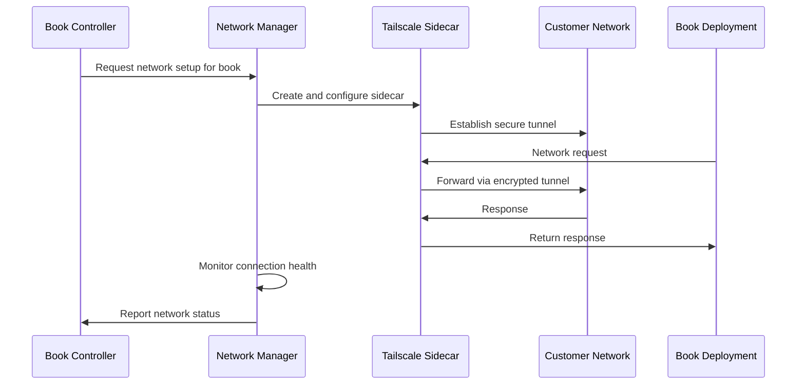

# Bifrost - Network Management and Tailscale Integration

**Namespace**: `bifrost`  
**Technology**: Rust, Tailscale, Kubernetes  
**Purpose**: Network management and secure customer connectivity via Tailscale

## Overview

Bifrost (Network Manager) serves as the network management service responsible for providing secure connectivity between Voyager services and customer infrastructure. It manages Tailscale sidecars and tailnet configurations to enable secure, encrypted access to customer networks.

## Responsibilities

- **Tailscale Management**: Attach and manage Tailscale sidecars for customer book deployments
- **Network Security**: Provide secure, encrypted tunnels to customer networks
- **Network Configuration**: Configure tailnets and network access policies
- **Connection Monitoring**: Monitor network connectivity and health
- **Customer Isolation**: Ensure proper network isolation between customers

## Architecture

### Services within Namespace

#### Network Manager Pod
The Network Manager Pod contains the core network management functionality:

##### Network Manager Service
- **Purpose**: Core network management and Tailscale orchestration
- **Technology**: Kubernetes Service (K8 Service), Kubernetes Deployment (K8 Deployment), Rust application
- **Function**: Manages Tailscale sidecars and network connectivity for customer books
- **Integration**: Coordinates with Book Controller for book deployment networking

**APIs**:
- **gRPC**: Network configuration, tailnet management, connectivity monitoring
- **REST via Gateway**: `/api/v1/networks` endpoints for network management

##### Network Manager gRPC Transcoder
- **Purpose**: Protocol translation and gateway integration
- **Technology**: Envoy application
- **Function**: Translates between REST and gRPC protocols for external API access

**APIs**:
- **REST via Gateway**: Network management operations accessible through Envoy Gateway

## Key Features

### Tailscale Integration
- **Sidecar Management**: Automatically attaches Tailscale sidecars to book deployments requiring customer network access
- **Tailnet Configuration**: Configures and manages customer-specific tailnets
- **Identity-Based Access**: Provides identity-based network access control
- **Zero-Trust Networking**: Implements zero-trust network principles

### Secure Connectivity
- **Encrypted Tunnels**: All customer network traffic encrypted via Tailscale
- **Network Isolation**: Strong isolation between different customer networks
- **Firewall Integration**: Integrates with customer firewall and security policies
- **Access Logging**: Comprehensive logging of network access and usage

### Multi-Customer Support
- **Customer-Specific Tailnets**: Separate tailnets for each customer
- **Policy Enforcement**: Customer-specific network access policies
- **Resource Tagging**: Proper tagging and identification of network resources
- **Scaling**: Horizontal scaling for multiple customer networks

## Data Flow



## API Specifications

### gRPC APIs

#### Network Management
```protobuf
service NetworkManager {
  rpc CreateTailnet(CreateTailnetRequest) returns (CreateTailnetResponse);
  rpc GetTailnet(GetTailnetRequest) returns (GetTailnetResponse);
  rpc UpdateTailnet(UpdateTailnetRequest) returns (UpdateTailnetResponse);
  rpc DeleteTailnet(DeleteTailnetRequest) returns (DeleteTailnetResponse);
  rpc AttachSidecar(AttachSidecarRequest) returns (AttachSidecarResponse);
  rpc DetachSidecar(DetachSidecarRequest) returns (DetachSidecarResponse);
  rpc GetNetworkStatus(GetNetworkStatusRequest) returns (GetNetworkStatusResponse);
}

message CreateTailnetRequest {
  string customer_id = 1;
  string tailnet_name = 2;
  NetworkConfiguration config = 3;
  repeated string tags = 4;
}

message AttachSidecarRequest {
  string book_deployment_id = 1;
  string tailnet_name = 2;
  SidecarConfiguration config = 3;
}

message NetworkConfiguration {
  repeated string allowed_networks = 1;
  repeated string blocked_networks = 2;
  AccessPolicy access_policy = 3;
  bool enable_logging = 4;
}
```

#### Network Monitoring
```protobuf
rpc MonitorConnectivity(MonitorConnectivityRequest) returns (stream ConnectivityEvent);
rpc GetConnectionMetrics(GetConnectionMetricsRequest) returns (GetConnectionMetricsResponse);

message ConnectivityEvent {
  string tailnet_name = 1;
  string event_type = 2; // connected, disconnected, error
  google.protobuf.Timestamp timestamp = 3;
  map<string, string> details = 4;
}

message GetConnectionMetricsResponse {
  repeated ConnectionMetric metrics = 1;
}

message ConnectionMetric {
  string tailnet_name = 1;
  int64 bytes_sent = 2;
  int64 bytes_received = 3;
  double latency_ms = 4;
  bool is_connected = 5;
  google.protobuf.Timestamp last_activity = 6;
}
```

### REST APIs (via Gateway)

#### Tailnet Management
```http
POST /api/v1/networks/tailnets
Content-Type: application/json

{
  "customer_id": "customer-123",
  "tailnet_name": "acme-corp-production",
  "config": {
    "allowed_networks": ["10.0.0.0/8", "192.168.0.0/16"],
    "blocked_networks": ["169.254.0.0/16"],
    "access_policy": "restrictive",
    "enable_logging": true
  },
  "tags": ["production", "customer-acme"]
}

Response: 201 Created
{
  "tailnet_id": "uuid",
  "tailnet_name": "acme-corp-production",
  "status": "creating",
  "created_at": "2024-01-01T00:00:00Z"
}
```

#### Sidecar Attachment
```http
POST /api/v1/networks/sidecars
Content-Type: application/json

{
  "book_deployment_id": "book-deployment-uuid",
  "tailnet_name": "acme-corp-production",
  "config": {
    "hostname": "book-customer-support",
    "advertise_routes": ["10.1.0.0/24"],
    "accept_routes": true,
    "enable_ssh": false
  }
}

Response: 201 Created
{
  "sidecar_id": "uuid",
  "status": "attaching",
  "tailnet_name": "acme-corp-production",
  "created_at": "2024-01-01T00:00:00Z"
}
```

#### Network Status
```http
GET /api/v1/networks/tailnets/acme-corp-production/status

Response: 200 OK
{
  "tailnet_name": "acme-corp-production",
  "status": "active",
  "connected_devices": 5,
  "last_activity": "2024-01-01T00:00:00Z",
  "metrics": {
    "bytes_sent": 1048576,
    "bytes_received": 2097152,
    "average_latency_ms": 45.2
  },
  "connected_sidecars": [
    {
      "sidecar_id": "uuid",
      "book_deployment": "customer-support-book",
      "status": "connected",
      "ip_address": "100.64.0.10"
    }
  ]
}
```

## Tailscale Configuration

### Sidecar Container Configuration
```yaml
apiVersion: apps/v1
kind: Deployment
metadata:
  name: book-with-tailscale
  namespace: customer-acme
spec:
  template:
    spec:
      containers:
      - name: book-app
        image: customer-book:latest
        # Main book application
      - name: tailscale
        image: tailscale/tailscale:latest
        env:
        - name: TS_KUBE_SECRET
          value: "tailscale-auth-acme"
        - name: TS_USERSPACE
          value: "false"
        - name: TS_HOSTNAME
          value: "book-customer-support"
        - name: TS_ROUTES
          value: "10.1.0.0/24"
        securityContext:
          capabilities:
            add:
            - NET_ADMIN
        volumeMounts:
        - name: dev-net-tun
          mountPath: /dev/net/tun
      volumes:
      - name: dev-net-tun
        hostPath:
          path: /dev/net/tun
```

### Network Policies
```yaml
apiVersion: networking.k8s.io/v1
kind: NetworkPolicy
metadata:
  name: tailscale-access
  namespace: customer-acme
spec:
  podSelector:
    matchLabels:
      app: book-deployment
  policyTypes:
  - Ingress
  - Egress
  ingress:
  - from:
    - podSelector:
        matchLabels:
          app: tailscale-sidecar
  egress:
  - to: []
    ports:
    - protocol: UDP
      port: 41641  # Tailscale default port
```

## Integration Points

### With Book Controller (BDK)
- **Deployment Coordination**: Coordinates with Book Controller to attach network sidecars to book deployments
- **Lifecycle Management**: Manages network sidecar lifecycle alongside book deployment lifecycle
- **Configuration Sync**: Synchronizes network configuration with book deployment requirements
- **Health Reporting**: Reports network health status back to Book Controller

### With Customer Infrastructure
- **Secure Tunneling**: Establishes secure, encrypted tunnels to customer networks
- **Network Discovery**: Discovers and maps customer network topology
- **Policy Enforcement**: Enforces customer-defined network access policies
- **Monitoring Integration**: Integrates with customer network monitoring systems

### With Envoy Gateway
- **API Exposure**: Exposes network management APIs through Envoy Gateway
- **Authentication**: Leverages gateway authentication for network API access
- **Rate Limiting**: Applies rate limiting to network management operations
- **Audit Logging**: Integrates with gateway audit logging for network operations

## Security Considerations

### Network Isolation
- **Customer Separation**: Complete network isolation between different customers
- **Tailnet Boundaries**: Strict boundaries between different tailnets
- **Access Control**: Fine-grained access control within tailnets
- **Traffic Encryption**: All inter-network traffic encrypted end-to-end

### Authentication and Authorization
- **Device Authentication**: Strong device authentication for tailnet access
- **Key Management**: Secure management of Tailscale authentication keys
- **Access Policies**: Comprehensive access policies for network resources
- **Audit Logging**: Detailed audit logging for all network access

### Compliance and Monitoring
- **Traffic Monitoring**: Real-time monitoring of network traffic and usage
- **Compliance Reporting**: Generate compliance reports for network access
- **Incident Response**: Automated incident response for security events
- **Data Protection**: Ensure customer data protection in transit

## Performance and Scaling

### High Availability
- **Multi-Instance**: Multiple Network Manager instances for redundancy
- **Failover**: Automatic failover for network connections
- **Health Monitoring**: Continuous health monitoring of network connections
- **Recovery**: Automated recovery from network failures

### Scaling Patterns
- **Horizontal Scaling**: Scale Network Manager instances based on customer count
- **Sidecar Optimization**: Optimize sidecar resource usage and performance
- **Connection Pooling**: Efficient connection pooling for network resources
- **Load Balancing**: Load balancing across multiple network endpoints

### Performance Optimization
- **Connection Caching**: Cache network connection information for performance
- **Route Optimization**: Optimize network routes for minimum latency
- **Bandwidth Management**: Manage and optimize network bandwidth usage
- **Monitoring**: Continuous performance monitoring and optimization

## Troubleshooting and Monitoring

### Network Diagnostics
- **Connectivity Testing**: Built-in connectivity testing and validation
- **Latency Monitoring**: Real-time latency monitoring and alerting
- **Throughput Analysis**: Network throughput analysis and optimization
- **Error Detection**: Automatic detection and reporting of network errors

### Operational Tools
- **Dashboard**: Comprehensive network status dashboard
- **Alerting**: Real-time alerting for network issues
- **Log Analysis**: Advanced log analysis for network troubleshooting
- **Performance Reports**: Regular performance and usage reports

### Support Procedures
- **Issue Escalation**: Automated escalation for critical network issues
- **Recovery Procedures**: Documented recovery procedures for common issues
- **Customer Communication**: Communication channels for network-related issues
- **Knowledge Base**: Comprehensive knowledge base for network troubleshooting
