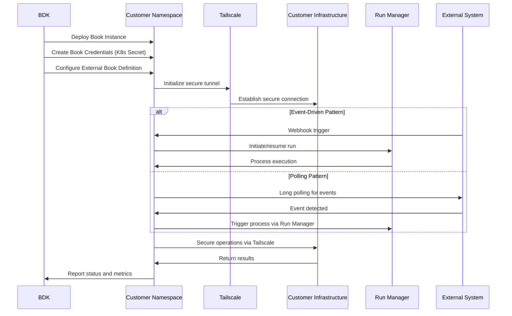

# Customer Deployments - Isolated Book Execution Environments

**Namespaces**: `customer-a`, `customer-b`, `customer-*`  
**Technology**: Python, Tailscale, Kubernetes CRDs  
**Purpose**: Customer-specific book deployment and execution environment with secure networking

## Overview

Customer Deployments provide isolated execution environments for customer-specific book instances. Each customer gets dedicated namespace(s) with secure networking, credential management, and various deployment patterns to meet different operational requirements.

## Responsibilities

- **Book Execution**: Deploy and run customer-specific book instances
- **Secure Networking**: Provide isolated network access via Tailscale integration
- **Credential Management**: Store and manage book-specific credentials securely
- **External Integration**: Interface with external book definitions and secondary deployments
- **Multi-Pattern Support**: Support various deployment patterns (primary, secondary, shared, event-driven)

## Architecture Patterns

### Customer-A Pattern: Standard Deployments
**Namespace**: `customer-a`

#### Book Pod
Contains the main book execution environment with networking:

##### Book Deployment
- **Purpose**: Core book execution and runtime environment
- **Technology**: K8 Service, K8 Deployment, Python application
- **Function**: Executes book logic and processes customer-specific workflows
- **Management**: Managed by Book Controller from BDK namespace
- **Integration**: Calls BDK Procedures for extended functionality

##### Tailscale Sidecar
- **Purpose**: Secure network connectivity and tunneling
- **Technology**: Tailscale sidecar container
- **Function**: Provides secure, encrypted network access to customer infrastructure
- **Data Flow**: Tunnels through to Book Deployment for secure communication

#### External Book Definition
- **Purpose**: Define external book configurations and schemas
- **Technology**: K8 CRD (Kubernetes Custom Resource Definition)
- **Function**: Store external book metadata and configuration
- **Creation**: Created by Book Library Service from BDK namespace
- **Usage**: Book Library Service retrieves descriptors using this definition
- **Relationship**: References Book Credentials and integrates with deployments

#### Secondary Book Deployment
- **Purpose**: Additional book deployment for complex scenarios
- **Technology**: K8 Service, K8 Deployment, Python application
- **Function**: Handle secondary or auxiliary book operations
- **Management**: Managed by Book Controller from BDK namespace
- **Integration**: Works alongside primary Book Deployment

#### Shared Book Deployment
- **Purpose**: Shared book instances for multi-tenant scenarios
- **Technology**: K8 Service, K8 Deployment, Python application
- **Function**: Provides book functionality shared across multiple customers
- **Management**: Managed by Book Controller from BDK namespace
- **Usage**: Cost-effective deployment model for common book operations

#### Book Credentials
- **Purpose**: Secure storage of book-specific credentials and secrets
- **Technology**: K8 Secret (Kubernetes Secret)
- **Function**: Store API keys, tokens, and other sensitive book data
- **Creation**: Created by Book Library Service from BDK namespace
- **Access**: Referenced by External Book Definition and deployments
- **Security**: Encrypted at rest and in transit

### Customer-B Pattern: Event-Driven Deployments
**Namespace**: `customer-b`

#### Long Polling Book Deployment
- **Purpose**: Poll external cloud providers for events
- **Technology**: K8 Deployment and K8 Service, Python application
- **Function**: Performs long polling to external providers for event detection
- **Flow**: Triggers processes via Run Manager when events detected
- **Use Cases**: Cloud provider event monitoring, API polling, resource watching

#### Webhook-Triggered Book Deployment
- **Purpose**: Execute books in response to webhooks routed by BDK Webhook Router
- **Technology**: K8 Deployment and K8 Service, Python application
- **Function**: Responds to webhook triggers from external systems
- **Flow**: Initiates or resumes runs via Run Manager upon webhook triggers
- **Integration**: Receives webhook events from BDK Webhook Router

## Key Features

### Customer Isolation
- **Namespace-Level Isolation**: Dedicated Kubernetes namespaces per customer
- **Resource Boundaries**: Clear resource boundaries and quotas per customer
- **Network Isolation**: Secure network isolation between customers
- **Data Isolation**: Complete data isolation with no cross-customer access

### Secure Networking
- **Tailscale Integration**: Tailscale mesh networking for secure connectivity
- **Customer Network Access**: Secure access to customer on-premises networks
- **Encrypted Communications**: All communications encrypted via Tailscale
- **Network Policies**: Kubernetes network policies for additional security

### Flexible Deployment Models
- **Primary Deployments**: Standard book deployments for main functionality
- **Secondary Deployments**: Additional instances for complex scenarios
- **Shared Deployments**: Cost-effective shared instances
- **Event-Driven**: Specialized deployments for event processing

### Credential Security
- **K8s Secret-Based**: Kubernetes secrets for credential storage
- **Per-Customer Scoping**: Credentials scoped to specific customers
- **Rotation Support**: Support for credential rotation and updates
- **Access Control**: Fine-grained access control for credential access

## Data Flow



## Deployment Configurations

### Standard Book Deployment
```yaml
apiVersion: apps/v1
kind: Deployment
metadata:
  name: customer-book-primary
  namespace: customer-acme
spec:
  replicas: 2
  selector:
    matchLabels:
      app: customer-book
      type: primary
  template:
    metadata:
      labels:
        app: customer-book
        type: primary
    spec:
      containers:
      - name: book-runtime
        image: voyager/book-runtime:latest
        env:
        - name: BOOK_TYPE
          value: "customer-support"
        - name: CUSTOMER_ID
          value: "acme-corp"
        - name: LOG_LEVEL
          value: "info"
        resources:
          requests:
            cpu: 200m
            memory: 512Mi
          limits:
            cpu: 500m
            memory: 1Gi
        volumeMounts:
        - name: book-credentials
          mountPath: /secrets
          readOnly: true
      - name: tailscale
        image: tailscale/tailscale:latest
        env:
        - name: TS_KUBE_SECRET
          value: "tailscale-auth"
        - name: TS_USERSPACE
          value: "false"
        securityContext:
          capabilities:
            add:
            - NET_ADMIN
      volumes:
      - name: book-credentials
        secret:
          secretName: acme-book-credentials
```

### Event-Driven Book Deployment
```yaml
apiVersion: apps/v1
kind: Deployment
metadata:
  name: webhook-triggered-book
  namespace: customer-acme
spec:
  replicas: 1
  selector:
    matchLabels:
      app: webhook-book
  template:
    spec:
      containers:
      - name: webhook-handler
        image: voyager/webhook-book:latest
        env:
        - name: WEBHOOK_SECRET
          valueFrom:
            secretKeyRef:
              name: webhook-credentials
              key: secret
        - name: RUN_MANAGER_ENDPOINT
          value: "http://jeeves-service.jeeves.svc.cluster.local"
        ports:
        - containerPort: 8080
          name: webhook
        livenessProbe:
          httpGet:
            path: /health
            port: 8080
          initialDelaySeconds: 30
          periodSeconds: 10
```

### External Book Definition CRD
```yaml
apiVersion: books.voyager.io/v1
kind: ExternalBookDefinition
metadata:
  name: acme-customer-support
  namespace: customer-acme
spec:
  bookType: "customer-support"
  version: "1.2.0"
  externalIntegrations:
    - name: "zendesk"
      type: "webhook"
      endpoint: "/webhooks/zendesk"
      authentication:
        type: "signature"
        secret_ref:
          name: "zendesk-webhook-secret"
          key: "signature_key"
    - name: "salesforce"
      type: "api"
      endpoint: "https://acme.salesforce.com/services/data/v55.0"
      authentication:
        type: "oauth2"
        secret_ref:
          name: "salesforce-credentials"
          key: "access_token"
  networking:
    tailscale:
      enabled: true
      tailnet: "acme-corp"
      tags: ["customer", "production"]
  resources:
    cpu_request: "200m"
    memory_request: "512Mi"
    cpu_limit: "1000m"
    memory_limit: "2Gi"
  scaling:
    min_replicas: 1
    max_replicas: 5
    target_cpu_utilization: 70
status:
  phase: "Ready"
  replicas: 2
  ready_replicas: 2
  last_updated: "2024-01-01T00:00:00Z"
```

## Security Model

### Tenant-Scoped Networking
- **Namespace Isolation**: Kubernetes namespace boundaries for network isolation
- **Tailscale Networks**: Separate Tailscale networks per customer
- **Network Policies**: Kubernetes NetworkPolicies for additional security
- **Firewall Rules**: Customer-specific firewall rules and access controls

### Credential Management
- **Per-Customer Secrets**: Kubernetes secrets scoped to customer namespaces
- **Credential Rotation**: Automated credential rotation capabilities
- **Access Control**: RBAC for credential access within customer namespaces
- **Audit Logging**: Comprehensive audit logging for credential access

### Multi-Tenant Security
- **Resource Quotas**: Kubernetes resource quotas per customer namespace
- **Pod Security**: Pod security policies and security contexts
- **Image Security**: Secure container images with vulnerability scanning
- **Runtime Security**: Runtime security monitoring and threat detection

## Integration Points

### With BDK (Book Development Kit)
- **Deployment Management**: BDK manages lifecycle of customer book deployments
- **Configuration Sync**: Synchronize book configurations from BDK to customer namespaces
- **Health Monitoring**: BDK monitors health of customer book deployments
- **Update Coordination**: Coordinate book updates across customer deployments

### With Run Manager (Jeeves)
- **Process Execution**: Customer books trigger process executions via Run Manager
- **Event Processing**: Process events and trigger appropriate runs
- **Status Reporting**: Report execution status back to Run Manager
- **Resume Operations**: Resume interrupted processes and runs

### With Customer Infrastructure
- **Secure Connectivity**: Secure connections to customer on-premises systems
- **API Integration**: Integration with customer APIs and services
- **Data Exchange**: Secure data exchange with customer systems
- **Event Monitoring**: Monitor customer systems for relevant events

## Operational Patterns

### Event-Driven Operations
- **Webhook Processing**: Process webhooks from external systems
- **Event Polling**: Long polling for events from cloud providers
- **Real-time Processing**: Real-time event processing and response
- **Batch Processing**: Batch processing for high-volume events

### Monitoring and Alerting
- **Health Checks**: Comprehensive health checks for all deployments
- **Performance Monitoring**: Monitor book performance and resource usage
- **Error Tracking**: Track and analyze errors and exceptions
- **Alert Management**: Automated alerting for critical issues

### Scaling and Performance
- **Auto-Scaling**: Horizontal pod autoscaling based on load
- **Resource Management**: Efficient resource allocation and management
- **Performance Optimization**: Optimize performance based on usage patterns
- **Capacity Planning**: Plan capacity based on customer growth

## Troubleshooting and Support

### Debugging Capabilities
- **Log Aggregation**: Centralized logging for customer deployments
- **Distributed Tracing**: End-to-end tracing across customer book operations
- **Performance Profiling**: Performance profiling and analysis tools
- **Debug Access**: Secure debug access for troubleshooting

### Support Workflows
- **Issue Escalation**: Automated issue escalation workflows
- **Customer Communication**: Communication channels for customer support
- **Resolution Tracking**: Track issue resolution and customer satisfaction
- **Knowledge Base**: Maintain knowledge base for common issues

### Recovery Procedures
- **Backup and Restore**: Backup and restore procedures for customer data
- **Disaster Recovery**: Disaster recovery plans for customer deployments
- **Rollback Procedures**: Quick rollback procedures for failed updates
- **Emergency Response**: Emergency response procedures for critical issues

## Cost Management

### Resource Optimization
- **Right-Sizing**: Right-size resources based on actual usage
- **Shared Resources**: Use shared resources where appropriate for cost savings
- **Reserved Capacity**: Use reserved capacity for predictable workloads
- **Spot Instances**: Use spot instances for non-critical workloads where possible

### Cost Allocation
- **Per-Customer Billing**: Accurate cost allocation per customer
- **Resource Tagging**: Comprehensive resource tagging for cost tracking
- **Usage Monitoring**: Monitor resource usage and costs per customer
- **Cost Optimization**: Continuous cost optimization based on usage patterns

### Budget Management
- **Budget Controls**: Implement budget controls and spending limits
- **Cost Alerts**: Automated alerts for budget overruns
- **Cost Forecasting**: Forecast costs based on usage trends
- **Cost Reporting**: Regular cost reporting to customers and internal teams
