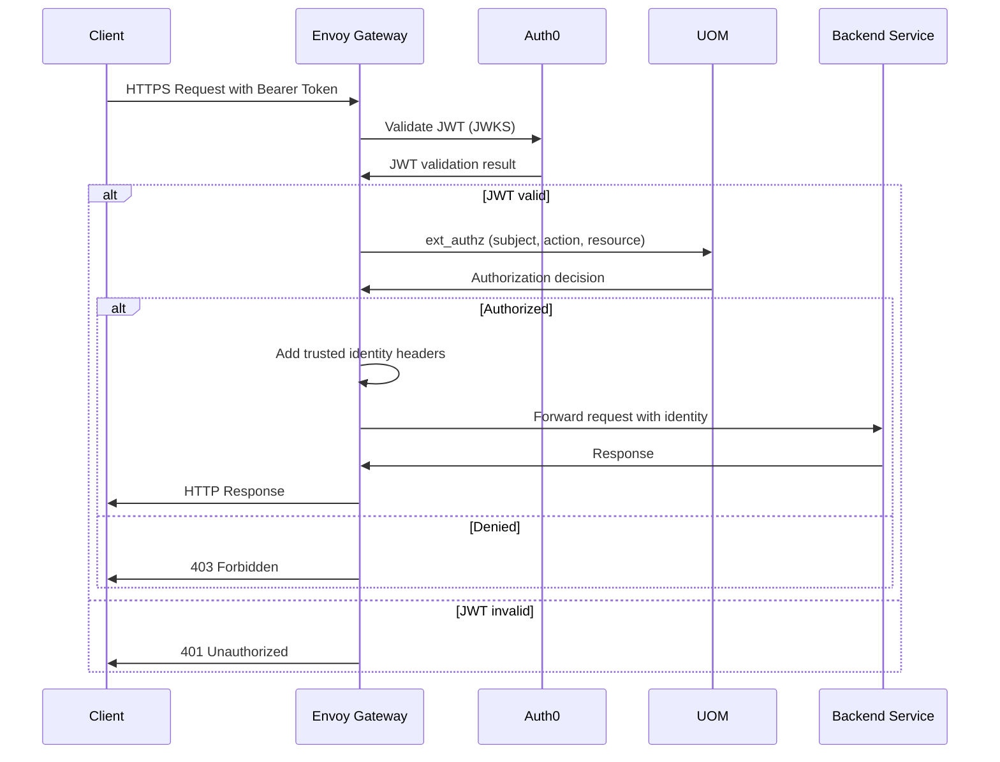

# Envoy Gateway - Public Edge with Authentication and Routing

**Namespace**: `envoy-gateway-system`  
**Technology**: Envoy, Kubernetes Gateway API  
**Purpose**: Public edge for all REST/WebSocket traffic with centralized authentication, authorization, and routing

## Overview

Envoy Gateway serves as the single entry point for all external traffic to the Voyager system. It provides centralized authentication, authorization, and intelligent routing to internal services while supporting both HTTP/REST and WebSocket protocols.

## Responsibilities

- Terminate client HTTP/WebSocket traffic at the system edge
- Validate bearer JWTs and optional API keys via User & Organization Manager (UOM)
- Authorize requests using Envoy `ext_authz` integration with UOM.Authorize
- Route requests to internal services with per-route filters (rate limiting, transforms, CORS)
- Normalize and propagate trusted identity headers to backend services
- Provide protocol translation between REST and gRPC via transcoding

## Architecture

### Services within Namespace

#### Authentication Filter
- **Purpose**: Verify JWTs using Auth0 JWKS; optionally validate API keys via UOM
- **Technology**: Envoy JWT filter with Auth0 integration and UOM API key validation
- **Function**: Primary authentication for all incoming requests
- **Integration**: Auth0 for JWKS validation, UOM for API key hash lookup

#### Authorization Filter
- **Purpose**: Evaluate allow/deny decisions for `{ subject, action, resource }` tuples
- **Technology**: Envoy `ext_authz` filter calling `UOM.Authorize`
- **Function**: Fine-grained authorization for all authenticated requests
- **Performance**: Optimized for low-latency authorization decisions

#### HTTP Router
- **Purpose**: Match host/path/method combinations to upstream clusters
- **Technology**: Envoy HTTP routing with configurable per-route filters
- **Targets**: Routes to Jeeves, Jarvis, Business Journal, Grimoire, Threads, Process Designer, SPy Mapper, SPy Writer, Herald, UOM, BDK, Object Service
- **Features**: Advanced routing rules, traffic splitting, and load balancing

#### Envoy Gateway Controller
- **Purpose**: Operate Envoy data plane and manage dynamic configuration
- **Technology**: Envoy Gateway controller with Kubernetes integration
- **Function**: Manages Envoy proxy lifecycle and configuration updates
- **CRDs**: Uses Kubernetes Gateway API and Envoy Gateway CRDs

## Key Features

### Centralized Authentication
- **JWT Validation**: Validates bearer tokens using Auth0 JWKS
- **API Key Support**: Optional API key authentication via UOM hash lookup
- **Multi-Method**: Supports both JWT and API key authentication methods
- **Token Caching**: Efficient token validation with caching for performance

### Fine-Grained Authorization
- **ext_authz Integration**: External authorization service integration
- **Resource-Based**: Authorization based on subject, action, and resource
- **Per-Route Authorization**: Different authorization policies per route
- **Performance Optimized**: Sub-millisecond authorization decisions

### Protocol Support
- **HTTP/HTTPS**: Full HTTP/1.1 and HTTP/2 support
- **WebSocket**: Native WebSocket support for real-time features
- **gRPC Transcoding**: Automatic REST ↔ gRPC protocol translation
- **Content Negotiation**: Intelligent content type handling and negotiation

### Advanced Routing
- **Path-Based Routing**: Route based on URL paths and patterns
- **Header-Based Routing**: Route based on request headers
- **Method-Based Routing**: HTTP method-specific routing rules
- **Host-Based Routing**: Multi-tenant routing based on host headers

## Data Flow



## API Endpoints (Edge Entry Points)

### Core Services
- **Runs**: `/runs/*` → Jeeves (Run orchestration)
- **Threads**: `/threads/*` → Threads (Chat persistence)
- **Processes**: `/processes/*` → Grimoire (Process management)
- **Objects**: `/objects/*` → Object Service (Artifact storage & signed URLs)

### Platform Services
- **Authentication**: `/auth/*` → UOM (Identity management)
- **Users/Organizations**: `/users/*`, `/orgs/*`, `/workspaces/*` → UOM
- **API Keys**: `/apikeys/*` → UOM
- **Triggers**: `/triggers/*` → Herald (Event processing)

### Book and Model Services
- **Books**: `/api/v1/books/*` → BDK (Book management)
- **Models**: `/api/v1/models/*` → LLM Services (Model management)
- **Prompts**: `/api/v1/prompts/*` → LLM Services (Prompt management)
- **Networks**: `/api/v1/networks/*` → Bifrost (Network management)
- **Webhooks**: `/api/v1/webhooks/*` → BDK (Webhook routing)

### WebSocket Endpoints
- **Thread Streaming**: `/threads/{id}/messages/stream` → Threads
- **Process Suggestions**: `/processes/{id}/suggestions/chat` → Grimoire

## Identity Propagation

### Inbound Header Stripping
Envoy Gateway strips all inbound identity headers to prevent spoofing:
- `X-Principal-Id`
- `X-Principal-Scopes`
- `X-Org-Ids`
- `X-Workspace-Ids`
- `X-Request-Id`

### Trusted Header Injection
After authentication and authorization, Envoy injects normalized identity headers:

```yaml
# Example identity headers forwarded to backends
X-Principal-Id: "user-uuid-123"
X-Principal-Scopes: "users.read,processes.execute"
X-Org-Ids: "org-uuid-456"
X-Workspace-Ids: "workspace-uuid-789"
X-Request-Id: "req-uuid-abc"
X-Auth-Method: "jwt|api_key"
X-Authenticated-At: "2024-01-01T00:00:00Z"
```

### Backend Trust
- **Header Trust**: Backend services trust identity headers from Envoy Gateway
- **No Re-Authentication**: Backends don't re-authenticate requests from gateway
- **Identity Parsing**: Backends parse identity from trusted headers
- **Audit Context**: Headers provide full audit context for backend operations

## Configuration Management

### Gateway API Configuration
```yaml
apiVersion: gateway.networking.k8s.io/v1beta1
kind: Gateway
metadata:
  name: voyager-gateway
  namespace: envoy-gateway-system
spec:
  gatewayClassName: envoy-gateway
  listeners:
  - name: https
    port: 443
    protocol: HTTPS
    tls:
      mode: Terminate
      certificateRefs:
      - name: voyager-tls-cert
  - name: http
    port: 80
    protocol: HTTP
```

### HTTPRoute Configuration
```yaml
apiVersion: gateway.networking.k8s.io/v1beta1
kind: HTTPRoute
metadata:
  name: core-services
spec:
  parentRefs:
  - name: voyager-gateway
  rules:
  - matches:
    - path:
        type: PathPrefix
        value: /runs
    backendRefs:
    - name: jeeves-service
      port: 80
    filters:
    - type: RequestHeaderModifier
      requestHeaderModifier:
        add:
        - name: X-Service-Route
          value: jeeves
```

### Authentication Configuration
```yaml
apiVersion: gateway.envoyproxy.io/v1alpha1
kind: SecurityPolicy
metadata:
  name: jwt-auth
spec:
  targetRef:
    group: gateway.networking.k8s.io
    kind: Gateway
    name: voyager-gateway
  jwt:
    providers:
    - name: auth0
      remoteJWKS:
        uri: "https://voyager.auth0.com/.well-known/jwks.json"
      audiences:
      - "voyager-api"
      issuer: "https://voyager.auth0.com/"
```

## Security Features

### TLS Termination
- **Certificate Management**: Automatic certificate provisioning and renewal
- **Perfect Forward Secrecy**: Support for PFS cipher suites
- **HSTS**: HTTP Strict Transport Security headers
- **Cipher Suite Control**: Control over allowed cipher suites

### Rate Limiting
- **Per-Client Limits**: Rate limiting per authenticated client
- **Per-Route Limits**: Different rate limits per API endpoint
- **Global Limits**: System-wide rate limiting for protection
- **Burst Handling**: Intelligent burst traffic handling

### CORS Support
- **Cross-Origin Requests**: Configurable CORS policies
- **Preflight Handling**: Automatic preflight request handling
- **Credential Support**: Support for credentialed cross-origin requests
- **Origin Validation**: Strict origin validation and whitelisting

### DDoS Protection
- **Connection Limits**: Maximum concurrent connection limits
- **Request Size Limits**: Maximum request body size limits
- **Timeout Controls**: Request and connection timeout controls
- **Circuit Breaker**: Circuit breaker for failing backend services

## Performance Optimization

### Caching
- **Response Caching**: Configurable response caching for GET requests
- **JWT Caching**: JWT validation result caching
- **Authorization Caching**: Authorization decision caching
- **Static Content**: Efficient static content serving

### Load Balancing
- **Algorithm Selection**: Multiple load balancing algorithms
- **Health Checking**: Active and passive health checking
- **Circuit Breaker**: Automatic circuit breaking for failed backends
- **Retry Logic**: Intelligent retry logic for failed requests

### Connection Management
- **HTTP/2**: Full HTTP/2 support for improved performance
- **Connection Pooling**: Efficient connection pooling to backends
- **Keep-Alive**: HTTP keep-alive optimization
- **Compression**: Response compression (gzip, brotli)

## Monitoring and Observability

### Metrics Collection
- **Request Metrics**: Request rate, latency, and error rate metrics
- **Authentication Metrics**: Authentication success/failure rates
- **Authorization Metrics**: Authorization decision metrics
- **Backend Metrics**: Backend service health and performance

### Access Logging
- **Structured Logging**: JSON-formatted access logs
- **Request Tracing**: Distributed tracing integration
- **Security Events**: Security event logging and alerting
- **Performance Logging**: Performance and latency logging

### Health Monitoring
- **Gateway Health**: Envoy Gateway controller health
- **Backend Health**: Backend service health monitoring
- **Certificate Health**: TLS certificate expiration monitoring
- **Configuration Health**: Configuration validation and health

## Integration Points

### With Auth0
- **JWKS Integration**: Fetches and caches Auth0 JWKS for JWT validation
- **Token Validation**: Validates JWT signatures and claims
- **Issuer Verification**: Verifies token issuer and audience claims
- **Key Rotation**: Handles Auth0 key rotation automatically

### With UOM (User & Organization Manager)
- **Authorization**: External authorization via `ext_authz` integration
- **API Key Validation**: API key hash lookup and validation
- **Identity Resolution**: Resolve user and organization information
- **Permission Evaluation**: Fine-grained permission evaluation

### With Backend Services
- **Service Discovery**: Kubernetes service discovery for backends
- **Health Checking**: Monitor backend service health
- **Load Balancing**: Distribute load across backend instances
- **Circuit Breaking**: Protect backends from overload

### Chat & Agent Endpoints
- **Process Designer**: `/api/v1/process-designer/*` → Process Designer
- **SPy Writer**: `/api/v1/spy-writer/*` → SPy Writer
- **SPy Mapper**: `/api/v1/spy-mapper/*` → SPy Mapper

## Error Handling

### Authentication Errors
```http
# Invalid JWT
HTTP 401 Unauthorized
{
  "error": "invalid_token",
  "error_description": "JWT signature validation failed"
}

# Missing authentication
HTTP 401 Unauthorized
{
  "error": "missing_token",
  "error_description": "Authentication required"
}
```

### Authorization Errors
```http
# Insufficient permissions
HTTP 403 Forbidden
{
  "error": "insufficient_permissions",
  "error_description": "Required permission: processes.execute"
}

# Authorization service failure
HTTP 503 Service Unavailable
{
  "error": "authorization_unavailable",
  "error_description": "Authorization service temporarily unavailable"
}
```

### Rate Limiting Errors
```http
# Rate limit exceeded
HTTP 429 Too Many Requests
{
  "error": "rate_limit_exceeded",
  "error_description": "Request rate limit exceeded",
  "retry_after": 60
}
```

## Deployment and Scaling

### High Availability
- **Multi-Instance**: Multiple Envoy proxy instances for redundancy
- **Rolling Updates**: Zero-downtime configuration updates
- **Health Checks**: Comprehensive health checking and failover
- **Geographic Distribution**: Support for multi-region deployments

### Auto-Scaling
- **HPA Integration**: Horizontal Pod Autoscaler integration
- **Metric-Based Scaling**: Scale based on request rate and latency
- **Predictive Scaling**: Predictive scaling based on traffic patterns
- **Resource Limits**: Proper resource limits for predictable scaling

### Configuration Management
- **GitOps**: GitOps-based configuration management
- **Validation**: Configuration validation before deployment
- **Rollback**: Quick rollback capabilities for bad configurations
- **Canary Deployment**: Canary deployment for configuration changes

## Troubleshooting

### Common Issues
- **Certificate Expiration**: Automatic certificate renewal monitoring
- **Backend Unavailable**: Circuit breaker and health check integration
- **Configuration Errors**: Comprehensive validation and error reporting
- **Performance Degradation**: Performance monitoring and alerting

### Debugging Tools
- **Access Logs**: Detailed access logs for request debugging
- **Trace Headers**: Distributed tracing for end-to-end visibility
- **Debug Endpoints**: Administrative endpoints for debugging
- **Configuration Dump**: Runtime configuration introspection

### Performance Tuning
- **Buffer Sizes**: Optimize buffer sizes for workload patterns
- **Timeout Tuning**: Tune timeouts for optimal performance
- **Cache Configuration**: Optimize caching for request patterns
- **Resource Allocation**: Proper CPU and memory allocation
