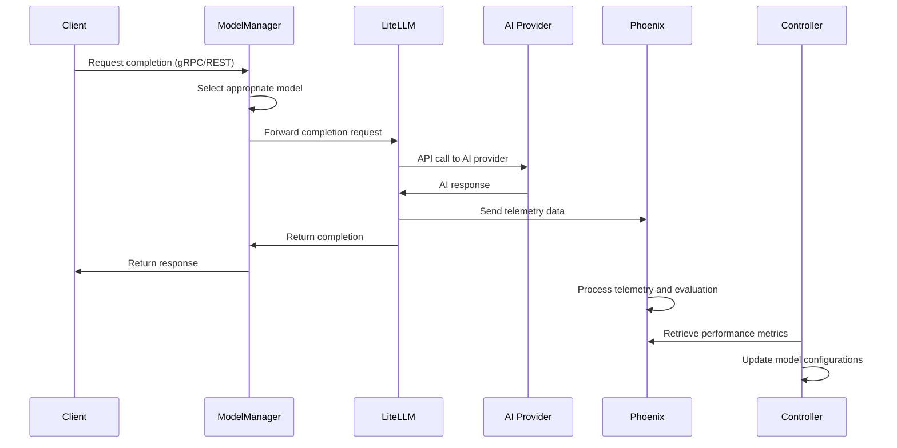

# LLM Services - Model and Prompt Management

**Namespace**: `llm`  
**Technology**: Rust, LiteLLM, Phoenix, Kubernetes Controllers  
**Purpose**: Centralized model/prompt management, LLM access brokering, and telemetry

## Overview

LLM Services provides centralized management of AI models, prompts, and evaluations while serving as the access broker for all LLM interactions across the Voyager platform. It includes comprehensive telemetry and evaluation capabilities for AI operations.

## Responsibilities

- **Model Management**: Manage `ModelDefinition` CRDs and orchestrate completions via proxy
- **Prompt Management**: Manage `PromptDefinition` CRDs with versioning and templates
- **Evaluation Management**: Manage `ModelEvaluation` CRDs for performance assessment
- **LLM Access Brokering**: Provide unified access to multiple LLM providers
- **Telemetry Collection**: Comprehensive telemetry and tracing for all LLM operations
- **Performance Monitoring**: Monitor and evaluate LLM performance and quality

## Architecture

### Services within Namespace

#### Model Manager Service
- **Purpose**: Manage ModelDefinition, PromptDefinition, and orchestrate completions via proxy
- **Technology**: Rust application, Kubernetes Service (K8 Service), Kubernetes Deployment (K8 Deployment)
- **Integration**: Sends completions through LiteLLM Proxy, watches prompt/model/evaluation resources

**APIs**:
- **gRPC**: CRUD for models, prompts, evaluations
- **REST via Gateway**: `GET/POST /api/v1/models`, `GET/POST /api/v1/prompts`

#### Model Manager gRPC Transcoder
- **Purpose**: Protocol translation and gateway integration
- **Technology**: Envoy application
- **Function**: Translates between REST and gRPC protocols for external API access

#### Model Controller
- **Purpose**: Reconcile model/prompt/evaluation CRDs and configure runtime
- **Technology**: Kubernetes Controller, Kubernetes Deployment
- **Watches**: `ModelDefinition`, `PromptDefinition`, `ModelEvaluation`
- **Integrations**: Configures LiteLLM Proxy, manages telemetry/evaluations in Phoenix

#### LiteLLM Proxy
- **Purpose**: Broker access to LLMs (OpenAI, Gemini, Claude, Ollama)
- **Technology**: Kubernetes Service, LiteLLM application
- **Integrations**: Uses `OpenAI API Key` and `Gemini API Key` (Kubernetes Secrets)
- **Telemetry**: Sends telemetry data to Phoenix for analysis

#### Phoenix
- **Purpose**: LLM tracing and evaluation telemetry sink
- **Technology**: Third-party application, Kubernetes deployment
- **Function**: Collects, analyzes, and visualizes LLM performance data
- **Integration**: Receives telemetry from LiteLLM Proxy and evaluation data

### Custom Resource Definitions (CRDs)

#### Model Definition
- **Purpose**: CRD for defining available AI models
- **Technology**: Kubernetes Custom Resource Definition
- **Function**: Configures model endpoints, parameters, and capabilities

#### Prompt Definition
- **Purpose**: CRD for managing reusable prompts
- **Technology**: Kubernetes Custom Resource Definition
- **Function**: Stores and versions prompt templates with parameters

#### Model Evaluation
- **Purpose**: CRD for model performance evaluation
- **Technology**: Kubernetes Custom Resource Definition
- **Function**: Defines evaluation metrics and test datasets

### Secrets & External Resources
- **OpenAI API Key**: Kubernetes Secret for OpenAI authentication
- **Gemini API Key**: Kubernetes Secret for Google Gemini authentication
- **External Secret Resources**: Managed by Vault Operator for secret sync/rotation

## Key Features

### Unified LLM Access
- **Multi-Provider Support**: Support for OpenAI, Gemini, Claude, Ollama, and custom models
- **Consistent API**: Unified API for all LLM providers regardless of underlying implementation
- **Load Balancing**: Intelligent load balancing across multiple model instances
- **Fallback Support**: Automatic fallback to alternative models when primary unavailable

### Model Management
- **Dynamic Configuration**: Runtime model configuration without service restart
- **Version Control**: Complete version control for model configurations
- **Capability Tracking**: Track and manage model capabilities and limitations
- **Cost Optimization**: Optimize model selection based on cost and performance

### Prompt Engineering
- **Template System**: Advanced prompt templating with variable substitution
- **Version Management**: Complete prompt version history and rollback capability
- **A/B Testing**: Support for prompt A/B testing and performance comparison
- **Optimization**: Automated prompt optimization based on performance metrics

### Comprehensive Telemetry
- **Request Tracing**: Full distributed tracing for all LLM requests
- **Performance Metrics**: Latency, throughput, and error rate monitoring
- **Cost Tracking**: Detailed cost tracking per model and request
- **Quality Assessment**: Automated quality assessment and scoring

## Data Flow



## Custom Resource Definitions

### Model Definition CRD
```yaml
apiVersion: llm.voyager.io/v1
kind: ModelDefinition
metadata:
  name: gpt-4-production
  namespace: llm
spec:
  provider: "openai"
  model_name: "gpt-4"
  version: "2024-01-01"
  capabilities:
    - "text_generation"
    - "code_generation"
    - "reasoning"
  parameters:
    max_tokens: 4096
    temperature: 0.7
    top_p: 1.0
  cost:
    input_token_cost: 0.00003
    output_token_cost: 0.00006
    currency: "USD"
  rate_limits:
    requests_per_minute: 500
    tokens_per_minute: 40000
  endpoints:
    primary: "https://api.openai.com/v1/chat/completions"
    backup: "https://api.openai.com/v1/completions"
  authentication:
    type: "bearer_token"
    secret_ref:
      name: "openai-api-key"
      key: "api_key"
status:
  phase: "Ready"
  last_health_check: "2024-01-01T00:00:00Z"
  availability: 99.9
  average_latency_ms: 1500
```

### Prompt Definition CRD
```yaml
apiVersion: llm.voyager.io/v1
kind: PromptDefinition
metadata:
  name: process-suggestion-prompt
  namespace: llm
spec:
  name: "process_suggestion"
  version: "1.2.0"
  description: "Generate process suggestions based on user requirements"
  template: |
    You are an expert process designer. Based on the following requirements, 
    suggest a well-structured process:
    
    Requirements: {{requirements}}
    Domain: {{domain}}
    Complexity: {{complexity}}
    
    Please provide:
    1. Process overview
    2. Key steps
    3. Decision points
    4. Expected outcomes
    
    Format your response as a structured process definition.
  parameters:
    - name: "requirements"
      type: "string"
      required: true
      description: "User requirements for the process"
    - name: "domain"
      type: "string"
      required: false
      default: "general"
      description: "Domain or industry context"
    - name: "complexity"
      type: "string"
      required: false
      default: "medium"
      enum: ["simple", "medium", "complex"]
  model_requirements:
    min_context_length: 4000
    capabilities: ["text_generation", "reasoning"]
  evaluation_criteria:
    - "relevance"
    - "completeness"
    - "clarity"
    - "actionability"
status:
  version: "1.2.0"
  usage_count: 1547
  average_rating: 4.7
  last_updated: "2024-01-01T00:00:00Z"
```

### Model Evaluation CRD
```yaml
apiVersion: llm.voyager.io/v1
kind: ModelEvaluation
metadata:
  name: gpt-4-process-generation-eval
  namespace: llm
spec:
  model_ref:
    name: "gpt-4-production"
  prompt_ref:
    name: "process-suggestion-prompt"
    version: "1.2.0"
  evaluation_type: "automated"
  metrics:
    - name: "relevance"
      weight: 0.3
      measurement: "semantic_similarity"
    - name: "completeness"
      weight: 0.3
      measurement: "keyword_coverage"
    - name: "clarity"
      weight: 0.2
      measurement: "readability_score"
    - name: "actionability"
      weight: 0.2
      measurement: "action_verb_density"
  test_dataset:
    source: "internal"
    size: 100
    path: "/evaluations/process-generation-test-set.json"
  schedule:
    frequency: "daily"
    time: "02:00"
  thresholds:
    minimum_score: 0.75
    warning_score: 0.80
    target_score: 0.90
status:
  last_evaluation: "2024-01-01T02:00:00Z"
  current_score: 0.87
  trend: "stable"
  evaluations_run: 45
  issues: []
```

## API Specifications

### gRPC APIs

#### Model Management
```protobuf
service ModelManager {
  rpc CreateModel(CreateModelRequest) returns (CreateModelResponse);
  rpc GetModel(GetModelRequest) returns (GetModelResponse);
  rpc UpdateModel(UpdateModelRequest) returns (UpdateModelResponse);
  rpc DeleteModel(DeleteModelRequest) returns (DeleteModelResponse);
  rpc ListModels(ListModelsRequest) returns (ListModelsResponse);
  rpc GenerateCompletion(GenerateCompletionRequest) returns (GenerateCompletionResponse);
}

message CreateModelRequest {
  string name = 1;
  string provider = 2;
  string model_name = 3;
  ModelParameters parameters = 4;
  CostConfiguration cost = 5;
  repeated string capabilities = 6;
}

message GenerateCompletionRequest {
  string model_name = 1;
  string prompt = 2;
  map<string, string> parameters = 3;
  string trace_id = 4;
  map<string, string> metadata = 5;
}

message GenerateCompletionResponse {
  string completion = 1;
  CompletionMetadata metadata = 2;
  UsageStatistics usage = 3;
  string trace_id = 4;
}
```

#### Prompt Management
```protobuf
rpc CreatePrompt(CreatePromptRequest) returns (CreatePromptResponse);
rpc GetPrompt(GetPromptRequest) returns (GetPromptResponse);
rpc UpdatePrompt(UpdatePromptRequest) returns (UpdatePromptResponse);
rpc RenderPrompt(RenderPromptRequest) returns (RenderPromptResponse);

message CreatePromptRequest {
  string name = 1;
  string version = 2;
  string template = 3;
  repeated PromptParameter parameters = 4;
  ModelRequirements model_requirements = 5;
}

message RenderPromptRequest {
  string prompt_name = 1;
  string version = 2;
  map<string, string> variables = 3;
}

message RenderPromptResponse {
  string rendered_prompt = 1;
  map<string, string> resolved_variables = 2;
  PromptMetadata metadata = 3;
}
```

### REST APIs (via Gateway)

#### Model Operations
```http
POST /api/v1/models
Content-Type: application/json

{
  "name": "gpt-4-production",
  "provider": "openai",
  "model_name": "gpt-4",
  "parameters": {
    "max_tokens": 4096,
    "temperature": 0.7
  },
  "capabilities": ["text_generation", "reasoning"],
  "cost": {
    "input_token_cost": 0.00003,
    "output_token_cost": 0.00006
  }
}

Response: 201 Created
{
  "model_id": "uuid",
  "name": "gpt-4-production",
  "status": "Pending",
  "created_at": "2024-01-01T00:00:00Z"
}
```

#### Completion Request
```http
POST /api/v1/models/gpt-4-production/completions
Content-Type: application/json

{
  "prompt": "Explain quantum computing in simple terms",
  "parameters": {
    "temperature": "0.7",
    "max_tokens": "500"
  },
  "metadata": {
    "user_id": "user-123",
    "session_id": "session-456"
  }
}

Response: 200 OK
{
  "completion": "Quantum computing is a revolutionary approach to computation...",
  "metadata": {
    "model_used": "gpt-4",
    "completion_time_ms": 1500,
    "trace_id": "trace-789"
  },
  "usage": {
    "input_tokens": 12,
    "output_tokens": 95,
    "total_cost": 0.0057
  }
}
```

#### Prompt Operations
```http
POST /api/v1/prompts
Content-Type: application/json

{
  "name": "customer_support_response",
  "version": "1.0.0",
  "template": "You are a helpful customer support agent. Customer inquiry: {{inquiry}}\n\nProvide a helpful and professional response.",
  "parameters": [
    {
      "name": "inquiry",
      "type": "string",
      "required": true,
      "description": "Customer inquiry text"
    }
  ],
  "model_requirements": {
    "min_context_length": 2000,
    "capabilities": ["text_generation"]
  }
}

Response: 201 Created
{
  "prompt_id": "uuid",
  "name": "customer_support_response",
  "version": "1.0.0",
  "created_at": "2024-01-01T00:00:00Z"
}
```

## Integration Points

### With BDK (Book Development Kit)
- **Book Prompt Retrieval**: BDK retrieves book-specific prompts from Model Manager
- **Template Sharing**: Share prompt templates across book implementations
- **Model Access**: Books access LLM capabilities through LLM Services
- **Cost Attribution**: Track LLM costs per book and customer

### With Grimoire (Process Management)
- **Process Suggestions**: Provide AI-powered process suggestions via LiteLLM
- **Code Generation**: Generate SPy code through AI assistance
- **Documentation**: Auto-generate process documentation
- **Optimization**: Suggest process optimizations based on AI analysis

### With Agent Services (via Thread Manager)
- **Conversational AI**: Provide AI capabilities to agents that operate within threads
- **Response Generation**: Generate intelligent responses for agents in chat conversations
- **Context Processing**: Process conversation context for agents to create intelligent responses
- **Agent AI Support**: Support various agent types with specialized AI capabilities

**Note**: LLM Services does not directly interface with Thread Manager. Thread Manager is pure infrastructure that routes messages to agents, and agents use LLM Services for AI processing.

### With Process Designer
- **Interactive Authoring**: Support interactive agent-oriented design with AI assistance
- **Real-time Suggestions**: Provide real-time suggestions during agent/process development
- **Prompt Support**: Supply prompts/templates for design workflows
- **Quality Assessment**: Assess design outputs through AI evaluation

### With SPy Writer
- **Code Generation**: Support AI-powered SPy code generation
- **Code Completion**: AI-powered code completion for SPy programs
- **Documentation**: Generate documentation for generated SPy code

## Performance and Optimization

### Model Selection Optimization
- **Cost-Performance Balance**: Automatically select models based on cost and performance requirements
- **Capability Matching**: Match model capabilities to request requirements
- **Load Balancing**: Distribute requests across multiple model instances
- **Caching**: Cache frequent requests to reduce costs and improve latency

### Request Optimization
- **Prompt Optimization**: Automatically optimize prompts for better performance
- **Parameter Tuning**: Dynamic parameter tuning based on performance metrics
- **Batch Processing**: Batch similar requests for improved efficiency
- **Connection Pooling**: Efficient connection pooling to LLM providers

### Cost Management
- **Usage Tracking**: Detailed tracking of LLM usage and costs
- **Budget Controls**: Implement budget controls and spending limits
- **Cost Optimization**: Automatically optimize for cost-effectiveness
- **Usage Analytics**: Analyze usage patterns for cost optimization

## Security Considerations

### API Key Management
- **Secure Storage**: Store LLM provider API keys in Kubernetes secrets
- **Rotation**: Automatic rotation of API keys
- **Access Control**: Fine-grained access control for LLM resources
- **Audit Logging**: Comprehensive audit logging for all LLM access

### Content Security
- **Input Validation**: Validate and sanitize all input prompts
- **Output Filtering**: Filter potentially harmful or inappropriate outputs
- **Content Monitoring**: Monitor content for policy violations
- **Privacy Protection**: Ensure user privacy in LLM interactions

### Multi-Tenancy Security
- **Tenant Isolation**: Ensure complete isolation between different tenants
- **Resource Quotas**: Enforce resource quotas per tenant
- **Access Policies**: Implement tenant-specific access policies
- **Data Protection**: Protect tenant data in multi-tenant deployments

## Monitoring and Observability

### Performance Metrics
- **Request Latency**: Track request latency across all models and providers
- **Throughput**: Monitor requests per second and token throughput
- **Error Rates**: Track error rates by model, provider, and error type
- **Availability**: Monitor model and provider availability

### Quality Metrics
- **Response Quality**: Automated assessment of response quality
- **User Satisfaction**: Track user satisfaction and feedback
- **A/B Test Results**: Monitor A/B test performance and outcomes
- **Evaluation Scores**: Track evaluation scores across models and prompts

### Cost Metrics
- **Usage Costs**: Track costs per model, user, and organization
- **Cost Trends**: Monitor cost trends and predict future spending
- **Budget Utilization**: Track budget utilization and alerts
- **Cost Optimization**: Identify opportunities for cost optimization

### Business Metrics
- **Feature Adoption**: Track adoption of different LLM features
- **User Engagement**: Monitor user engagement with AI features
- **Value Realization**: Measure business value from LLM integration
- **ROI Analysis**: Analyze return on investment for LLM usage
