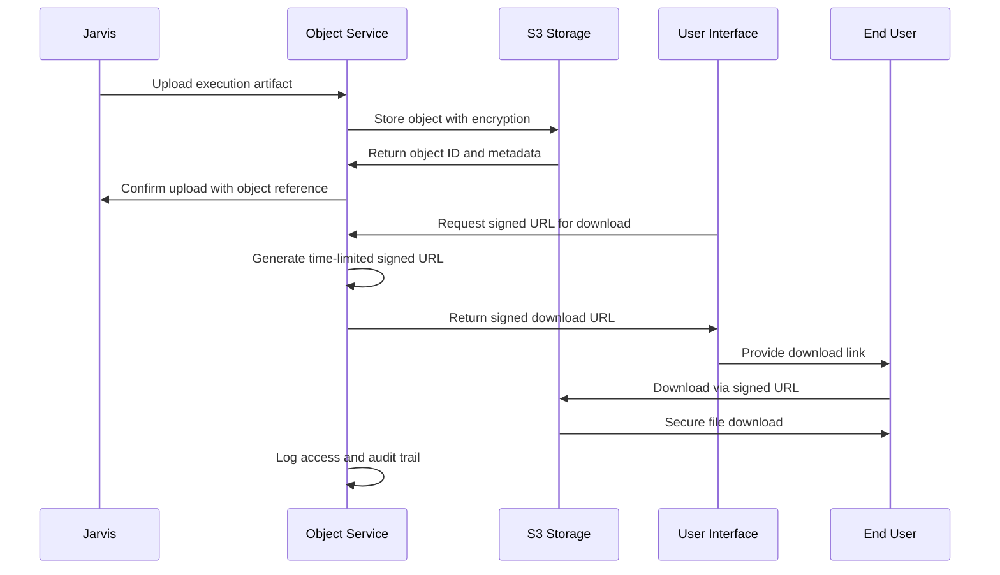

# Object Service - Artifact Storage and Signed URL Generation

**Namespace**: `objects`  
**Technology**: Rust, S3-Compatible Storage  
**Purpose**: Artifact storage and signed URL generation for secure HTTP downloads

## Overview

Object Service provides dedicated artifact storage capabilities with secure signed URL generation for HTTP downloads through the UI. It serves as the centralized storage solution for large execution outputs, file attachments, and other artifacts generated by the Voyager platform.

## Responsibilities

- **Artifact Storage**: Store large execution outputs, files, and artifacts securely
- **Signed URL Generation**: Generate time-limited signed URLs for secure HTTP downloads
- **UI Integration**: Provide secure download capabilities through the user interface
- **Storage Management**: Manage object lifecycle, retention, and cleanup policies
- **Access Control**: Ensure secure access to stored artifacts with proper authorization
- **Metadata Management**: Store and manage object metadata and indexing information

## Architecture

### Services within Namespace

#### Object Storage Service
- **Purpose**: Core object storage and management functionality
- **Technology**: Kubernetes Service (K8 Service), Kubernetes Deployment (K8 Deployment), Rust application
- **Storage Backend**: S3-compatible storage (AWS S3, MinIO, or similar)
- **Security**: Encryption at rest and in transit for all stored objects

**APIs**:
- **gRPC**: Object upload, download, metadata management, signed URL generation
- **REST via Gateway**: `/api/v1/objects` endpoints for object operations

#### Object Storage gRPC Transcoder
- **Purpose**: Protocol translation and gateway integration
- **Technology**: Envoy application
- **Function**: Translates between REST and gRPC protocols for external API access

**APIs**:
- **REST via Gateway**: Object operations accessible through Envoy Gateway

## Key Features

### Secure Artifact Storage
- **Large File Support**: Efficient handling of large execution outputs and artifacts
- **Encryption**: End-to-end encryption for all stored objects
- **Versioning**: Object versioning support for artifact history
- **Compression**: Automatic compression for storage efficiency

### Signed URL Generation
- **Time-Limited Access**: Generate URLs with configurable expiration times
- **One-Time Use**: Support for single-use download links
- **IP Restrictions**: Optional IP-based access restrictions
- **Audit Logging**: Comprehensive logging of all URL generation and access

### UI Integration
- **Secure Downloads**: Seamless integration with UI for secure file downloads
- **Progress Tracking**: Download progress tracking and resumption support
- **Preview Capabilities**: Preview support for common file types
- **Batch Downloads**: Support for batch downloads and zip archives

### Storage Management
- **Lifecycle Policies**: Configurable object lifecycle and retention policies
- **Storage Classes**: Multiple storage classes for cost optimization
- **Cleanup**: Automatic cleanup of expired or unused objects
- **Monitoring**: Storage usage monitoring and alerting

## Data Flow



## API Specifications

### gRPC APIs

#### Object Management
```protobuf
service ObjectService {
  rpc UploadObject(UploadObjectRequest) returns (UploadObjectResponse);
  rpc GetObject(GetObjectRequest) returns (GetObjectResponse);
  rpc DeleteObject(DeleteObjectRequest) returns (DeleteObjectResponse);
  rpc ListObjects(ListObjectsRequest) returns (ListObjectsResponse);
  rpc GenerateSignedURL(GenerateSignedURLRequest) returns (GenerateSignedURLResponse);
  rpc GetObjectMetadata(GetObjectMetadataRequest) returns (GetObjectMetadataResponse);
}

message UploadObjectRequest {
  string filename = 1;
  bytes content = 2;
  string content_type = 3;
  map<string, string> metadata = 4;
  string run_id = 5;
  string execution_id = 6;
}

message UploadObjectResponse {
  string object_id = 1;
  string object_url = 2;
  int64 size = 3;
  google.protobuf.Timestamp created_at = 4;
}

message GenerateSignedURLRequest {
  string object_id = 1;
  google.protobuf.Duration expiration = 2;
  bool one_time_use = 3;
  repeated string allowed_ips = 4;
}

message GenerateSignedURLResponse {
  string signed_url = 1;
  google.protobuf.Timestamp expires_at = 2;
  string download_token = 3;
}
```

### REST APIs (via Gateway)

#### Object Upload
```http
POST /api/v1/objects
Content-Type: multipart/form-data

{
  "file": <binary_data>,
  "filename": "execution_output.json",
  "metadata": {
    "run_id": "uuid",
    "execution_id": "uuid", 
    "type": "execution_output"
  }
}

Response: 201 Created
{
  "object_id": "obj_uuid",
  "object_url": "/api/v1/objects/obj_uuid",
  "size": 1048576,
  "created_at": "2024-01-01T00:00:00Z"
}
```

#### Generate Signed URL
```http
POST /api/v1/objects/{object_id}/signed-url
Content-Type: application/json

{
  "expiration_minutes": 60,
  "one_time_use": true,
  "allowed_ips": ["192.168.1.100"]
}

Response: 200 OK
{
  "signed_url": "https://storage.voyager.io/secure/obj_uuid?signature=...",
  "expires_at": "2024-01-01T01:00:00Z",
  "download_token": "download_token_uuid"
}
```

#### Object Metadata
```http
GET /api/v1/objects/{object_id}/metadata

Response: 200 OK
{
  "object_id": "obj_uuid",
  "filename": "execution_output.json",
  "size": 1048576,
  "content_type": "application/json",
  "created_at": "2024-01-01T00:00:00Z",
  "metadata": {
    "run_id": "uuid",
    "execution_id": "uuid",
    "type": "execution_output"
  },
  "download_count": 3,
  "last_accessed": "2024-01-01T00:30:00Z"
}
```

## Integration Points

### With Jarvis (Execution Engine)
- **Artifact Upload**: Jarvis uploads large execution outputs and artifacts
- **Reference Storage**: Store object references for later retrieval
- **Checkpoint Integration**: Store execution checkpoints and state files
- **Error Artifacts**: Store error logs and debugging information

### With User Interface
- **Secure Downloads**: UI requests signed URLs for secure user downloads
- **File Preview**: Provide file preview capabilities for supported formats
- **Download Management**: Track download progress and provide resumption
- **Batch Operations**: Support for bulk download operations

### With Other Services
- **Cross-Service Storage**: Any service can store artifacts via Object Service
- **Shared Access**: Secure sharing of artifacts between services
- **Backup Integration**: Integration with backup and disaster recovery systems
- **Compliance**: Support for compliance and audit requirements

## Security Features

### Access Control
- **Authorization**: Integration with UOM for access control
- **Service Authentication**: Secure authentication between services
- **Time-Limited Access**: All signed URLs have configurable expiration
- **IP Restrictions**: Optional IP-based access control

### Encryption
- **At Rest**: All objects encrypted at rest in storage backend
- **In Transit**: Encrypted communication for all operations
- **Key Management**: Secure key management and rotation
- **Audit Trail**: Comprehensive audit trail for all operations

### Compliance
- **Data Retention**: Configurable data retention policies
- **Geographic Compliance**: Support for geographic data restrictions
- **Audit Logging**: Detailed audit logs for compliance requirements
- **Data Classification**: Support for data classification and handling

## Performance and Scaling

### Storage Optimization
- **Compression**: Automatic compression for supported file types
- **Deduplication**: Object-level deduplication for storage efficiency
- **Storage Classes**: Multiple storage classes for cost optimization
- **CDN Integration**: CDN integration for global content distribution

### Upload/Download Performance
- **Multipart Uploads**: Support for multipart uploads of large files
- **Parallel Transfers**: Parallel upload/download for improved performance
- **Resume Capability**: Support for resuming interrupted transfers
- **Progress Tracking**: Real-time progress tracking for transfers

### Scaling Capabilities
- **Horizontal Scaling**: Scale service instances based on demand
- **Storage Scaling**: Automatic storage scaling based on usage
- **Cache Management**: Intelligent caching for frequently accessed objects
- **Load Balancing**: Load balancing across multiple service instances

## Monitoring and Observability

### Storage Metrics
- **Usage Monitoring**: Track storage usage and growth trends
- **Performance Metrics**: Monitor upload/download performance
- **Error Rates**: Track error rates and failure patterns
- **Cost Analysis**: Monitor storage costs and optimization opportunities

### Access Analytics
- **Download Patterns**: Analyze download patterns and usage
- **Popular Content**: Identify frequently accessed objects
- **User Behavior**: Track user download behavior and preferences
- **Security Events**: Monitor and alert on security events

### System Health
- **Service Availability**: Monitor service health and uptime
- **Backend Health**: Monitor storage backend connectivity and performance
- **Resource Utilization**: Track CPU, memory, and network usage
- **Capacity Planning**: Plan for future storage and performance needs

## Error Handling and Recovery

### Upload Failures
- **Retry Logic**: Intelligent retry logic for failed uploads
- **Partial Upload Recovery**: Resume interrupted uploads
- **Validation**: Content validation and integrity checking
- **Error Reporting**: Detailed error reporting and diagnostics

### Storage Failures
- **Redundancy**: Multiple storage replicas for fault tolerance
- **Failover**: Automatic failover to backup storage systems
- **Data Recovery**: Backup and recovery procedures for data loss
- **Monitoring**: Continuous monitoring of storage health

### Access Issues
- **URL Validation**: Validate signed URLs and access permissions
- **Rate Limiting**: Protect against abuse and excessive downloads
- **Circuit Breaker**: Circuit breaker pattern for failing storage backends
- **Graceful Degradation**: Graceful handling of partial service failures