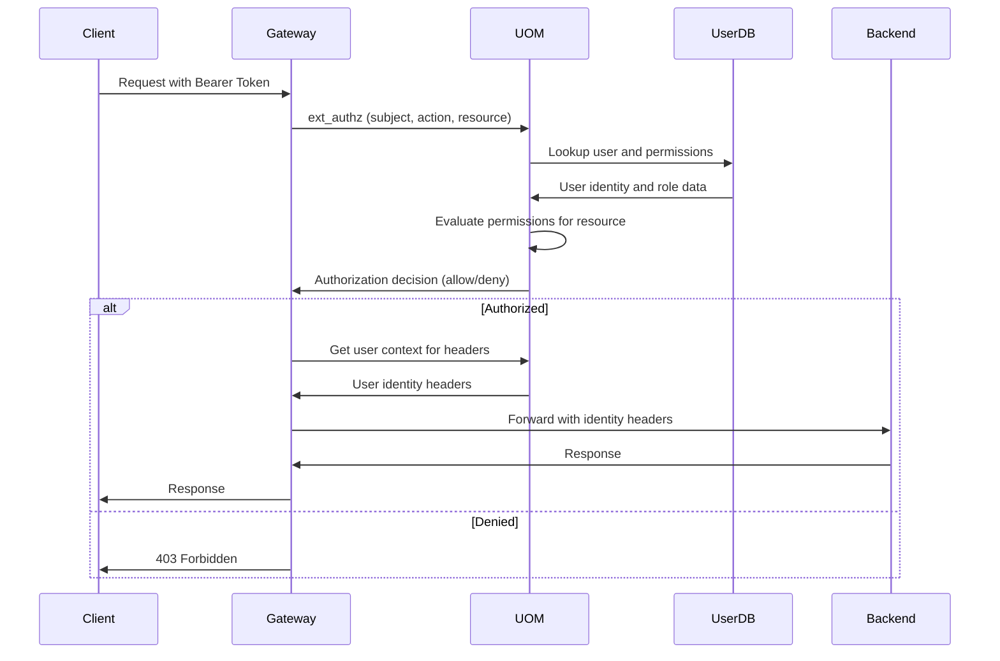

# User & Organization Manager - Identity and Authorization

**Namespace**: `user`  
**Technology**: Rust, PostgreSQL, Envoy  
**Purpose**: Identity, organization, and authorization management

## Overview

User & Organization Manager (UOM) serves as the central identity and authorization service for the Voyager platform. It manages users, organizations, workspaces, and provides comprehensive authentication and authorization capabilities including API key management.

## Responsibilities

- **Identities**: User profile management and storage
- **Information Architecture**: Organizations, workspaces, memberships and roles
- **Authentication**: Access/refresh token lifecycle management
- **Authorization**: Permission evaluation and audit logging
- **API Keys**: User/service key lifecycle management with secure storage
- **External Authorization**: Envoy `ext_authz` integration for gateway requests

## Architecture

### Services within Namespace

#### User and Organization Manager Pod
The UOM Pod contains two cooperating applications:

##### User and Organization Manager Service
- **Purpose**: Core identity and authorization management
- **Technology**: Kubernetes Service (K8 Service), Kubernetes Deployment (K8 Deployment), Rust application
- **Database**: PostgreSQL User Database (master source of truth)
- **Integration**: Envoy Gateway integration for route-level authorization

**APIs**:
- **gRPC**: Full user/org/workspace CRUD, authentication, authorization, API key management

##### User and Organization Manager gRPC Transcoder
- **Purpose**: Protocol translation and gateway integration
- **Technology**: Envoy application
- **Function**: Translates between REST and gRPC protocols for external access

**APIs**:
- **REST via Gateway**:
  - **Auth**: `/auth/login`, `/auth/refresh`, `/auth/validate`, `/auth/authorize`
  - **Users/Orgs**: `/users/*`, `/orgs/*`, `/workspaces/*` CRUD operations
  - **API Keys**: `/apikeys/*` lifecycle operations

#### User Database
- **Purpose**: Master source of truth for identity data
- **Technology**: PostgreSQL
- **Data**: Users, organizations, workspaces, roles, API keys, information architecture
- **Access**: Exclusively via User and Organization Manager Service

## Key Features

### Identity Management
- **User Profiles**: Complete user profile management with metadata
- **Profile Lifecycle**: User creation, updates, deactivation, and deletion
- **Identity Linking**: Link multiple identity providers to single user
- **Profile Validation**: Comprehensive profile validation and verification

### Information Architecture
- **Organizations**: Top-level organizational entities
- **Workspaces**: Project or team-level workspaces within organizations
- **Memberships**: User membership in organizations and workspaces
- **Roles**: Role-based access control with hierarchical permissions

### Authentication Services
- **Token Management**: JWT access and refresh token lifecycle
- **Multi-Factor Authentication**: Support for MFA and additional security factors
- **Session Management**: User session tracking and management
- **Password Management**: Secure password handling and reset procedures

### Authorization Engine
- **Permission Evaluation**: Real-time permission evaluation for resource access
- **Role-Based Access**: RBAC with support for inherited permissions
- **Resource-Level Security**: Fine-grained resource-level permissions
- **Audit Logging**: Comprehensive audit logging for all authorization decisions

### API Key Management
- **Key Generation**: Secure API key generation and storage
- **Scoped Permissions**: API keys with scoped permissions and restrictions
- **Key Rotation**: Automated and manual key rotation capabilities
- **Usage Tracking**: API key usage tracking and analytics

## Data Flow



## Database Schema

### Users Table
```sql
users (
    id UUID PRIMARY KEY,
    email VARCHAR(255) UNIQUE NOT NULL,
    username VARCHAR(100) UNIQUE,
    first_name VARCHAR(100),
    last_name VARCHAR(100),
    profile_data JSONB,
    email_verified BOOLEAN DEFAULT FALSE,
    active BOOLEAN DEFAULT TRUE,
    created_at TIMESTAMP NOT NULL,
    updated_at TIMESTAMP NOT NULL,
    last_login_at TIMESTAMP,
    password_hash VARCHAR(255), -- For local auth
    external_id VARCHAR(255), -- For external auth providers
    provider VARCHAR(50) -- auth0, google, etc.
)
```

### Organizations Table
```sql
organizations (
    id UUID PRIMARY KEY,
    name VARCHAR(255) NOT NULL,
    display_name VARCHAR(255),
    description TEXT,
    settings JSONB,
    created_at TIMESTAMP NOT NULL,
    updated_at TIMESTAMP NOT NULL,
    created_by UUID NOT NULL REFERENCES users(id),
    active BOOLEAN DEFAULT TRUE
)
```

### Workspaces Table
```sql
workspaces (
    id UUID PRIMARY KEY,
    organization_id UUID NOT NULL REFERENCES organizations(id),
    name VARCHAR(255) NOT NULL,
    display_name VARCHAR(255),
    description TEXT,
    settings JSONB,
    created_at TIMESTAMP NOT NULL,
    updated_at TIMESTAMP NOT NULL,
    created_by UUID NOT NULL REFERENCES users(id),
    active BOOLEAN DEFAULT TRUE,
    UNIQUE(organization_id, name)
)
```

### Memberships Table
```sql
memberships (
    id UUID PRIMARY KEY,
    user_id UUID NOT NULL REFERENCES users(id),
    organization_id UUID REFERENCES organizations(id),
    workspace_id UUID REFERENCES workspaces(id),
    role VARCHAR(100) NOT NULL,
    permissions JSONB, -- Additional permissions
    created_at TIMESTAMP NOT NULL,
    updated_at TIMESTAMP NOT NULL,
    expires_at TIMESTAMP,
    active BOOLEAN DEFAULT TRUE,
    CHECK (organization_id IS NOT NULL OR workspace_id IS NOT NULL)
)
```

### API Keys Table
```sql
api_keys (
    id UUID PRIMARY KEY,
    user_id UUID NOT NULL REFERENCES users(id),
    name VARCHAR(255) NOT NULL,
    key_hash VARCHAR(255) UNIQUE NOT NULL, -- Hashed key value
    scopes TEXT[] NOT NULL, -- Array of permission scopes
    created_at TIMESTAMP NOT NULL,
    expires_at TIMESTAMP,
    last_used_at TIMESTAMP,
    usage_count INTEGER DEFAULT 0,
    active BOOLEAN DEFAULT TRUE,
    metadata JSONB
)
```

## API Specifications

### gRPC APIs

#### Authentication
```protobuf
service UserOrgManager {
  rpc Authenticate(AuthenticateRequest) returns (AuthenticateResponse);
  rpc RefreshToken(RefreshTokenRequest) returns (RefreshTokenResponse);
  rpc ValidateToken(ValidateTokenRequest) returns (ValidateTokenResponse);
  rpc Authorize(AuthorizeRequest) returns (AuthorizeResponse);
}

message AuthenticateRequest {
  string email = 1;
  string password = 2;
  string provider = 3; // Optional: auth0, google, etc.
  string external_token = 4; // For external provider auth
}

message AuthenticateResponse {
  string access_token = 1;
  string refresh_token = 2;
  int64 expires_in = 3;
  UserProfile user = 4;
}

message AuthorizeRequest {
  string subject = 1; // User ID or API key
  string action = 2; // Permission action
  string resource = 3; // Resource identifier
  map<string, string> context = 4; // Additional context
}

message AuthorizeResponse {
  bool allowed = 1;
  string reason = 2; // Reason for denial if applicable
  repeated string missing_permissions = 3;
}
```

#### User Management
```protobuf
rpc CreateUser(CreateUserRequest) returns (CreateUserResponse);
rpc GetUser(GetUserRequest) returns (GetUserResponse);
rpc UpdateUser(UpdateUserRequest) returns (UpdateUserResponse);
rpc DeleteUser(DeleteUserRequest) returns (DeleteUserResponse);
rpc ListUsers(ListUsersRequest) returns (ListUsersResponse);

message CreateUserRequest {
  string email = 1;
  string username = 2;
  string first_name = 3;
  string last_name = 4;
  string password = 5; // For local auth
  map<string, string> profile_data = 6;
}
```

#### Organization Management
```protobuf
rpc CreateOrganization(CreateOrgRequest) returns (CreateOrgResponse);
rpc GetOrganization(GetOrgRequest) returns (GetOrgResponse);
rpc UpdateOrganization(UpdateOrgRequest) returns (UpdateOrgResponse);
rpc DeleteOrganization(DeleteOrgRequest) returns (DeleteOrgResponse);
rpc ListOrganizations(ListOrgsRequest) returns (ListOrgsResponse);

rpc AddMember(AddMemberRequest) returns (AddMemberResponse);
rpc RemoveMember(RemoveMemberRequest) returns (RemoveMemberResponse);
rpc UpdateMembership(UpdateMembershipRequest) returns (UpdateMembershipResponse);
```

#### API Key Management
```protobuf
rpc CreateAPIKey(CreateAPIKeyRequest) returns (CreateAPIKeyResponse);
rpc GetAPIKey(GetAPIKeyRequest) returns (GetAPIKeyResponse);
rpc ListAPIKeys(ListAPIKeysRequest) returns (ListAPIKeysResponse);
rpc RevokeAPIKey(RevokeAPIKeyRequest) returns (RevokeAPIKeyResponse);

message CreateAPIKeyRequest {
  string name = 1;
  repeated string scopes = 2;
  google.protobuf.Timestamp expires_at = 3;
  map<string, string> metadata = 4;
}

message CreateAPIKeyResponse {
  string key_id = 1;
  string api_key = 2; // Raw key value (only returned on creation)
  repeated string scopes = 3;
  google.protobuf.Timestamp expires_at = 4;
}
```

### REST APIs (via Gateway)

#### Authentication Endpoints
```http
POST /auth/login
Content-Type: application/json

{
  "email": "user@example.com",
  "password": "secure_password"
}

Response: 200 OK
{
  "access_token": "jwt_token",
  "refresh_token": "refresh_token",
  "expires_in": 3600,
  "user": {
    "id": "uuid",
    "email": "user@example.com",
    "username": "johndoe"
  }
}
```

```http
POST /auth/refresh
Content-Type: application/json

{
  "refresh_token": "refresh_token"
}

Response: 200 OK
{
  "access_token": "new_jwt_token",
  "expires_in": 3600
}
```

```http
POST /auth/authorize
Content-Type: application/json

{
  "subject": "user_uuid",
  "action": "processes.execute",
  "resource": "process:uuid"
}

Response: 200 OK
{
  "allowed": true
}
```

#### User Management
```http
POST /users
Content-Type: application/json

{
  "email": "newuser@example.com",
  "username": "newuser",
  "first_name": "New",
  "last_name": "User",
  "password": "secure_password"
}

Response: 201 Created
{
  "id": "uuid",
  "email": "newuser@example.com",
  "created_at": "2024-01-01T00:00:00Z"
}
```

#### Organization Management
```http
POST /orgs
Content-Type: application/json

{
  "name": "acme_corp",
  "display_name": "Acme Corporation",
  "description": "Leading widget manufacturer"
}

Response: 201 Created
{
  "id": "uuid",
  "name": "acme_corp",
  "created_at": "2024-01-01T00:00:00Z"
}
```

#### API Key Management
```http
POST /apikeys
Content-Type: application/json

{
  "name": "Production API Key",
  "scopes": ["processes.execute", "runs.read"],
  "expires_at": "2025-01-01T00:00:00Z"
}

Response: 201 Created
{
  "key_id": "uuid",
  "api_key": "voy_live_abc123...", // Only shown on creation
  "scopes": ["processes.execute", "runs.read"],
  "expires_at": "2025-01-01T00:00:00Z"
}
```

## Authorization Framework

### Permission Model
```yaml
# Permission structure
permissions:
  users:
    - read      # Read user profiles
    - write     # Update user profiles
    - manage    # Full user management
  
  processes:
    - read      # View process definitions
    - execute   # Execute processes
    - write     # Create/update processes
    - manage    # Full process management
  
  runs:
    - read      # View run details
    - create    # Create new runs
    - manage    # Manage run lifecycle
  
  agents:
    - execute   # Use agents for conversations
    - manage    # Create/update agent definitions
```

### Role Definitions
```yaml
roles:
  viewer:
    permissions:
      - users.read
      - processes.read
      - runs.read
  
  developer:
    inherits: [viewer]
    permissions:
      - processes.execute
      - runs.create
      - agents.execute
  
  admin:
    inherits: [developer]
    permissions:
      - processes.write
      - processes.manage
      - agents.manage
  
  super_admin:
    inherits: [admin]
    permissions:
      - users.manage
      - "*"  # All permissions
```

### Resource-Level Permissions
```yaml
# Resource-specific permissions
resource_permissions:
  process:
    - "processes.read:process:{process_id}"
    - "processes.execute:process:{process_id}"
    - "processes.write:process:{process_id}"
  
  organization:
    - "orgs.read:org:{org_id}"
    - "orgs.manage:org:{org_id}"
  
  workspace:
    - "workspaces.read:workspace:{workspace_id}"
    - "workspaces.manage:workspace:{workspace_id}"
```

## Integration Points

### With Envoy Gateway
- **ext_authz Integration**: Provides external authorization for gateway requests
- **Real-time Authorization**: Sub-millisecond authorization decisions
- **Identity Headers**: Provides normalized identity headers for backend services
- **Token Validation**: Validates API keys and provides user context

### With Auth0
- **JWT Validation**: Validates JWT tokens issued by Auth0
- **User Sync**: Synchronizes user data from Auth0 to local database
- **Profile Updates**: Updates user profiles based on Auth0 data
- **External Identity**: Links Auth0 identities to local user accounts

### With All Backend Services
- **Identity Propagation**: Provides user identity context via headers
- **Permission Enforcement**: Backend services rely on UOM authorization decisions
- **Audit Context**: Provides audit context for all user actions
- **API Key Authentication**: Validates API key access for programmatic clients

## Security Features

### Secure Storage
- **Password Hashing**: Bcrypt hashing for local passwords
- **API Key Hashing**: SHA-256 hashing for API keys with salt
- **Encrypted Secrets**: Encryption at rest for sensitive data
- **Key Rotation**: Support for automatic key rotation

### Access Control
- **Role-Based Access**: Hierarchical role-based access control
- **Resource-Level Security**: Fine-grained resource-level permissions
- **Temporary Access**: Support for time-limited access and memberships
- **API Key Scoping**: Scoped API keys with limited permissions

### Audit and Compliance
- **Comprehensive Logging**: Audit logs for all authentication and authorization
- **Access Tracking**: Track user access patterns and API key usage
- **Compliance Reports**: Generate compliance reports for auditing
- **Data Retention**: Configurable data retention policies

## Performance Optimization

### Caching Strategy
- **Permission Caching**: Cache permission evaluation results
- **User Context Caching**: Cache user profile and role data
- **Token Caching**: Cache token validation results
- **Database Optimization**: Optimized queries and indexes

### High Availability
- **Database Replication**: Read replicas for scaling read operations
- **Connection Pooling**: Efficient database connection management
- **Graceful Degradation**: Graceful handling of temporary failures
- **Circuit Breaker**: Circuit breaker for external dependencies

### Scaling Considerations
- **Horizontal Scaling**: Multiple UOM service instances
- **Database Scaling**: Separate read and write workloads
- **Cache Scaling**: Distributed caching for permission data
- **Load Balancing**: Intelligent load balancing for authorization requests

## Monitoring and Analytics

### Security Metrics
- **Authentication Success/Failure**: Track authentication attempt outcomes
- **Authorization Decisions**: Monitor authorization allow/deny rates
- **Suspicious Activity**: Detect and alert on suspicious access patterns
- **API Key Usage**: Monitor API key usage and abuse patterns

### Performance Metrics
- **Authorization Latency**: Track authorization decision latency
- **Database Performance**: Monitor database query performance
- **Service Health**: Track service availability and error rates
- **Cache Performance**: Monitor cache hit rates and effectiveness

### Business Analytics
- **User Activity**: Analyze user engagement and activity patterns
- **Feature Usage**: Track feature adoption and usage
- **Organization Growth**: Monitor organization and workspace growth
- **API Adoption**: Track API usage and developer adoption
