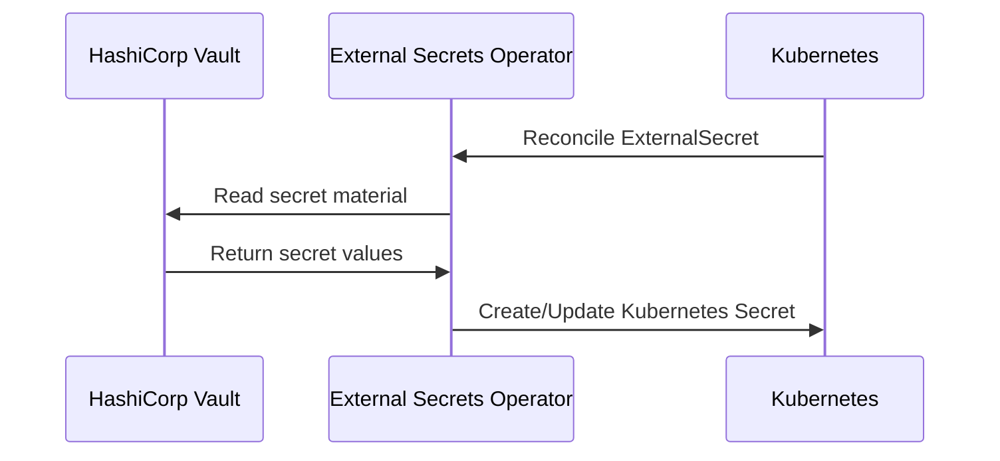

# Vault Management - Secret Management and Synchronization

**Namespace**: `vault`  
**Technology**: External Secrets Operator, HashiCorp Vault  
**Purpose**: Centralized secret storage, rotation, and synchronization

## Overview

Vault Management provides centralized, secure secret storage and lifecycle management. Secrets are synchronized into Kubernetes via External Secrets Operator.

## Responsibilities

- Manage secret sources in HashiCorp Vault
- Synchronize secrets to Kubernetes namespaces via External Secrets
- Rotate credentials and manage PKI where required
- Enforce secret access policies and audit logging

## Architecture

### Components

- HashiCorp Vault (external HA cluster)
- External Secrets Operator (cluster-wide)
- ExternalSecret and SecretStore CRDs per namespace

### Data Flow



## Example Configuration

```yaml
apiVersion: external-secrets.io/v1beta1
kind: SecretStore
metadata:
  name: vault-store
  namespace: user
spec:
  provider:
    vault:
      server: https://vault.voyager.internal
      path: kv/data
      version: v2
      auth:
        kubernetes:
          mountPath: kubernetes
          role: voyager-platform
---
apiVersion: external-secrets.io/v1beta1
kind: ExternalSecret
metadata:
  name: openai-api-key
  namespace: llm
spec:
  refreshInterval: 1h
  secretStoreRef:
    name: vault-store
    kind: SecretStore
  target:
    name: openai-api-key
  data:
  - secretKey: api_key
    remoteRef:
      key: llm/openai
      property: api_key
```

## Security

- Least-privilege SecretStore bindings per namespace
- Vault policies per service and environment
- Full audit logging of reads/rotations

## Operations

- Automated rotation schedules for provider keys
- Break-glass procedures for key revocation
- Monitoring for sync drift and failure alerts


