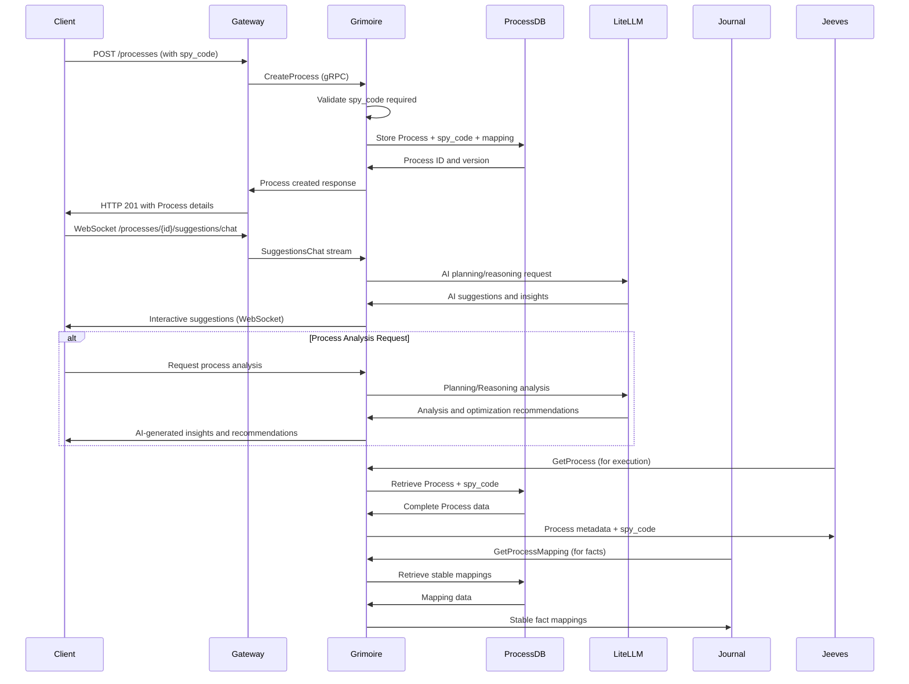
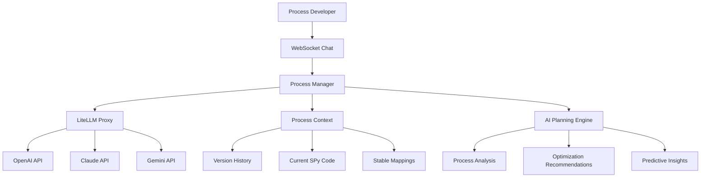

# Grimoire - Process Document Storage and Management

**Namespace**: `grimoire`  
**Technology**: Rust, PostgreSQL, Envoy  
**Purpose**: Process document storage and management

## Overview

Grimoire is the authoritative source for Process documents, which are English-language specifications that describe business workflows. It manages Process CRUD operations, versioning, and provides interactive Process suggestions through AI integration. While it also stores SPy code for execution, the English process specifications are the primary documentation format.

## Responsibilities

- Store and manage English-language Process specifications with comprehensive versioning
- Store associated SPy code (Python subset) and stable expression-to-fact-ID mappings
- Provide interactive Process suggestions through AI integration
- Serve stable mappings to Business Journal for fact computation
- Maintain version management and Process history tracking
- Support AI-powered process design and optimization workflows

## Architecture

### Process-First Architecture

Grimoire implements a process-first approach where:
- **English specifications are primary**: Process documents describe business workflows in natural language
- **SPy code implements logic**: SPy code (Python subset) implements the automation logic for execution
- **Mapping storage**: Stable expression-to-fact-ID mappings stored with each Process version
- **Documentation-centric**: English specifications drive understanding and AI assistance

### Services within Namespace

#### Process Manager Pod
The Process Manager Pod contains two cooperating applications:

##### Process Manager Service
- **Purpose**: Core Process management and business logic
- **Technology**: Kubernetes Service (K8 Service), Rust application
- **Database**: PostgreSQL Process Database
- **AI Integration**: LiteLLM Proxy for advanced planning, reasoning, and process optimization

**APIs**:
- **gRPC**:
  - `CreateProcess`: Create new Process with SPy code
  - `GetProcess`: Retrieve Process details and metadata
  - `UpdateProcess`: Update existing Process (requires SPy code)
  - `DeleteProcess`: Remove Process and its versions
  - `ListProcessVersions`: Enumerate Process version history
  - `GetProcessSpy`: Retrieve SPy code for specific version
  - `GetProcessMapping`: Get stable mappings for fact computation
  - `SuggestionsChat`: Interactive Process suggestions via AI
  - `AnalyzeProcess`: AI-powered process analysis and optimization
  - `GenerateProcessInsights`: Generate insights and recommendations
  - `PlanProcessImprovement`: AI planning for process improvements

##### Process Manager gRPC Transcoder
- **Purpose**: Protocol translation and gateway integration
- **Technology**: Envoy application
- **Function**: Translates between REST and gRPC protocols

**APIs**:
- **REST via Gateway**:
  - `/processes` - Full CRUD operations
- **WebSocket**:
  - `/processes/{id}/suggestions/chat` - Interactive suggestions interface

#### Process Database
- **Purpose**: Persistent storage for Process documents and metadata
- **Technology**: PostgreSQL
- **Data**: Process documents, SPy code, stable mappings, version history
- **Access**: Exclusively via Process Manager Service

## Data Flow



## Key Features

### Process Management Operations
- **English Specifications**: Primary focus on natural language process descriptions
- **Associated SPy Code**: SPy code (Python subset) stored alongside process documentation
- **Code Validation**: Validates SPy code syntax when provided
- **Version Control**: Each version includes complete process specification and associated code
- **Execution Ready**: Stored SPy code ready for Jarvis execution

### Process Versioning
- **Complete Versioning**: Full version history with SPy code and mappings
- **Immutable Versions**: Published versions cannot be modified
- **Version Queries**: Retrieve any historical version
- **Mapping Evolution**: Track stable mapping changes across versions

### AI-Powered Process Intelligence
- **Advanced Planning**: Uses LiteLLM Proxy for sophisticated AI planning and reasoning
- **Interactive Design**: Real-time interactive chat for AI-assisted Process development
- **Context-Aware Analysis**: Deep analysis based on Process context, execution history, and patterns
- **Iterative Optimization**: Support for iterative Process refinement and optimization
- **Predictive Insights**: AI-generated insights about process performance and potential improvements
- **Strategic Recommendations**: Long-term strategic recommendations for process evolution

### Stable Mapping Management
- **Expression-to-Fact-ID Mapping**: Provides stable mappings for Business Journal fact computation
- **Cross-Service Integration**: Mappings served to Business Journal for InfluxDB queries
- **Version-Specific**: Each Process version maintains its own stable mappings
- **Consistency**: Ensures stable fact IDs across multiple SPy program executions

## Database Schema

### Processes Table
```sql
processes (
    id UUID PRIMARY KEY,
    name VARCHAR(255) NOT NULL,
    description TEXT,
    created_at TIMESTAMP NOT NULL,
    updated_at TIMESTAMP NOT NULL,
    latest_version INTEGER NOT NULL DEFAULT 1,
    created_by UUID NOT NULL,
    organization_id UUID NOT NULL
)
```

### Process Versions Table
```sql
process_versions (
    id UUID PRIMARY KEY,
    process_id UUID NOT NULL REFERENCES processes(id),
    version_number INTEGER NOT NULL,
    spy_code TEXT NOT NULL, -- Canonical source
    process_document JSONB, -- Derived/complementary
    stable_mapping JSONB NOT NULL, -- For fact computation
    created_at TIMESTAMP NOT NULL,
    created_by UUID NOT NULL,
    changelog TEXT,
    UNIQUE(process_id, version_number)
)
```

### Process Suggestions Table
```sql
process_suggestions (
    id UUID PRIMARY KEY,
    process_id UUID NOT NULL REFERENCES processes(id),
    session_id UUID NOT NULL,
    suggestion_type VARCHAR(50) NOT NULL,
    input_context JSONB NOT NULL,
    ai_response JSONB NOT NULL,
    created_at TIMESTAMP NOT NULL,
    user_feedback INTEGER -- 1-5 rating
)
```

## API Specifications

### gRPC APIs

#### CreateProcess
```protobuf
service ProcessManager {
  rpc CreateProcess(CreateProcessRequest) returns (CreateProcessResponse);
}

message CreateProcessRequest {
  string name = 1;
  string description = 2;
  string spy_code = 3; // Required - canonical source
  map<string, string> stable_mapping = 4;
  string organization_id = 5;
}

message CreateProcessResponse {
  string process_id = 1;
  int32 version_number = 2;
  google.protobuf.Timestamp created_at = 3;
}
```

#### GetProcess
```protobuf
rpc GetProcess(GetProcessRequest) returns (GetProcessResponse);

message GetProcessRequest {
  string process_id = 1;
  int32 version_number = 2; // Optional, defaults to latest
}

message GetProcessResponse {
  string process_id = 1;
  string name = 2;
  string description = 3;
  string spy_code = 4;
  map<string, string> stable_mapping = 5;
  int32 version_number = 6;
  repeated ProcessVersion version_history = 7;
}
```

#### SuggestionsChat
```protobuf
rpc SuggestionsChat(stream ChatRequest) returns (stream ChatResponse);

message ChatRequest {
  string process_id = 1;
  string session_id = 2;
  string message = 3;
  map<string, string> context = 4;
}

message ChatResponse {
  string suggestion = 1;
  string suggestion_type = 2; // improvement, alternative, validation
  map<string, string> metadata = 3;
  bool is_final = 4;
}
```

### REST APIs (via Gateway)

#### Create Process
```http
POST /processes
Content-Type: application/json

{
  "name": "User Authentication Process",
  "description": "Handles user login and session management",
  "spy_code": "def authenticate(username, password): ...",
  "stable_mapping": {
    "user_id": "stable_fact_id_1",
    "session_token": "stable_fact_id_2"
  }
}

Response: 201 Created
{
  "process_id": "uuid",
  "version_number": 1,
  "created_at": "2024-01-01T00:00:00Z"
}
```

#### Get Process
```http
GET /processes/{process_id}?version=2

Response: 200 OK
{
  "process_id": "uuid",
  "name": "User Authentication Process",
  "spy_code": "def authenticate(username, password): ...",
  "stable_mapping": {...},
  "version_number": 2,
  "version_history": [...]
}
```

#### Update Process
```http
PUT /processes/{process_id}
Content-Type: application/json

{
  "spy_code": "def authenticate_v2(username, password): ...", // Required
  "description": "Updated authentication with 2FA",
  "stable_mapping": {...},
  "changelog": "Added two-factor authentication support"
}

Response: 200 OK
{
  "process_id": "uuid",
  "version_number": 3,
  "updated_at": "2024-01-01T00:00:00Z"
}
```

### WebSocket APIs

#### Process Suggestions Chat
```javascript
// WebSocket connection
const ws = new WebSocket('/processes/uuid/suggestions/chat');

// Send suggestion request
ws.send(JSON.stringify({
  "session_id": "chat_session_uuid",
  "message": "How can I improve the error handling in this process?",
  "context": {
    "current_spy_code": "...",
    "focus_area": "error_handling"
  }
}));

// Receive suggestions
ws.onmessage = (event) => {
  const response = JSON.parse(event.data);
  console.log(response.suggestion);
  console.log(response.suggestion_type); // "improvement"
};
```

## Integration Points

### With Business Journal
- **Stable Mappings**: Provides expression-to-fact-ID mappings for fact computation in InfluxDB
- **Fact Stability**: Ensures consistent fact identification across executions
- **Version Coordination**: Mappings versioned with Process versions for historical consistency

### With Jeeves
- **Process Retrieval**: Supplies Process specifications and associated SPy code for execution
- **Validation**: Validates Process existence before run creation
- **Metadata**: Provides Process context for run orchestration and documentation

### With LiteLLM Proxy
- **AI Suggestions**: Uses LLM services for interactive Process suggestions
- **Planning Support**: AI-powered Process planning and optimization
- **Context Understanding**: Leverages AI for Process analysis and improvement

### With Threads
- **Thread Publishing**: Publishes thread updates to Kafka journal topic
- **Process Context**: Stores process data in threads for conversation context
- **Integration**: Coordinates with thread-based Process development

## AI-Powered Features

### Interactive Suggestions
- **Real-time Chat**: WebSocket-based chat interface for Process development
- **Context-Aware**: AI suggestions based on current Process state
- **Multi-modal**: Support for code analysis, documentation, and optimization
- **Learning**: Feedback loop for improving suggestion quality

### Suggestion Types
- **Code Improvements**: SPy code optimization and best practices
- **Error Handling**: Enhanced error handling and resilience
- **Performance**: Performance optimization suggestions
- **Security**: Security best practices and vulnerability analysis
- **Documentation**: Automatic documentation generation and improvement

### AI Integration Architecture


## AI Planning and Reasoning Capabilities

### Advanced Process Analysis
- **Pattern Recognition**: Identify patterns in process design and execution
- **Performance Analysis**: Analyze process performance metrics and bottlenecks
- **Complexity Assessment**: Evaluate process complexity and suggest simplifications
- **Dependency Analysis**: Analyze process dependencies and integration points

### Strategic Planning
- **Long-term Optimization**: Generate long-term optimization strategies for processes
- **Scalability Planning**: Plan for process scalability and growth requirements
- **Risk Assessment**: Assess potential risks and suggest mitigation strategies
- **Resource Planning**: Optimize resource allocation and utilization

### Intelligent Recommendations
- **Best Practice Integration**: Apply industry best practices to process design
- **Code Optimization**: Suggest SPy code optimizations and improvements
- **Architecture Improvements**: Recommend architectural improvements and refactoring
- **Integration Opportunities**: Identify opportunities for process integration and reuse

## Security Considerations

### Process Access Control
- **Organization Isolation**: Processes scoped to organizations
- **User Permissions**: Role-based access control for Process operations
- **Version Protection**: Immutable published versions
- **Audit Logging**: Comprehensive logging of all Process operations

### Code Security
- **SPy Code Validation**: Syntax and security validation of SPy code
- **Injection Prevention**: Protection against code injection attacks
- **Sandbox Execution**: Safe execution environment for code validation
- **Version Integrity**: Cryptographic verification of version integrity

### AI Integration Security
- **Content Filtering**: AI response filtering for security and appropriateness
- **Context Isolation**: Secure handling of Process context in AI requests
- **API Security**: Secure integration with external AI services
- **Data Privacy**: Protection of sensitive Process information

## Performance Considerations

### Database Optimization
- **Indexing**: Optimized indexes for Process queries and version lookups
- **Query Optimization**: Efficient queries for common access patterns
- **Connection Pooling**: Database connection management and pooling
- **Partitioning**: Time-based partitioning for version history

### Caching Strategy
- **Process Caching**: Redis caching for frequently accessed Processes
- **Version Caching**: Cache recent versions for quick access
- **Mapping Caching**: Cache stable mappings for fact computation
- **AI Response Caching**: Cache AI suggestions for similar contexts

### AI Performance
- **Response Caching**: Cache AI responses for similar requests
- **Parallel Processing**: Concurrent AI requests for complex suggestions
- **Rate Limiting**: Intelligent rate limiting for AI service usage
- **Context Optimization**: Optimized context preparation for AI requests
